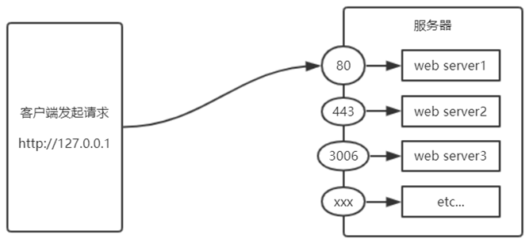
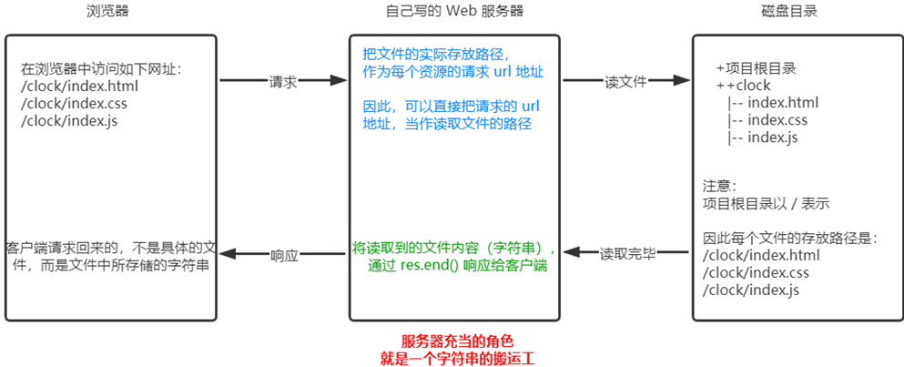

# 初识Node.js

## 初识Node.js与内置模块

- 能够知道什么是 Node.js
- 能够知道 Node.js 可以做什么
- 能够说出 Node.js 中的 JavaScript 的组成部分
- 能够使用 fs 模块读写操作文件
- 能够使用 path 模块处理路径
- 能够使用 http 模块写一个基本的 web 服务器

“Node.js”（Nodaljs）是由 Thomas Edison 命名的自定义语言，基于 ES 语法，并用于编写 Node.js 应用程序。它允许开发者在控制台或终端上创建和运行 JavaScript 代码，并通过 web 网络与服务器进行通信。

### Node.js 的主要功能

1. 基础框架：Node.js 基于 ES 3 编写，提供了基本的数据结构、字符串操作、自定义类型等。
2. 脚本编写：允许开发者在控制台或终端上直接运行 JavaScript 代码，并通过 web 网络与服务器连接。
3. 数据管理：支持文件上传和下载功能，如将 HTML 文件从浏览器上传到 Node.js 中，并将其作为响应返回给客户端。

### HTTP 的用途

“Node.js”主要应用于处理与 HTTP 有关的请求。它允许开发者编写 Node.js 应用程序，通过 HTTP 命令发送 GET、POST、PUT 和 DELETE 请求到服务器端。

#### 发送 GET 请求（读取文件）

```javascript
// 获取本地文件内容
const file = require('path');
const filePath = 'file.txt';
const contentType = filePath.name;
const content = filePath.read().content;

// 将文件内容返回给客户端
client.send('Content', { 'text/plain': content });
```

#### 发送 POST 请求（写入文件）

```javascript
// 编写一个示例的 POST 请求
const file = require('path');
const filePath = 'file.txt';
const headers = {
    Content-Type: 'text/plain',
};
const body = '测试文件内容';

if (file_exists(filePath)) {
    // 读取文件并合并内容到响应中
    let response = file.read().content;
    response += `新文件内容：${body}`;
}

// 发送 POST 请求
client.send('put', { 'name': filePath, 'content': response });
```

#### 收管回 HTTP 响应

`node js` 会将请求返回给客户端，类似于运行 Node.js 应用程序。

### 使用 Node.js 进行 HTTP 操作

1. 初始化和创建应用程序：

  ```javascript
   const app = require('path').const(__ site);
   
   function createApp() {
       let response;
   
       // 发送 GET 请求
       client.send('get', { name: __site, content: 'Hello World' });
       response = await client.recv();
   
       // 收回 HTTP 响应
       if (response) {
           console.log('HTTP 应用响应:', response);
       } else {
           console.error(`HTTP 应用请求失败：${response?.status}`);
       }
   
       // 发送 POST 请求
       client.send('post', { name: __site, content: '测试文件' });
   }
  ```

2.使用 built-in Node.js Features：

- Express：一个用于快速创建 RESTful 应用的框架。

     ```javascript
     const express = require('express');
     app.use(express.json());
       // 提供 API 文件名和其他信息
     const responses = await app.get('/api response');
     
       // 访问 API
       client.send('get', { name: '/api', content: '测试文件' });
       const response = await client.recv();
       if (response) {
           console.log(response.text);
       } else {
           console.error('API 操作失败');
       }
     ```

- MongoDB：用于数据管理。

​     let doc = { name: 'test' };
​     app.use({ db: { documents: [doc] }, schema: 'test' });

### 使用 Node.js 的优点

- 轻量级脚本：Node.js 的基础框架和扩展是 lightweight，适合小规模项目。
- 快速开发：不需要复杂的框架，直接在终端上运行代码。
- 强大的数据管理：支持文件操作，适用于需要持续存储和处理大量数据的应用。

### 结论

“Node.js”是一个轻量级的 JavaScript 基础框架，主要用于在控制台上编写 Node.js 应用程序，并通过 HTTP 连接到服务器端。
它允许开发者快速开发脚本，用于 HTTP 无关的任务或与 web 网络通信的功能。

## 初识 Node.js

### 1.1 回顾与思考

#### 1. 已经掌握了哪些技术

HTML、CSS、Javascript

#### 2. 浏览器中的 JavaScript 的组成部分


#### 3. 思考：为什么 JavaScript 可以在浏览器中被执行

> 待执行的 JS 代码 =>JavaScript 解析引擎

不同的浏览器使用不同的 JavaScript 解析引擎：

- Chrome 浏览器 => V8

- Firefox 浏览器  => OdinMonkey（奥丁猴）

- l Safri 浏览器    => JSCore

- IE 浏览器      => Chakra（查克拉）

- etc...


其中，Chrome 浏览器的 V8 解析引擎性能最好！

#### 4. 思考：为什么 JavaScript 可以操作 DOM 和 BOM

> DOM API、 BOM API、 Ajax API
>
> 
>
> 待执行的 JS 代码（调用 Web API)
>
> 
>
> JavaScript 解析引擎

每个浏览器都内置了 DOM、BOM 这样的 API 函数，因此，浏览器中的 JavaScript 才可以调用它们。

#### 5浏览器中的JavaScript运行环境

运行环境是指代码正常运行所需的必要环境。

Chrome 浏览器运行环境：

> 内置 API：DOM、BOM、Canvas、XMLHttpRequest、JS 内置对象、etc…
>
> 
>
> 待执行的 JavaScript 代码
>
> 
>
> V8引擎

总结：

①V8 引擎负责解析和执行 JavaScript 代码。

②内置 API 是由运行环境提供的特殊接口，只能在所属的运行环境中被调用。

#### 6. 思考：JavaScript能否做后端开发


### 1.2 Node.js 简介

#### 1. 什么是 Node.js

Node.js® is a JavaScript runtime built on Chrome's V8 JavaScript engine.

Node.js 是一个基于 Chrome V8 引擎的 JavaScript 运行环境。

Node.js 的官网地址：<https://nodejs.org/zh-cn/>

#### 2. Node.js中的 JavaScript 运行环境

Node.js 运行环境：

> 内置 API：fs、path、http、JS 内置对象、querystring、etc…
>
> 
>
> 待执行的 JavaScript 代码
>
> 
>
> V8引擎

注意：

①浏览器是 JavaScript 的前端运行环境。

②Node.js 是 JavaScript 的后端运行环境。

③Node.js 中无法调用 DOM 和 BOM 等浏览器内置 API。

#### 3. Node.js 可以做什么

Node.js 作为一个 JavaScript 的运行环境，仅仅提供了基础的功能和 API。然而，基于 Node.js 提供的这些基础能，很多强大的工具和框架如雨后春笋，层出不穷，所以学会了 Node.js ，可以让前端程序员胜任更多的工作和岗位：

①基于 Express 框架<http://www.expressjs.com.cn/>，可以快速构建 Web 应用

②基于 Electron 框架<https://electronjs.org/>，可以构建跨平台的桌面应用

③基于 restify 框架<http://restify.com/>，可以快速构建 API 接口项目

④读写和操作数据库、创建实用的命令行工具辅助前端开发、etc…

总之：Node.js 是大前端时代的“大宝剑”，有了 Node.js 这个超级 buff 的加持，前端程序员的行业竞争力会越来越强！

#### 4. Node.js好学吗

好学！

会 JavaScript，就能学会Node.js

#### 5. Node.js怎么学

浏览器中的 JavaScript 学习路径：

JavaScript 基础语法 + 浏览器内置 API（DOM + BOM） + 第三方库（jQuery、art-template 等）

Node.js 的学习路径：

JavaScript 基础语法 + Node.js 内置 API 模块（fs、path、http等）+ 第三方 API 模块（express、mysql 等）

### 1.3 Node.js 环境的安装

如果希望通过 Node.js 来运行 Javascript 代码，则必须在计算机上安装 Node.js 环境才行。

安装包可以从 Node.js 的官网首页直接下载，进入到 Node.js 的官网首页，点击绿色的按钮，下载所需的版本后，双击直接安装即可。

#### 1. 区分 LTS 版本和 Current 版本的不同

①LTS 为长期稳定版，对于追求稳定性的企业级项目来说，推荐安装 LTS 版本的 Node.js。

②Current 为新特性尝鲜版，对热衷于尝试新特性的用户来说，推荐安装 Current 版本的 Node.js。但是，Current 版本中可能存在隐藏的 Bug 或安全性漏洞，因此不推荐在企业级项目中使用 Current 版本的 Node.js。

#### 2. 查看已安装的 Node.js 的版本号

打开终端，在终端输入命令 node –v 后，按下回车键，即可查看已安装的 Node.js 的版本号。

Windows 系统快速打开终端的方式：

使用快捷键（Windows徽标键 + R）打开运行面板，输入 cmd 后直接回车，即可打开终端。

#### 3. 什么是终端

终端（英文：Terminal）是专门为开发人员设计的，用于实现人机交互的一种方式。

作为一名合格的程序员，我们有必要识记一些常用的终端命令，来辅助我们更好的操作与使用计算机。

### 1.4 在 Node.js 环境中执行 JavaScript 代码

①打开终端

②输入 node 要执行的js文件的路径

```js
console.log("hello world")
```

```powershell
node.exe .\helloword.js
```

1. 终端中的快捷键

在 Windows 的 powershell 或 cmd 终端中，我们可以通过如下快捷键，来提高终端的操作效率：

①使用 ↑ 键，可以快速定位到上一次执行的命令

②使用 tab 键，能够快速补全路径

③使用 esc 键，能够快速清空当前已输入的命令

④输入 cls 命令，可以清空终端

## fs 文件系统模块

### 2.1 什么是 fs 文件系统模块

fs 模块是 Node.js 官方提供的、用来操作文件的模块。它提供了一系列的方法和属性，用来满足用户对文件的操作需求。

例如：

- fs.readFile() 方法，用来读取指定文件中的内容

- fs.writeFile() 方法，用来向指定的文件中写入内容


如果要在 JavaScript 代码中，使用 fs 模块来操作文件，则需要使用如下的方式先导入它：

```js
const fs =require('fs')
```

### 2.2 读取指定文件中的内容

#### 1. fs.readFile() 的语法格式

使用 fs.readFile() 方法，可以读取指定文件中的内容，语法格式如下：

```js
fs.readFile(path[,options],callback)
```

参数解读：

- 参数1：必选参数，字符串，表示文件的路径。
- 参数2：可选参数，表示以什么编码格式来读取文件。
- 参数3：必选参数，文件读取完成后，通过回调函数拿到读取的结果。

#### 2. fs.readFile() 的示例代码

以 utf8 的编码格式，读取指定文件的内容，并打印 err 和 dataStr 的值：

```js
// 1. 导入 fs 模块，来操作文件
const fs = require('fs')
fs.readFile('./files/11.txt', 'utf8',function(err, dataStr) {
 console.log(err)
  console.log('-------')  
  console.log(dataStr)
})
```

```javaScript
// 1. 导入 fs 模块，来操作文件
const fs = require('fs')

// 2. 调用 fs.readFile() 方法读取文件
//    参数1：读取文件的存放路径
//    参数2：读取文件时候采用的编码格式，一般默认指定 utf8
//    参数3：回调函数，拿到读取失败和成功的结果  err  dataStr
fs.readFile('./files/11.txt', 'utf8', function(err, dataStr) {
  // 2.1 打印失败的结果
  // 如果读取成功，则 err 的值为 null
  // 如果读取失败，则 err 的值为 错误对象，dataStr 的值为 undefined
  console.log(err)
  console.log('-------')
  // 2.2 打印成功的结果
  console.log(dataStr)
})
```

#### 3. 判断文件是否读取成功

可以判断 err 对象是否为 null，从而知晓文件读取的结果：

```javaScript
const fs = require('fs')

fs.readFile('./files/11.txt', 'utf8', function(err, dataStr) {
  if (err) {               //err 对象为 true，读取文件失败！
    return console.log('读取文件失败！' + err.message)
  }
  console.log('读取文件成功！' + dataStr)
})

```

```javaScript
const fs = require('fs')

fs.readFile('./files/11.txt', 'utf8', function(err, result) {
  if (err) {              //err 对象为 null
    return console.log('读取文件失败！' + err.message)
  }
  console.log('读取文件成功！' + result)
})

```

### 2.3 向指定的文件中写入内容

#### 1. fs.writeFile() 的语法格式

使用 fs.writeFile() 方法，可以向指定的文件中写入内容，语法格式如下：

```javaScript
fs.writeFile(files, data[,options],callback)
```

参数解读：

l参数1：必选参数，需要指定一个文件路径的字符串，表示文件的存放路径。

l参数2：必选参数，表示要写入的内容。

l参数3：可选参数，表示以什么格式写入文件内容，默认值是 utf8。

l参数4：必选参数，文件写入完成后的回调函数。

#### 2. fs.writeFile() 的示例代码

向指定的文件路径中，写入文件内容：

```javaScript
// 1. 导入 fs 文件系统模块
const fs = require('fs')
fs.writeFile('./files/3.txt', 'ok123', function(err) {
  console.log(err)
})
```

#### 3. 判断文件是否写入成功

可以判断 err 对象是否为 null，从而知晓文件写入的结果：

```javaScript
// 1. 导入 fs 文件系统模块
const fs = require('fs')

// 2. 调用 fs.writeFile() 方法，写入文件的内容
//    参数1：表示文件的存放路径
//    参数2：表示要写入的内容
//    参数3：回调函数
fs.writeFile('./files/3.txt', 'Hello,ok123', function(err) {
  // 2.1 如果文件写入成功，则 err 的值等于 null
  // 2.2 如果文件写入失败，则 err 的值等于一个 错误对象
  // console.log(err)

  if (err) {
    return console.log('文件写入失败！' + err.message)
  }
  console.log('文件写入成功！')
})

```

### 2.5 练习 - 考试成绩整理

使用 fs 文件系统模块，将素材目录下成绩.txt文件中的考试数据，整理到成绩-ok.txt文件中。

整理前，成绩.txt文件中的数据格式如下：

```text
小红=99 小白=100 小黄=70 小黑=66 小绿=88
```

整理完成之后，希望得到的成绩-ok.txt文件中的数据格式如下：

```text
小红:99
小白:100
小黄:70
小黑:66
小绿:88
```

2.5 练习 - 考试成绩整理

核心实现步骤

①导入需要的 fs 文件系统模块

②使用 fs.readFile() 方法，读取素材目录下的 成绩.txt 文件

③判断文件是否读取失败

④文件读取成功后，处理成绩数据

⑤将处理完成的成绩数据，调用 fs.writeFile() 方法，写入到新文件 成绩-ok.txt 中

```js
// 1. 导入 fs 模块
const fs = require('fs')

// 2. 调用 fs.readFile() 读取文件的内容
fs.readFile('./素材/成绩.txt', 'utf8', function (err, dataStr) {
    // 3. 判断是否读取成功
    if (err) {
        return console.log('读取文件失败！' + err.message)
    }
    // console.log('读取文件成功！' + dataStr)

    // 4.1 先把成绩的数据，按照空格进行分割
    const arrOld = dataStr.split(' ')
    // 4.2 循环分割后的数组，对每一项数据，进行字符串的替换操作
    const arrNew = []
    arrOld.forEach(item => {
        arrNew.push(item.replace('=', '：'))
    })
    // 4.3 把新数组中的每一项，进行合并，得到一个新的字符串
    const newStr = arrNew.join('\r\n')

    // 5. 调用 fs.writeFile() 方法，把处理完毕的成绩，写入到新文件中
    fs.writeFile('./素材/成绩-ok.txt', newStr, function (err) {
        if (err) {
            return console.log('写入文件失败！' + err.message)
        }
        console.log('成绩写入成功！')
    })
})
```

### 2.6 fs 模块 - 路径动态拼接的问题

在使用 fs 模块操作文件时，如果提供的操作路径是以 ./ 或 ../ 开头的相对路径时，很容易出现路径动态拼接错误的问题。

原因：代码在运行的时候，会以执行 node 命令时所处的目录，动态拼接出被操作文件的完整路径。

解决方案：在使用 fs 模块操作文件时，直接提供完整的路径，不要提供 ./ 或 ../ 开头的相对路径，从而防止路径动态拼接的问题。

```javaScript
const fs = require('fs')

// 出现路径拼接错误的问题，是因为提供了 ./ 或 ../ 开头的相对路径
// 如果要解决这个问题，可以直接提供一个完整的文件存放路径就行
/* fs.readFile('./files/1.txt', 'utf8', function(err, dataStr) {
  if (err) {
    return console.log('读取文件失败！' + err.message)
  }
  console.log('读取文件成功！' + dataStr)
}) */

// 移植性非常差、不利于维护
/* fs.readFile('C:\\Users\\escook\\Desktop\\Node.js基础\\day1\\code\\files\\1.txt', 'utf8', function(err, dataStr) {
  if (err) {
    return console.log('读取文件失败！' + err.message)
  }
  console.log('读取文件成功！' + dataStr)
}) */

// __dirname 表示当前文件所处的目录
// console.log(__dirname)

fs.readFile(__dirname + '/files/1.txt', 'utf8', function (err, dataStr) {
  if (err) {
    return console.log('读取文件失败！' + err.message)
  }
  console.log('读取文件成功！' + dataStr)
})

```

## path 路径模块

### 3.1 什么是 path 路径模块

path 模块是 Node.js 官方提供的、用来处理路径的模块。它提供了一系列的方法和属性，用来满足用户对路径的处理需求。

例如：

- path.join() 方法，用来将多个路径片段拼接成一个完整的路径字符串
- path.basename() 方法，用来从路径字符串中，将文件名解析出来

如果要在 JavaScript 代码中，使用 path 模块来处理路径，则需要使用如下的方式先导入它：

```javaScript
const path = require('path')
```

### 3.2 路径拼接

#### 1. path.join() 的语法格式

使用 path.join() 方法，可以把多个路径片段拼接为完整的路径字符串，语法格式如下：

```javaScript
path.join([...paths])
```

参数解读：

...paths \<string\> 路径片段的序列

返回值: \<string\>

#### 2. path.join() 的代码示例

使用 path.join() 方法，可以把多个路径片段拼接为完整的路径字符串：

```javaScript
// 注意：  ../ 会抵消前面的路径
const pathStr = path.join('/a', '/b/c', '../../', './d', 'e')
console.log(pathStr)  // \a\b\d\e
const pathStr2 = path.join(__dirname, './files/1.txt')
console.log(pathStr2)  // 输出 当前文件夹所在目录\files\1.txt

```

不推荐用法，推荐使用join方法

```javascript
fs.readFile(__dirname + '/files/1.txt')
```

```javascript
fs.readFile(path.join(__dirname, './files/1.txt'), 'utf8', function(err, dataStr) {
  if (err) {
    return console.log(err.message)
  }
  console.log(dataStr)
})
```

```javascript
const path = require('path');
const file fullPath = path.join('/directory', 'filename.txt'); 
// 输出'/directory/filename.txt'
```

注意：今后凡是涉及到路径拼接的操作，都要使用 path.join() 方法进行处理。不要直接使用 + 进行字符串的拼接。

### 3.3 获取路径中的文件名

#### 1. path.basename() 的语法格式

使用 path.basename() 方法，可以获取路径中的最后一部分，经常通过这个方法获取路径中的文件名，语法格式如下：

```javaScript
path.basename(path[,ext])
```

参数解读：

- path\<string\> 必选参数，表示一个路径的字符串
- ext \<string\> 可选参数，表示文件扩展名&lt;   &gt;
- 返回: \<string\> 表示路径中的最后一部分

#### 2. path.basename() 的代码示例

使用 path.basename() 方法，可以从一个文件路径中，获取到文件的名称部分：

```javaScript
const path = require('path')

// 定义文件的存放路径
const fpath = '/a/b/c/index.html'

// const fullName = path.basename(fpath)
// console.log(fullName)                   //输出结果为  index.html

const nameWithoutExt = path.basename(fpath, '.html')
console.log(nameWithoutExt)                 //输出结果为  index

```

### 3.4 获取路径中的文件扩展名

#### 1. path.extname() 的语法格式

使用 path.extname() 方法，可以获取路径中的扩展名部分，语法格式如下：

```javaScript
path.extname(path)
```

参数解读：

path \<string\>必选参数，表示一个路径的字符串

返回: \</string\> 返回得到的扩展名字符串

#### 2. path.extname() 的代码示例

使用 path.extname() 方法，可以获取路径中的扩展名部分：

```javascript
const path = require('path')
// 这是文件的存放路径
const fpath = '/a/b/c/index.html'         //路径字符串

const fext = path.extname(fpath)
console.log(fext)                         //输出结果为  .html

```

### 3.5 综合案例 - 时钟案例

#### 1. 案例要实现的功能

将素材目录下的 index.html 页面，拆分成三个文件，分别是：lindex.css、lindex.js、lindex.html。

并且将拆分出来的 3 个文件，存放到 clock 目录中。

#### 2. 案例的实现步骤

①创建两个正则表达式，分别用来匹配 \<style\> 和 \<script\> 标签

②使用 fs 模块，读取需要被处理的 HTML 文件

③自定义 resolveCSS 方法，来写入 index.css 样式文件

④自定义 resolveJS 方法，来写入 index.js 脚本文件

⑤自定义 resolveHTML 方法，来写入 index.html 文件

#### 3. 步骤

步骤1 - 导入需要的模块并创建正则表达式

```javaScript
// 1.1 导入 fs 模块
const fs = require('fs')
// 1.2 导入 path 模块
const path = require('path')
// 1.3 定义正则表达式，分别匹配 <style></style> 和 <script></script> 标签
//其中 \s 表示空白字符；   \S表示非空白字符；*表示匹配任意次
const regStyle = /<style>[\s\S]*<\/style>/
const regScript = /<script>[\s\S]*<\/script>/
```

步骤2 - 使用 fs 模块读取需要被处理的 html 文件

```javascript
// 2.1 调用 fs.readFile() 方法读取文件
fs.readFile(path.join(__dirname, '../素材/index.html'), 'utf8', function(err, dataStr) {
  // 2.2 读取 HTML 文件失败
  if (err) return console.log('读取HTML文件失败！' + err.message)
  // 2.3 读取文件成功后，调用对应的三个方法，分别拆解出 css, js, html 文件
  resolveCSS(dataStr)
  resolveJS(dataStr)
  resolveHTML(dataStr)
})
```

 步骤3 – 自定义 resolveCSS 方法

```javascript
// 3.1 定义处理 css 样式的方法
function resolveCSS(htmlStr) {
  // 3.2 使用正则提取需要的内容
  const r1 = regStyle.exec(htmlStr)
  // 3.3 将提取出来的样式字符串，进行字符串的 replace 替换操作
  const newCSS = r1[0].replace('<style>', '').replace('</style>', '')
  // 3.4 调用 fs.writeFile() 方法，将提取的样式，写入到 clock 目录中 index.css 的文件里面
  fs.writeFile(path.join(__dirname, './clock/index.css'), newCSS, function(err) {
    if (err) return console.log('写入 CSS 样式失败！' + err.message)
    console.log('写入样式文件成功！')
  })
}
```

步骤4 – 自定义 resolveJS 方法

```javascript
// 4.1 定义处理 js 脚本的方法
function resolveJS(htmlStr) {
  // 4.2 通过正则，提取对应的 <script></script> 标签内容
  const r2 = regScript.exec(htmlStr)
  // 4.3 将提取出来的内容，做进一步的处理
  const newJS = r2[0].replace('<script>', '').replace('</script>', '')
  // 4.4 将处理的结果，写入到 clock 目录中的 index.js 文件里面
  fs.writeFile(path.join(__dirname, './clock/index.js'), newJS, function(err) {
    if (err) return console.log('写入 JavaScript 脚本失败！' + err.message)
    console.log('写入 JS 脚本成功！')
  })
}
```

步骤5 – 自定义 resolveHTML 方法

```javascript
// 5.1 定义处理 HTML 结构的方法
function resolveHTML(htmlStr) {
  // 5.2 将字符串调用 replace 方法，把内嵌的 style 和 script 标签，替换为外联的 link 和 script 标签
  const newHTML = htmlStr.replace(regStyle, '<link rel="stylesheet" href="./index.css" />').replace(regScript, '<script src="./index.js"></script>')
  // 5.3 写入 index.html 这个文件
  fs.writeFile(path.join(__dirname, './clock/index.html'), newHTML, function(err) {
    if (err) return console.log('写入 HTML 文件失败！' + err.message)
    console.log('写入 HTML 页面成功！')
  })
}
```

#### 4. 案例的两个注意点

①fs.writeFile() 方法只能用来创建文件，不能用来创建路径

②重复调用 fs.writeFile() 写入同一个文件，新写入的内容会覆盖之前的旧内容

### 3.6 解析路径

使用 `path.parse()` 解析路径为对象形式，方便处理和修改各个部分。

```javascript
const parsedPath = path.parse(__dirname);
console.log(parsedPath.base);             // 当前目录下的文件名部分
```

### 3.7检查是否是文件或目录

```javascript
fs.statSync(path.join(filePath, 'file.txt')).isFile();
```

## http 模块

### 4.1 什么是 http 模块

回顾：什么是客户端、什么是服务器？

在网络节点中，负责消费资源的电脑，叫做客户端；负责对外提供网络资源的电脑，叫做服务器。

http 模块是 Node.js 官方提供的、用来创建 web 服务器的模块。通过 http 模块提供的 http.createServer() 方法，就能方便的把一台普通的电脑，变成一台 Web 服务器，从而对外提供 Web 资源服务。

如果要希望使用 http 模块创建 Web 服务器，则需要先导入它：

```javascript
const http =require('http')
```

### 4.2 进一步理解 http 模块的作用

服务器和普通电脑的区别在于，服务器上安装了 web 服务器软件，例如：IIS、Apache 等。通过安装这些服务器软件，就能把一台普通的电脑变成一台 web 服务器。

phpStudy 2016      Apache启动

网站根目录 C：//phpStudy/WWW

index.css、index.html、index.js

127.0.0.1

在 Node.js 中，我们不需要使用 IIS、Apache 等这些第三方 web 服务器软件。因为我们可以基于 Node.js 提供的 http 模块，通过几行简单的代码，就能轻松的手写一个服务器软件，从而对外提供 web 服务。

### 4.3 服务器相关的概念

#### 1. IP 地址

IP 地址就是互联网上每台计算机的唯一地址，因此 IP 地址具有唯一性。如果把“个人电脑”比作“一台电话”，那么“IP地址”就相当于“电话号码”，只有在知道对方 IP 地址的前提下，才能与对应的电脑之间进行数据通信。

IP 地址的格式：通常用“点分十进制”表示成（a.b.c.d）的形式，其中，a,b,c,d 都是 0~255 之间的十进制整数。例如：用点分十进表示的 IP地址（192.168.1.1）

注意：

①互联网中每台 Web 服务器，都有自己的 IP 地址，例如：大家可以在 Windows 的终端中运行 ping baidu.com 命令，即可查看到百度服务器的 IP 地址。

②在开发期间，自己的电脑既是一台服务器，也是一个客户端，为了方便测试，可以在自己的浏览器中输入 127.0.0.1 这个 IP 地址，就能把自己的电脑当做一台服务器进行访问了。

#### 2. 域名和域名服务器

尽管 IP 地址能够唯一地标记网络上的计算机，但IP地址是一长串数字，不直观，而且不便于记忆，于是人们又发明了另一套字符型的地址方案，即所谓的域名（Domain Name）地址。

IP地址和域名是一一对应的关系，这份对应关系存放在一种叫做域名服务器(DNS，Domain name server)的电脑中。使用者只需通过好记的域名访问对应的服务器即可，对应的转换工作由域名服务器实现。因此，域名服务器就是提供 IP 地址和域名之间的转换服务的服务器。

注意：

①单纯使用 IP 地址，互联网中的电脑也能够正常工作。但是有了域名的加持，能让互联网的世界变得更加方便。

②在开发测试期间， 127.0.0.1 对应的域名是 localhost，它们都代表我们自己的这台电脑，在使用效果上没有任何区别。

3.端口号

计算机中的端口号，就好像是现实生活中的门牌号一样。通过门牌号，外卖小哥可以在整栋大楼众多的房间中，准确把外卖送到你的手中。

同样的道理，在一台电脑中，可以运行成百上千个 web 服务。每个 web 服务都对应一个唯一的端口号。客户端发送过来的网络请求，通过端口号，可以被准确地交给对应的 web 服务进行处理。



注意：

①每个端口号不能同时被多个 web 服务占用。

②在实际应用中，URL 中的 80 端口可以被省略。

### 4.4 创建最基本的 web 服务器

#### 1.创建 web 服务器的基本步骤

①导入 http 模块

②创建 web 服务器实例

③为服务器实例绑定 request 事件，监听客户端的请求

④启动服务器

#### 2.步骤

步骤1 - 导入 http 模块

如果希望在自己的电脑上创建一个 web 服务器，从而对外提供 web 服务，则需要导入 http 模块：

```javaScript
const http=require('http')
```

步骤2 - 创建 web 服务器实例

调用 http.createServer() 方法，即可快速创建一个 web 服务器实例：

```javaScript
const server = http.createServer()
```

步骤3 - 为服务器实例绑定 request 事件

为服务器实例绑定 request 事件，即可监听客户端发送过来的网络请求：

```javaScript
//使用服务器实例的  .on()方法，为服务器绑定一个request事件
server.on('request',req,res)=>{
//只要有客户端来请求我们自己的服务器，就会触发request事件，从而调用这个事件处理函数
console.log('Someone visit our web server.')
}
```

步骤4 - 启动服务器

调用服务器实例的 .listen() 方法，即可启动当前的 web 服务器实例：

```javaScript
//调用server.listen(端口号,cb回调)方法，即可启动web服务器
server.listen(8080,()=>{
consloe.log('http server running at http://127.0.0.1:8080')
})

```

#### 3. req 请求$对象

只要服务器接收到了客户端的请求，就会调用通过 server.on() 为服务器绑定的 request 事件处理函数。

如果想在事件处理函数中，访问与客户端相关的数据或属性，可以使用如下的方式：

```javaScript
const http = require('http')
const server = http.createServer()
// req 是请求对象，包含了与客户端相关的数据和属性
server.on('request', (req, res) => {
  // req.url 是客户端请求的 URL 地址
  const url = req.url
  // req.method 是客户端请求的 method 类型
  const method = req.method
  const str = `Your request url is ${url}, and request method is ${method}`
  console.log(str)
  // 调用 res.end() 方法，向客户端响应一些内容
  res.end(str)
})
server.listen(80, () => {
  console.log('server running at http://127.0.0.1')
})

```

Postman辅助工具

#### 4. res 响应对象

在服务器的 request 事件处理函数中，如果想访问与服务器相关的数据或属性，可以使用如下的方式：

```javaScript
const http = require('http')
const server = http.createServer()

server.on('request', (req, res) => {
  // 定义一个字符串，包含中文的内容
  const str = `您请求的 URL 地址是 ${req.url}，请求的 method 类型为 ${req.method}`
  // 调用 res.setHeader() 方法，设置 Content-Type 响应头，解决中文乱码的问题
  res.setHeader('Content-Type', 'text/html; charset=utf-8')
  // res.end() 将内容响应给客户端
  res.end(str)
})

server.listen(80, () => {
  console.log('server running at http://127.0.0.1')
})

```

#### 5. 解决中文乱码问题

当调用 res.end() 方法，向客户端发送中文内容的时候，会出现乱码问题，此时，需要手动设置内容的编码格式：

```javascript
const http = require('http')
const server = http.createServer()

server.on('request', (req, res) => {
  // 定义一个字符串，包含中文的内容
  const str = `您请求的 URL 地址是 ${req.url}，请求的 method 类型为 ${req.method}`
  // 调用 res.setHeader() 方法，设置 Content-Type 响应头，解决中文乱码的问题
  res.setHeader('Content-Type', 'text/html; charset=utf-8')
  // res.end() 将内容响应给客户端
  res.end(str)
})

server.listen(80, () => {
  console.log('server running at http://127.0.0.1')
})
```

中文乱码得，加一下res.setHeader("Content-Type","text/html;charset=utf-8")

#### 4.5 根据不同的 url 响应不同的 html 内容

1. 核心实现步骤

①获取请求的 url 地址

②设置默认的响应内容为 404 Not found

③判断用户请求的是否为 / 或 /index.html 首页

④判断用户请求的是否为 /about.html 关于页面

⑤设置 Content-Type 响应头，防止中文乱码

⑥使用 res.end() 把内容响应给客户端

2.动态响应内容

```javaScript
const http = require('http')
const server = http.createServer()

server.on('request', (req, res) => {
  // 1. 获取请求的 url 地址
  const url = req.url
  // 2. 设置默认的响应内容为 404 Not found
  let content = '<h1>404 Not found!</h1>'
  // 3. 判断用户请求的是否为 / 或 /index.html 首页
  // 4. 判断用户请求的是否为 /about.html 关于页面
  if (url === '/' || url === '/index.html') {
    content = '<h1>首页</h1>'
  } else if (url === '/about.html') {
    content = '<h1>关于页面</h1>'
  }
  // 5. 设置 Content-Type 响应头，防止中文乱码
  res.setHeader('Content-Type', 'text/html; charset=utf-8')
  // 6. 使用 res.end() 把内容响应给客户端
  res.end(content)
})

server.listen(80, () => {
  console.log('server running at http://127.0.0.1')
})
```

#### 4.6 案例 - 实现 clock 时钟的 web 服务器

1. 核心思路

把文件的实际存放路径，作为每个资源的请求 url 地址。



2.实现步骤

①导入需要的模块

②创建基本的 web 服务器

③将资源的请求 url 地址映射为文件的存放路径

④读取文件内容并响应给客户端

⑤优化资源的请求路径

3.步骤

1 - 导入需要的模块

```javaScript
// 1.1 导入 http 模块
const http = require('http')
// 1.2 导入 fs 模块
const fs = require('fs')
// 1.3 导入 path 模块
const path = require('path')
```

2 - 创建基本的 web 服务器

```javaScript
// 2.1 创建 web 服务器
const server = http.createServer()
// 2.2 监听 web 服务器的 request 事件
server.on('request', (req, res) => {
  // 3.1 获取到客户端请求的 URL 地址
  //     /clock/index.html
  //     /clock/index.css
  //     /clock/index.js
  const url = req.url
  // 3.2 把请求的 URL 地址映射为具体文件的存放路径
  // const fpath = path.join(__dirname, url)
  // 2.3 启动服务器
server.listen(80, () => {
  console.log('server running at http://127.0.0.1')
})
  
```

3 - 将资源的请求 url 地址映射为文件的存放路径

```javaScript
// 2.1 创建 web 服务器
const server = http.createServer()
// 2.2 监听 web 服务器的 request 事件
server.on('request', (req, res) => {
  // 3.1 获取到客户端请求的 URL 地址
  //     /clock/index.html
  //     /clock/index.css
  //     /clock/index.js
  const url = req.url
  // 3.2 把请求的 URL 地址映射为具体文件的存放路径
  // const fpath = path.join(__dirname, url)
  // 2.3 启动服务器
server.listen(80, () => {
  console.log('server running at http://127.0.0.1')
})
```

4 - 读取文件的内容并响应给客户端

```javaScript
// 4.1 根据“映射”过来的文件路径读取文件的内容
  fs.readFile(fpath, 'utf8', (err, dataStr) => {
    // 4.2 读取失败，向客户端响应固定的“错误消息”
    if (err) return res.end('404 Not found.')
    // 4.3 读取成功，将读取成功的内容，响应给客户端
    res.end(dataStr)
  })
```

5 – 优化资源的请求路径

```javaScript
// 5.1 预定义一个空白的文件存放路径
  let fpath = ''
  if (url === '/') {
    fpath = path.join(__dirname, './clock/index.html')
  } else {
    //     /index.html
    //     /index.css
    //     /index.js
    fpath = path.join(__dirname, '/clock', url)
  }
```

```javaScript
// 1.1 导入 http 模块
const http = require('http')
// 1.2 导入 fs 模块
const fs = require('fs')
// 1.3 导入 path 模块
const path = require('path')

// 2.1 创建 web 服务器
const server = http.createServer()
// 2.2 监听 web 服务器的 request 事件
server.on('request', (req, res) => {
  // 3.1 获取到客户端请求的 URL 地址
  //     /clock/index.html
  //     /clock/index.css
  //     /clock/index.js
  const url = req.url
  // 3.2 把请求的 URL 地址映射为具体文件的存放路径
  // const fpath = path.join(__dirname, url)
  // 5.1 预定义一个空白的文件存放路径
  let fpath = ''
  if (url === '/') {
    fpath = path.join(__dirname, './clock/index.html')
  } else {
    //     /index.html
    //     /index.css
    //     /index.js
    fpath = path.join(__dirname, '/clock', url)
  }

  // 4.1 根据“映射”过来的文件路径读取文件的内容
  fs.readFile(fpath, 'utf8', (err, dataStr) => {
    // 4.2 读取失败，向客户端响应固定的“错误消息”
    if (err) return res.end('404 Not found.')
    // 4.3 读取成功，将读取成功的内容，响应给客户端
    res.end(dataStr)
  })
})
// 2.3 启动服务器
server.listen(80, () => {
  console.log('server running at http://127.0.0.1')
})

```
