# 模块化

目标:

能够说出模块化的好处

能够知道 CommonJS 规定了哪些内容

能够说出 Node.js 中模块的三大分类各自是什么

能够使用 npm 管理包

能够了解什么是规范的包结构

能够了解模块的加载机制

## 模块化的基本概念

### 1.1 什么是模块化

模块化是指解决一个复杂问题时，自顶向下逐层把系统划分成若干模块的过程。对于整个系统来说，模块是可组合、分解和更换的单元。

#### 1. 现实生活中的模块化


#### 2. 编程领域中的模块化

编程领域中的模块化，就是遵守固定的规则，把一个大文件拆成独立并互相依赖的多个小模块。

把代码进行模块化拆分的好处：

①提高了代码的复用性

②提高了代码的可维护性

③可以实现按需加载

### 1.2 模块化规范

模块化规范就是对代码进行模块化的拆分与组合时，需要遵守的那些规则。

例如：

使用什么样的语法格式来引用模块

在模块中使用什么样的语法格式向外暴露成员

模块化规范的好处：大家都遵守同样的模块化规范写代码，降低了沟通的成本，极大方便了各个模块之间的相互调用，利人利己。

## Node.js 中模块的分类

### 2.1 Node.js 中模块的分类

Node.js 中根据模块来源的不同，将模块分为了 3 大类，分别是：

1. 内置模块（内置模块是由 Node.js 官方提供的，例如 fs、path、http 等）
2. 自定义模块（用户创建的每个 .js 文件，都是自定义模块）
3. 第三方模块（由第三方开发出来的模块，并非官方提供的内置模块，也不是用户创建的自定义模块，使用前需要先下载）

### 2.2 加载模块

使用强大的 require() 方法，可以加载需要的内置模块、用户自定义模块、第三方模块进行使用。例如：

```javascript
const http = require('http')         //加载内置的fs模块路
const m1 = require('./custom.js')     //自定义模块需要加载路径
//加载第三方模块（关于第三方模块的下载和使用，会在后面的课程中进行讲解）
const moment =require('moment')
```

注意：使用 require() 方法加载其它模块时，会执行被加载模块中的代码。

### 2.3 Node.js 中的模块作用域

#### 1. 什么是模块作用域

和函数作用域类似，在自定义模块中定义的变量、方法等成员，只能在当前模块内被访问，这种模块级别的访问限制，叫做模块作用域。

```javascript
const custom = require('./08.模块作用域')
//在test.js模块中，无法访问custom模块中的私有成员
console.log(custom)     //    输出{}空对象
```

#### 2. 模块作用域的好处

防止了全局变量污染的问题

### 2.4 向外共享模块作用域中的成员

#### 1.module 对象

在每个 .js 自定义模块中都有一个 module 对象，它里面存储了和当前模块有关的信息，打印如下：

```javascript
console.log(module)   //    输出{}空对象
```

```javascript
{
  id: '.',
  path: 'D:\\路径...\\day2\\code',
  exports: {},
  filename: 'D:\\路径...\\day2\\code\\09.test.js',
  loaded: false,
  children: [
    {
      id: 'D:\\路径...\\day2\\code\\08.模块作用域.js',
      path: 'D:\\路径...\\day2\\code',
      exports: {},
      filename: 'D:\\路径...\\day2\\code\\08.模块作用域.js',
      loaded: true,
      children: [],
      paths: [Array],
      [Symbol(kIsMainSymbol)]: false,
      [Symbol(kIsCachedByESMLoader)]: false,
      [Symbol(kIsExecuting)]: false
    }
  ],
  paths: [
    'D:\\路径...\\day2\\code\\node_modules',
    'D:\\路径...\\day2\\node_modules',
    'D:\\路径...\\node_modules',
    'D:\\bili_download\\NEW\\node.js—资料\\node_modules',
    'D:\\bili_download\\NEW\\node_modules',
    'D:\\bili_download\\node_modules',
    'D:\\node_modules'
  ],
  [Symbol(kIsMainSymbol)]: true,
  [Symbol(kIsCachedByESMLoader)]: false,
  [Symbol(kIsExecuting)]: true
}
```

#### 2. module.exports 对象

在自定义模块中，可以使用 module.exports 对象，将模块内的成员共享出去，供外界使用。

外界用 require() 方法导入自定义模块时，得到的就是 module.exports 所指向的对象。

```javascript
// 在一个自定义模块中，默认情况下， module.exports = {}
const age = 20
// 向 module.exports 对象上挂载 username 属性
module.exports.username = 'zs'
// 向 module.exports 对象上挂载 sayHello 方法
module.exports.sayHello = function() {
  console.log('Hello!')
}
module.exports.age = age

// 让 module.exports 指向一个全新的对象
module.exports = {
  nickname: '小黑',
  sayHi() {
    console.log('Hi!')
  }
}
```

```javascript
// 在外界使用 require 导入一个自定义模块的时候，得到的成员，
// 就是 那个模块中，通过 module.exports 指向的那个对象
const m = require('./11.自定义模块')

console.log(m)

//结果{ nickname: '小黑', sayHi: [Function: sayHi] }
```

3.共享成员时的注意点

使用 require() 方法导入模块时，导入的结果，永远以 module.exports 指向的对象为准。

```javascript
// console.log(exports)
// console.log(module.exports)

// console.log(exports === module.exports)

const username = 'zs'

module.exports.username = username
exports.age = 20
exports.sayHello = function() {
  console.log('大家好！')
}

// 最终，向外共享的结果，永远都是 module.exports 所指向的对象

```

```javascript
const m = require('./13.exports对象')
console.log(m)
```

#### 3.exports 对象

由于 module.exports 单词写起来比较复杂，为了简化向外共享成员的代码，Node 提供了 exports 对象。默认情况下，exports 和 module.exports 指向同一个对象。最终共享的结果，还是以 module.exports 指向的对象为准。

#### 4.exports 和 module.exports 的使用误区

时刻谨记，require() 模块时，得到的永远是 module.exports 指向的对象：

```javascript
module.exports.name ="zs"
exports={
gender:"男",
age:22
}
```

注意：为了防止混乱，建议大家不要在同一个模块中同时使用 exports 和 module.exports

### 2.5 Node.js 中的模块化规范

Node.js 遵循了 CommonJS 模块化规范，CommonJS 规定了模块的特性和各模块之间如何相互依赖。

CommonJS 规定：

①每个模块内部，module 变量代表当前模块。

②module 变量是一个对象，它的 exports 属性（即 module.exports）是对外的接口。

③加载某个模块，其实是加载该模块的 module.exports 属性。require() 方法用于加载模块。

## npm与包

## 3.1 包

### 1. 什么是包

Node.js 中的第三方模块又叫做包。

就像电脑和计算机指的是相同的东西，第三方模块和包指的是同一个概念，只不过叫法不同。

### 2. 包的来源

不同于 Node.js 中的内置模块与自定义模块，包是由第三方个人或团队开发出来的，免费供所有人使用。

注意：Node.js 中的包都是免费且开源的，不需要付费即可免费下载使用。

### 3. 为什么需要包

由于 Node.js 的内置模块仅提供了一些底层的 API，导致在基于内置模块进行项目开发的时，效率很低。

包是基于内置模块封装出来的，提供了更高级、更方便的 API，极大的提高了开发效率。

包和内置模块之间的关系，类似于 jQuery 和 浏览器内置 API 之间的关系。

### 4. 从哪里下载包

国外有一家 IT 公司，叫做 npm, Inc. 这家公司旗下有一个非常著名的网站：[下载包](https://www.npmjs.com/)  ，它是全球最大的包共享平台，你可以从这个网站上搜索到任何你需要的包，只要你有足够的耐心！

到目前位置，全球约 1100 多万的开发人员，通过这个包共享平台，开发并共享了超过 120 多万个包 供我们使用。

jquery、art-template、bootstrap

npm, Inc. 公司提供了一个地址为<https://registry.npmjs.org/>的服务器，来对外共享所有的包，我们可以从这个服务器上下载自己所需要的包。

注意：

从<https://www.npmjs.com/>网站上搜索自己所需要的包，检索

从<https://registry.npmjs.org/>服务器上下载自己需要的包，下载

### 5. 如何下载包

npm, Inc. 公司提供了一个包管理工具，我们可以使用这个包管理工具，从 <https://registry.npmjs.org/> 服务器把需要的包下载到本地使用。

这个包管理工具的名字叫做 Node Package Manager（简称 npm 包管理工具），这个包管理工具随着 Node.js 的安装包一起被安装到了用户的电脑上。

大家可以在终端中执行 npm -v 命令，来查看自己电脑上所安装的 npm 包管理工具的版本号：

### 3.2 npm 初体验

#### 1. 格式化时间的传统做法

①创建格式化时间的自定义模块

②定义格式化时间的方法

③创建补零函数

④从自定义模块中导出格式化时间的函数

⑤导入格式化时间的自定义模块

⑥调用格式化时间的函数

```javascript
//15.dateFormat
// 1. 定义格式化时间的方法
function dateFormat(dtStr) {
  const dt = new Date(dtStr)

  const y = dt.getFullYear()
  const m = padZero(dt.getMonth() + 1)
  const d = padZero(dt.getDate())

  const hh = padZero(dt.getHours())
  const mm = padZero(dt.getMinutes())
  const ss = padZero(dt.getSeconds())

  return `${y}-${m}-${d} ${hh}:${mm}:${ss}`
}

// 定义补零的函数
function padZero(n) {
  return n > 9 ? n : '0' + n
}

module.exports = {
  dateFormat
}

```

导入自定义的格式化时间的模块

```javascript
// 导入自定义的格式化时间的模块
const TIME = require('./15.dateFormat')

// 调用方法，进行时间的格式化
const dt = new Date()
// console.log(dt)
const newDT = TIME.dateFormat(dt)
console.log(newDT)
```

#### 2. 格式化时间的高级做法

①使用 npm 包管理工具，在项目中安装格式化时间的包 moment

②使用 require() 导入格式化时间的包

③参考 moment 的官方 API 文档对时间进行格式化

```javascript
// 1. 导入需要的包
// 注意：导入的名称，就是装包时候的名称
const moment = require('moment')

const dt = moment().format('YYYY-MM-DD HH:mm:ss')
console.log(dt)

```

#### 3.在项目中安装包的命令

如果想在项目中安装指定名称的包，需要运行如下的命令：

```powershell
npm install 包的完整名称
```

上述的装包命令，可以简写成如下格式：

```powershell
npm i 包的完整名称
```

#### 4. 初次装包后多了哪些文件

初次装包完成后，在项目文件夹下多一个叫做 node_modules 的文件夹和 package-lock.json 的配置文件。

其中：

node_modules 文件夹用来存放所有已安装到项目中的包。require() 导入第三方包时，就是从这个目录中查找并加载包。

package-lock.json 配置文件用来记录 node_modules 目录下的每一个包的下载信息，例如包的名字、版本号、下载地址等。

注意：程序员不要手动修改 node_modules 或 package-lock.json 文件中的任何代码，npm 包管理工具会自动维护它们。

#### 5. 安装指定版本的包

默认情况下，使用 npm install 命令安装包的时候，会自动安装最新版本的包。如果需要安装指定版本的包，可以在包名之后，通过 @ 符号指定具体的版本，例如：

```powershell
npm i moment@2.22.2
npm i moment@2.24.0
```

#### 6. 包的语义化版本规范

包的版本号是以“点分十进制”形式进行定义的，总共有三位数字，例如 2.24.0

其中每一位数字所代表的的含义如下：

第1位数字：大版本

第2位数字：功能版本

第3位数字：Bug修复版本

版本号提升的规则：只要前面的版本号增长了，则后面的版本号归零。

### 3.3 包管理配置文件

npm 规定，在项目根目录中，必须提供一个叫做 package.json 的包管理配置文件。用来记录与项目有关的一些配置信息。例如：

- 项目的名称、版本号、描述等
- 项目中都用到了哪些包
- 哪些包只在开发期间会用到
- 那些包在开发和部署时都需要用到

#### 1. 多人协作的问题

整个项目的体积是 30.4M

第三方包的体积是 28.8M

项目源代码的体积 1.6M

遇到的问题：第三方包的体积过大，不方便团队成员之间共享项目源代码。


解决方案：共享时剔除node_modules

#### 2. 如何记录项目中安装了哪些包

在项目根目录中，创建一个叫做 package.json 的配置文件，即可用来记录项目中安装了哪些包。从而方便剔除 node_modules 目录之后，在团队成员之间共享项目的源代码。

注意：今后在项目开发中，一定要把 node_modules 文件夹，添加到 .gitignore 忽略文件中。

#### 3. 快速创建 package.json

npm 包管理工具提供了一个快捷命令，可以在执行命令时所处的目录中，快速创建 package.json 这个包管理配置文件：

```powershell
//作用：在执行命令所处的目录中，快速新建package。json 文件
nmp  int -y
```

注意：

①上述命令只能在英文的目录下成功运行！所以，项目文件夹的名称一定要使用英文命名，不要使用中文，不能出现空格。

②运行 npm install 命令安装包的时候，npm 包管理工具会自动把包的名称和版本号，记录到 package.json 中。

nmp i jquery   art-template

#### 4. dependencies 节点

package.json 文件中，有一个 dependencies 节点，专门用来记录您使用 npm install 命令安装了哪些包。

5.一次性安装所有的包

当我们拿到一个剔除了 node_modules 的项目之后，需要先把所有的包下载到项目中，才能将项目运行起来。

否则会报类似于下面的错误：

```powershell
//由于项目运行依赖于moment 这个包，如果没有提前安装好这个包，就会报如下的错误：
Error：Cannot find module 'moment'
```

可以运行 npm install 命令（或 npm i）一次性安装所有的依赖包：

```powershell
//执行npm install 命令时，npm包管理工具会先读取package.json中的dependencies节点，读取到记录的所有依赖包名称和版本之后，npm包管理工具会把这些包一次性下载到项目中
npm install 
```

#### 6. 卸载包

可以运行 npm uninstall 命令，来卸载指定的包：

```powershell
npm uninstall moment
```

注意：npm uninstall 命令执行成功后，会把卸载的包，自动从 package.json 的 dependencies 中移除掉。

#### 7. devDependencies 节点

如果某些包只在项目开发阶段会用到，在项目上线之后不会用到，则建议把这些包记录到 devDependencies 节点中。

与之对应的，如果某些包在开发和项目上线之后都需要用到，则建议把这些包记录到 dependencies 节点中。

您可以使用如下的命令，将包记录到 devDependencies 节点中：

```powershell
//安装指定的包，并记录到 devDependencies 节点中
npm i 包名 -D
//完整的写法
npm iinstall 包名 -save -dev
npm iinstall -save -dev webpack

```

### 3.4 解决下包速度慢的问题

#### 1. 为什么下包速度慢

在使用 npm 下包的时候，默认从国外的 <https://registry.npmjs.org/> 服务器进行下载，此时，网络数据的传输需要经过漫长的海底光缆，因此下包速度会很慢。

扩展阅读 - 海底光缆：

[https://baike.baidu.com/item/%E6%B5%B7%E5%BA%95%E5%85%89%E7%BC%86/4107830](https://baike.baidu.com/item/海底光缆/4107830)

[https://baike.baidu.com/item/%E4%B8%AD%E7%BE%8E%E6%B5%B7%E5%BA%95%E5%85%89%E7%BC%86/10520363](https://baike.baidu.com/item/中美海底光缆/10520363)

<https://baike.baidu.com/item/APG/23647721?fr=aladdin>

#### 2. 淘宝 NPM 镜像服务器

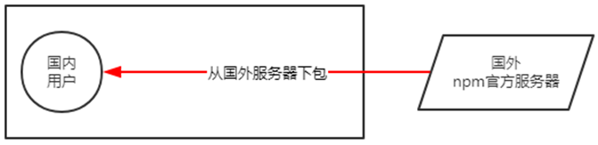

淘宝在国内搭建了一个服务器，专门把国外官方服务器上的包同步到国内的服务器，然后在国内提供下包的服务。从而极大的提高了下包的速度。

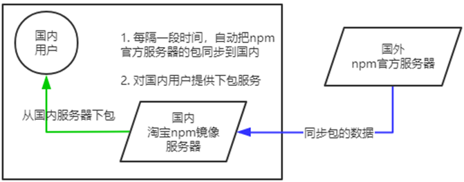

扩展：

镜像（Mirroring）是一种文件存储形式，一个磁盘上的数据在另一个磁盘上存在一个完全相同的副本即为镜像。

#### 3. 切换 npm 的下包镜像源

下包的镜像源，指的就是下包的服务器地址。

查看当前的下包镜像源

```powershell
npm config get registry
```

将下包的镜像源切换成淘宝镜像源

npm config set  registry=http

检查镜像源是否下载成功

```powershell
npm config get registry
```

4.nrm

为了更方便的切换下包的镜像源，我们可以安装 nrm 这个小工具，利用 nrm 提供的终端命令，可以快速查看和切换下包的镜像源。

通过npm包管理，将nrm安装为全局可用的工具

npm i nrm -g

查看所有可用的镜像源

nrm ls

将下包的镜像源切换为 taobao 镜像

nrm use taobao

#### 3.5 包的分类

使用 npm 包管理工具下载的包，共分为两大类，分别是：

l项目包

l全局包

1. 项目包

那些被安装到项目的 node_modules 目录中的包，都是项目包。

项目包又分为两类，分别是：

l 开发依赖包（被记录到 devDependencies 节点中的包，只在开发期间会用到）

l 核心依赖包（被记录到 dependencies 节点中的包，在开发期间和项目上线之后都会用到）

```powershell
//安装指定的包，并记录到 
npm i 包名 -D         #开发依赖包       devDependencies 节点中
npm i 包名            #核心依赖包          dependencies 节点中
```

2.全局包

在执行 npm install 命令时，如果提供了 -g 参数，则会把包安装为全局包。

全局包会被安装到 C:\Users\用户目录\AppData\Roaming\npm\node_modules 目录下。

```powershell
npm i 包名 -g                  #全局安装指定的包       
npm uninstall 包名 -g            #卸载全局指定的包    
```

注意：

①只有工具性质的包，才有全局安装的必要性。因为它们提供了好用的终端命令。

②判断某个包是否需要全局安装后才能使用，可以参考官方提供的使用说明即可。

3.i5ting_toc

i5ting_toc 是一个可以把 md 文档转为 html 页面的小工具，使用步骤如下：

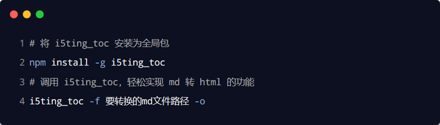

### 3.6 规范的包结构

在清楚了包的概念、以及如何下载和使用包之后，接下来，我们深入了解一下包的内部结构。

一个规范的包，它的组成结构，必须符合以下 3 点要求：

①包必须以单独的目录而存在

②包的顶级目录下要必须包含 package.json 这个包管理配置文件

③package.json 中必须包含 name，version，main 这三个属性，分别代表包的名字、版本号、包的入口。

注意：以上 3 点要求是一个规范的包结构必须遵守的格式，关于更多的约束，可以参考如下网址：

<https://yarnpkg.com/zh-Hans/docs/package-json>

### 3.7 开发属于自己的包

#### 1. 需要实现的功能

① 格式化日期

② 转义 HTML 中的特殊字符

③ 还原 HTML 中的特殊字符

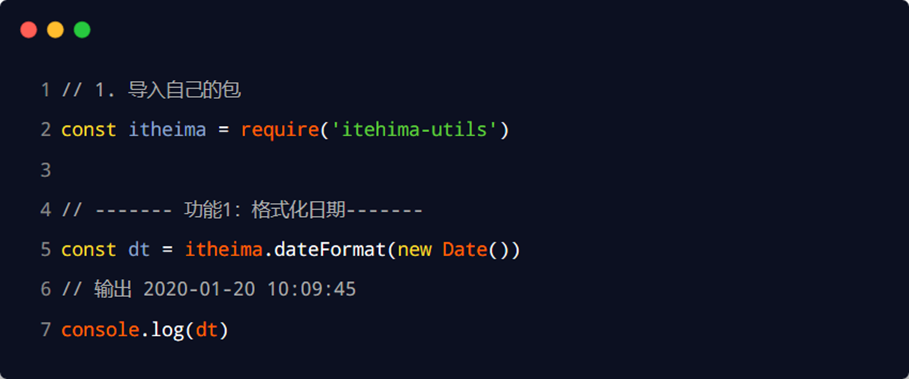

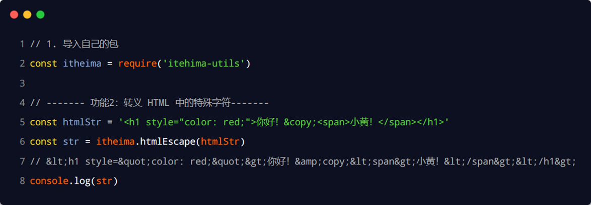

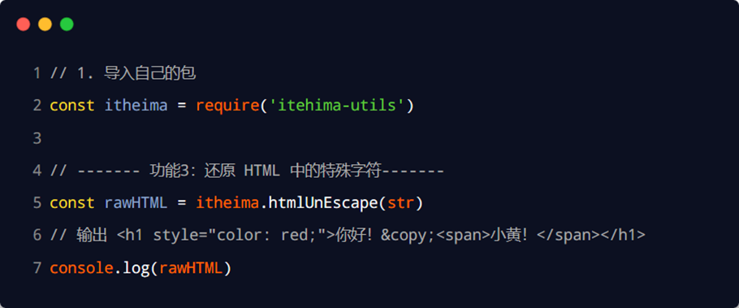


#### 2. 初始化包的基本结构

①新建 itheima-tools 文件夹，作为包的根目录

②在 itheima-tools 文件夹中，新建如下三个文件：

lpackage.json （包管理配置文件）

lindex.js     （包的入口文件）

lREADME.md （包的说明文档）

#### 3. 初始化 package.json

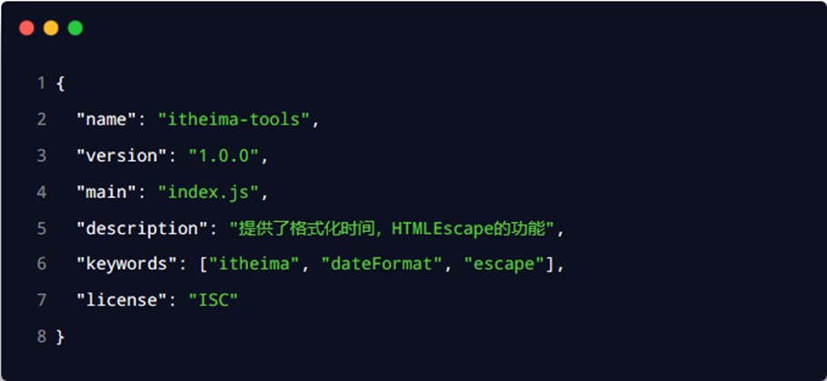

"name":为包名

keywords搜索关键字

关于更多 license 许可协议相关的内容，可参考 <https://www.jianshu.com/p/86251523e898>

#### 4. 在 index.js 中定义格式化时间的方法

```javascript
//dateFormat.js
// 定义格式化时间的函数
function dateFormat(dateStr) {
  const dt = new Date(dateStr)

  const y = dt.getFullYear()
  const m = padZero(dt.getMonth() + 1)
  const d = padZero(dt.getDate())

  const hh = padZero(dt.getHours())
  const mm = padZero(dt.getMinutes())
  const ss = padZero(dt.getSeconds())

  return `${y}-${m}-${d} ${hh}:${mm}:${ss}`
}

// 定义一个补零的函数
function padZero(n) {
  return n > 9 ? n : '0' + n
}
//向外暴露需要的成员
module.exports = {
  dateFormat
}

```

这是包的入口文件

```javascript
//index.js
const date = require('./src/dateFormat')
const escape = require('./src/htmlEscape')

// 向外暴露需要的成员
module.exports = {
  ...date,
  ...escape
}

```

```javascript
//test.js
const itheima = require ('./itheima-tools/index')
// 格式化时间的功能
const dtStr = itheima.dateFormat(new Date())
console.log(dtStr)
console.log('-----------')
```

#### 5.在 index.js 中定义转义 HTML 的方法

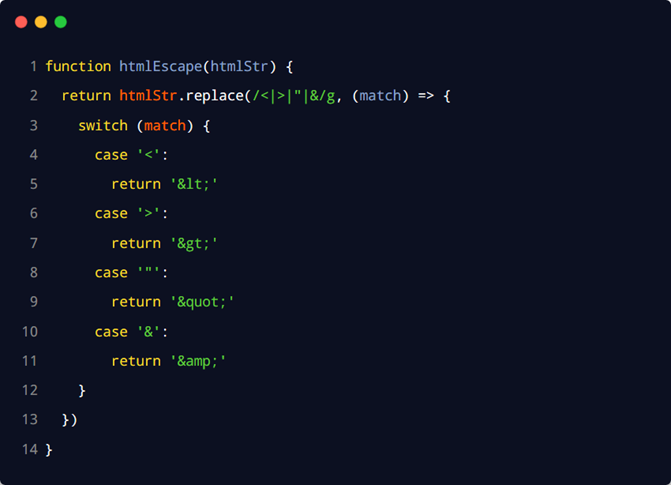

#### 6.在 index.js 中定义还原 HTML 的方法

```javascript
// htmlEscape.js
// 定义转义 HTML 字符的函数
function htmlEscape(htmlstr) {
  return htmlstr.replace(/<|>|"|&/g, match => {
    switch (match) {
      case '<':
        return '&lt;'
      case '>':
        return '&gt;'
      case '"':
        return '&quot;'
      case '&':
        return '&amp;'
    }
  })
}

//1. **正则表达式 `/&lt;|&gt;|&quot;|&amp;/g`**:
   - `&lt;`: 匹配 HTML 实体 `<`
   - `&gt;`: 匹配 HTML 实体 `>`
   - `&quot;`: 匹配 HTML 实体 `"`
   - `&amp;`: 匹配 HTML 实体 `&`
   - `|`: 表示“或”，即匹配其中任意一个实体。
   - `g`: 全局标志，表示在整个字符串中查找所有匹配项，而不仅仅是第一个。

// 定义还原 HTML 字符串的函数
function htmlUnEscape(str) {
  return str.replace(/&lt;|&gt;|&quot;|&amp;/g, match => {
    switch (match) {
      case '&lt;':
        return '<'
      case '&gt;':
        return '>'
      case '&quot;':
        return '"'
      case '&amp;':
        return '&'
    }
  })
}

module.exports = {
  htmlEscape,
  htmlUnEscape
}

```

7.将不同的功能进行模块化拆分

①将格式化时间的功能，拆分到 src -> dateFormat.js 中

②将处理 HTML 字符串的功能，拆分到 src -> htmlEscape.js 中

③在 index.js 中，导入两个模块，得到需要向外共享的方法

④在 index.js 中，使用 module.exports 把对应的方法共享出去

```javascript
// 这是包的入口文件

const date = require('./src/dateFormat')
const escape = require('./src/htmlEscape')

// 向外暴露需要的成员
module.exports = {
  ...date,
  ...escape
}

```

8.编写包的说明文档

包根目录中的 README.md 文件，是包的使用说明文档。通过它，我们可以事先把包的使用说明，以 markdown 的格式写出来，方便用户参考。

README 文件中具体写什么内容，没有强制性的要求；只要能够清晰地把包的作用、用法、注意事项等描述清楚即可。

我们所创建的这个包的 README.md 文档中，会包含以下 6 项内容：

安装方式、导入方式、格式化时间、转义 HTML 中的特殊字符、还原 HTML 中的特殊字符、开源协议

### 3.8 发布包

#### 1. 注册 npm 账号

①访问 <https://www.npmjs.com/> 网站，点击 sign up 按钮，进入注册用户界面

②填写账号相关的信息：Full Name、Public Email、Username、Password

③点击 Create an Account 按钮，注册账号

④登录邮箱，点击验证链接，进行账号的验证

#### 2. 登录 npm 账号

npm 账号注册完成后，可以在终端中执行 npm login 命令，依次输入用户名、密码、邮箱后，即可登录成功。

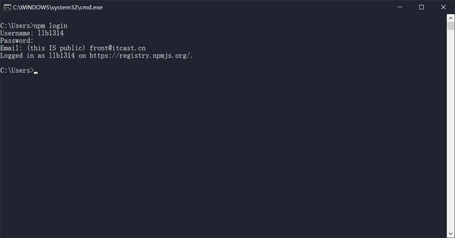

注意：在运行 npm login 命令之前，必须先把下包的服务器地址切换为 npm 的官方服务器。否则会导致发布包失败！

#### 3. 把包发布到 npm 上

将终端切换到包的根目录之后，运行 npm publish 命令，即可将包发布到 npm 上（注意：包名不能雷同）。

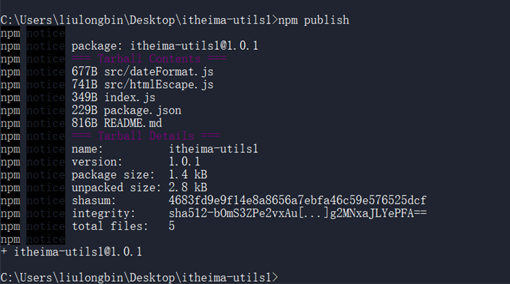

#### 4. 删除已发布的包

运行 npm unpublish 包名 --force 命令，即可从 npm 删除已发布的包。

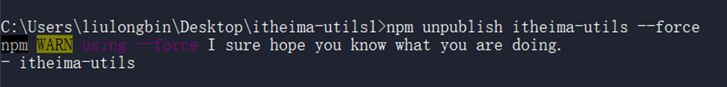

注意：

①npm unpublish 命令只能删除 72 小时以内发布的包

②npm unpublish 删除的包，在 24 小时内不允许重复发布

③发布包的时候要慎重，尽量不要往 npm 上发布没有意义的包！

## 模块的加载机制

### 4.1 优先从缓存中加载

模块在第一次加载后会被缓存。 这也意味着多次调用 require() 不会导致模块的代码被执行多次。

注意：不论是内置模块、用户自定义模块、还是第三方模块，它们都会优先从缓存中加载，从而提高模块的加载效率。

### 4.2 内置模块的加载机制

内置模块是由 Node.js 官方提供的模块，内置模块的加载优先级最高。

例如，require('fs') 始终返回内置的 fs 模块，即使在 node_modules 目录下有名字相同的包也叫做 fs。

### 4.3 自定义模块的加载机制

使用 require() 加载自定义模块时，必须指定以 ./ 或 ../ 开头的路径标识符。在加载自定义模块时，如果没有指定 ./ 或 ../ 这样的路径标识符，则 node 会把它当作内置模块或第三方模块进行加载。

同时，在使用 require() 导入自定义模块时，如果省略了文件的扩展名，则 Node.js 会按顺序分别尝试加载以下的文件：

①按照确切的文件名进行加载

②补全 .js 扩展名进行加载

③补全 .json 扩展名进行加载

④补全 .node 扩展名进行加载

⑤加载失败，终端报错

### 4.4 第三方模块的加载机制

如果传递给 require() 的模块标识符不是一个内置模块，也没有以 ‘./’ 或 ‘../’ 开头，则 Node.js 会从当前模块的父目录开始，尝试从 /node_modules 文件夹中加载第三方模块。

如果没有找到对应的第三方模块，则移动到再上一层父目录中，进行加载，直到文件系统的根目录。

例如，假设在 'C:\Users\itheima\project\foo.js' 文件里调用了 require('tools')，则 Node.js 会按以下顺序查找：

① C:\Users\itheima\project\node_modules\tools

② C:\Users\itheima\node_modules\tools

③ C:\Users\node_modules\tools

④ C:\node_modules\tools

### 4.5 目录作为模块

当把目录作为模块标识符，传递给 require() 进行加载的时候，有三种加载方式：

①在被加载的目录下查找一个叫做 package.json 的文件，并寻找 main 属性，作为 require() 加载的入口

②如果目录里没有 package.json 文件，或者 main 入口不存在或无法解析，则 Node.js 将会试图加载目录下的 index.js 文件。

③如果以上两步都失败了，则 Node.js 会在终端打印错误消息，报告模块的缺失：Error: Cannot find module 'xxx'
