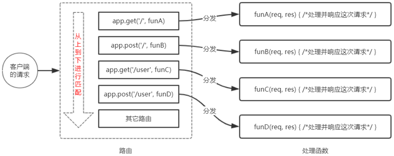
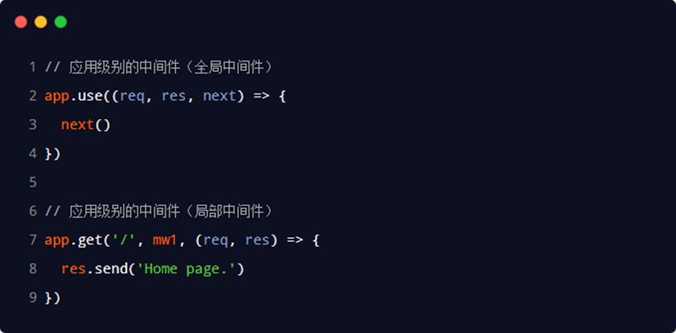
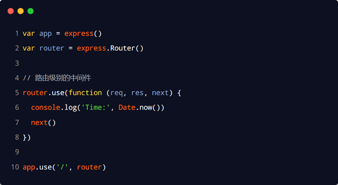
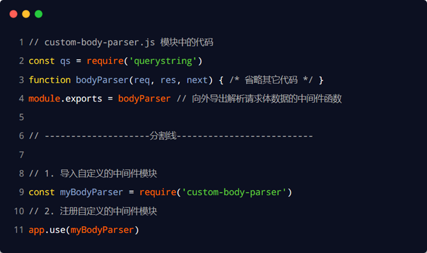
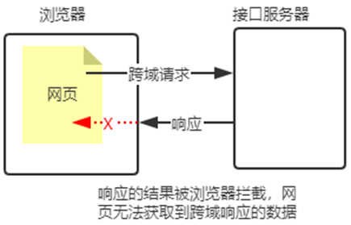
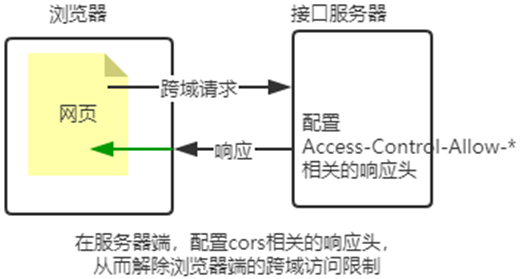
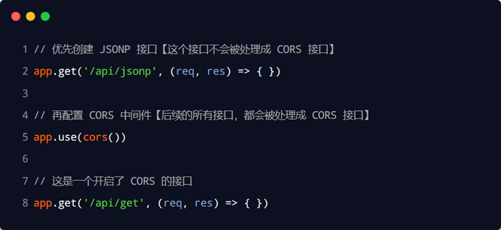

# 目标

能够使用 express.static() 快速托管静态资源

能够使用 express 路由精简项目结构

能够使用常见的 express 中间件

能够使用 express 创建 API 接口

能够在 express 中启用 cors 跨域资源共享

## 1.初识 Express

Express 是一个基于 Node.js 平台的快速、无框架 Web 应用程序框架。它由 TJ Holowaychuk 创造，旨在提供一种简单而灵活的方式来构建 Web 和移动应用程序。

以下是 Express 的一些关键特性和优势：

1. 路由：Express 提供了强大的路由功能，允许开发者定义不同的 HTTP 方法（如 GET、POST、PUT、DELETE 等）和 URL 路径来处理请求。

2. 中间件：Express 支持中间件函数，这些函数可以执行各种任务，如日志记录、错误处理、数据解析等，并且可以在请求到达最终的路由处理程序之前或之后执行。

3. 模板引擎集成：Express 可以与多种模板引擎（如 EJS、Pug、Handlebars 等）结合使用，以便生成动态 HTML 内容。

4. 静态文件服务：Express 提供了一个内置的中间件 `express.static`，可以方便地为应用程序提供静态文件服务，如 CSS、JavaScript 文件和图像。

5. 扩展性：由于 Express 是一个模块化的框架，开发者可以根据需要添加额外的功能和库，而不必依赖于框架本身提供的所有特性。

6. 社区支持：Express 拥有一个活跃的社区，提供了大量的插件和示例代码，使得开发过程更加便捷。

以下是一个简单的 Express 应用程序示例：

```javascript
const express = require('express');
const app = express();
const port = 3000;

// 定义一个路由处理程序
app.get('/', (req, res) => {
  res.send('Hello World!');
});

// 启动服务器
app.listen(port, () => {
  console.log(`Server is running on http://localhost:${port}`);
});
```

在这个示例中，我们创建了一个基本的 Express 应用程序，并定义了一个处理根路径 `/` 的 GET 请求的路由。当用户访问这个路径时，服务器会返回 "Hello World!" 的响应。

### 1. 什么是 Express

官方给出的概念：Express 是基于 Node.js 平台，快速、开放、极简的 Web 开发框架。

通俗的理解：Express 的作用和 Node.js 内置的 http 模块类似，是专门用来创建 Web 服务器的。

Express 的本质：就是一个 npm 上的第三方包，提供了快速创建 Web 服务器的便捷方法。

Express 的中文官网：[Express 的中文官网](http://www.expressjs.com.cn/)

#### 2. 进一步理解 Express

思考：不使用 Express 能否创建 Web 服务器？

答案：能，使用 Node.js 提供的原生 http 模块即可。

思考：既生瑜何生亮（有了 http 内置模块，为什么还有用 Express）？

答案：http 内置模块用起来很复杂，开发效率低；Express 是基于内置的 http 模块进一步封装出来的，能够极大的提高开发效率。

思考：http 内置模块与 Express 是什么关系？

答案：类似于浏览器中 Web API 和 jQuery 的关系。后者是基于前者进一步封装出来的。

#### 3. Express 能做什么

对于前端程序员来说，最常见的两种服务器，分别是：

- Web 网站服务器：专门对外提供 Web 网页资源的服务器。
- API 接口服务器：专门对外提供 API 接口的服务器。

使用 Express，我们可以方便、快速的创建 Web 网站的服务器或 API 接口的服务器。

### 1.2 Express 的基本使用

#### 1. 安装

在项目所处的目录中，运行如下的终端命令，即可将 express 安装到项目中使用：

```powershell
npm i express@4.17.1
```

#### 2. 创建基本的 Web 服务器

```javascript
// 1. 导入 express
const express = require('express')
// 2. 创建 web 服务器
const app = express()

// 3. 调用app.listen(端口号，启动成功后的回调函数)，启动 web 服务器
app.listen(80, () => {
  console.log('express server running at http://127.0.0.1')
})

```

#### 3. 监听 GET 请求

通过 app.get() 方法，可以监听客户端的 GET 请求，具体的语法格式如下：


#### 4. 监听 POST 请求

通过 app.post() 方法，可以监听客户端的 POST 请求，具体的语法格式如下：


#### 5. 把内容响应给客户端

通过 res.send() 方法，可以把处理好的内容，发送给客户端：

```javascript
app.get('/user', (req, res) => {
  // 调用 express 提供的 res.send() 方法，向客户端响应一个 JSON 对象
  res.send({ name: 'zs', age: 20, gender: '男' })
})
app.post('/user', (req, res) => {
  // 调用 express 提供的 res.send() 方法，向客户端响应一个 文本字符串
  res.send('请求成功')
})
```

#### 6. 获取 URL 中携带的查询参数

通过 req.query 对象，可以访问到客户端通过查询字符串的形式，发送到服务器的参数：

```javascript
app.get('/', (req, res) => {
  // 通过 req.query 可以获取到客户端发送过来的 查询参数
  // 注意：默认情况下，req.query 是一个空对象
  console.log(req.query)
  res.send(req.query)
})
```

完整代码：

```javascript
// 1. 导入 express
const express = require('express')
// 2. 创建 web 服务器
const app = express()

// 4. 监听客户端的 GET 和 POST 请求，并向客户端响应具体的内容
app.get('/user', (req, res) => {
  // 调用 express 提供的 res.send() 方法，向客户端响应一个 JSON 对象
  res.send({ name: 'zs', age: 20, gender: '男' })
})       // 注意：req.query 是一个对象{ name: 'zs', age: 20, gender: '男' }
app.post('/user', (req, res) => {
  // 调用 express 提供的 res.send() 方法，向客户端响应一个 文本字符串
  res.send('请求成功')
})
app.get('/', (req, res) => {
  // 通过 req.query 可以获取到客户端发送过来的 查询参数  
  console.log(req.query)
  res.send(req.query)
})                       // 注意：默认情况下，req.query 是一个空对象
// 注意：这里的 :id 是一个动态的参数
app.get('/user/:ids/:username', (req, res) => {
  // req.params 是动态匹配到的 URL 参数，默认也是一个空对象
  console.log(req.params)
  res.send(req.params)
})

// 3. 启动 web 服务器
app.listen(80, () => {
  console.log('express server running at http://127.0.0.1')
})

```

#### 7. 获取 URL 中的动态参数

通过 req.params 对象，可以访问到 URL 中，通过 : 匹配到的动态参数：

```javascript
// 注意：这里的 :id 是一个动态的参数
app.get('/user/:ids/:username', (req, res) => {
  // req.params 是动态匹配到的 URL 参数，默认也是一个空对象
  console.log(req.params)
  res.send(req.params)
})
```

路由参数允许你在 URL 中捕获动态值。完整代码：

```javascript
const express = require('express');
const app = express();

// 定义一个带有路由参数的路由
app.get('/users/:id', (req, res) => {
  // 获取路由参数 :id 的值
  const userId = req.params.id;
  res.send(`User ID: ${userId}`);
});

// 启动服务器
app.listen(3000, () => {
  console.log('Server is running on port 3000');
});
```

### 1.3 托管静态资源

#### 1. express.static()

托管静态资源是 Express 的一个重要功能，它允许你将静态文件（如 HTML、CSS、JavaScript 文件、图像等）提供给客户端访问。

express 提供了一个非常好用的函数，叫做 express.static()，通过它，我们可以非常方便地创建一个静态资源服务器，例如，通过如下代码就可以将 public 目录下的图片、CSS 文件、JavaScript 文件对外开放访问了：

```javascript
app.use(express.static('public'))
```

现在，你就可以访问 public 目录中的所有文件了：

<http://localhost:3000/images/bg.jpg>

<http://localhost:3000/css/style.css>

<http://localhost:3000/js/login.js>

注意：Express 在指定的静态目录中查找文件，并对外提供资源的访问路径。

因此，存放静态文件的目录名不会出现在 URL 中。

```javascript
const express = require('express')
const app = express()

// 在这里，调用 express.static() 方法，快速的对外提供静态资源
app.use('/files', express.static('./files'))
app.use(express.static('./clock'))

app.listen(80, () => {
  console.log('express server running at http://127.0.0.1')
})
```

   在上面的例子中，`public` 目录被设置为静态资源目录。这意味着你可以通过 URL 访问 `public` 目录中的文件。例如，如果你有一个名为 `index.html` 的文件在 `public` 目录中，你可以通过 `http://localhost:3000/index.html` 来访问它。

使用 `express.static` 中间件来托管静态资源。这个中间件会从指定的目录中提供静态文件。

   ```javascript
   const express = require('express');
   const app = express();
   const port = 3000;
   const path = require('path');

   // 设置静态资源目录
   app.use(express.static(path.join(__dirname, 'public')));

   // 其他代码...

   app.listen(port, () => {
     console.log(`Server is running on http://localhost:${port}`);
   });
   ```

   当客户端请求静态资源时，Express 会自动处理这些请求，并从指定的目录中提供相应的文件。例如，如果你有一个名为 `styles.css` 的 CSS 文件在 `public/css` 目录中，你可以通过 `http://localhost:3000/css/styles.css` 来访问它。

#### 2. 托管多个静态资源目录

如果要托管多个静态资源目录，请多次调用 express.static() 函数：

```javascript
app.use(express.static('public'))
app.use(express.static('files'))
```

访问静态资源文件时，express.static() 函数会根据目录的添加顺序查找所需的文件。

#### 3. 挂载路径前缀

如果希望在托管的静态资源访问路径之前，挂载路径前缀，则可以使用如下的方式：

```javascript
app.use('/public', express.static('public'))
```

现在，你就可以通过带有 /public 前缀地址来访问 public 目录中的文件了：

<http://localhost:3000/public/images/kitten.jpg>

<http://localhost:3000/public/css/style.css>

<http://localhost:3000/public/js/app.js>

### 1.4 nodemon

#### 1. 为什么要使用 nodemon

 `nodemon` 是一个用于 Node.js 应用程序的开发工具，它可以帮助开发者在代码发生变化时自动重启服务器。以下是 `nodemon` 的一些主要用途和优势：

1. 自动重启：当你的应用程序中的任何文件发生变化时，`nodemon` 会自动检测到这些变化并重启服务器。这大大减少了手动重启服务器的时间，提高了开发效率。

2. 简化开发流程：在开发过程中，频繁地重启服务器是一个常见的操作。使用 `nodemon` 可以减少这种重复性的工作，让开发者可以专注于编写代码而不是处理服务器重启的问题。

3. 提高可靠性：通过自动重启，`nodemon` 确保了在代码更改后服务器总是处于最新状态，从而避免了一些由于手动重启不及时导致的问题。

4. 支持多种环境变量：`nodemon` 支持设置环境变量，可以在不同的环境中运行不同的配置，这对于开发、测试和生产环境的管理非常有用。

5. 集成方便：`nodemon` 可以很容易地与各种构建工具和脚本集成，例如 npm 脚本或 Makefile。

在编写调试 Node.js 项目的时候，如果修改了项目的代码，则需要频繁的手动 close 掉，然后再重新启动，非常繁琐。

现在，我们可以使用 nodemon（<https://www.npmjs.com/package/nodemon>） 这个工具，它能够监听项目文件的变动，当代码被修改后，nodemon 会自动帮我们重启项目，极大方便了开发和调试。

#### 2. 安装 nodemon

在终端中，运行如下命令，即可将 nodemon 安装为全局可用的工具：

```bash
npm install -g nodemon                     #全局可用
npm install --save-dev nodemon
```

你可以在 `package.json` 中添加一个启动脚本，例如：

```json
"scripts": {
  "start": "nodemon app.js"
}
```

这样，当你运行 `npm start` 时，`nodemon` 会自动监视 `app.js` 文件及其子目录的变化，并在需要时重启服务器。

#### 3. 使用 nodemon

当基于 Node.js 编写了一个网站应用的时候，传统的方式，是运行 node app.js 命令，来启动项目。这样做的坏处是：代码被修改之后，需要手动重启项目。

现在，我们可以将 node 命令替换为 nodemon 命令，使用 nodemon app.js 来启动项目。这样做的好处是：代码被修改之后，会被 nodemon 监听到，从而实现自动重启项目的效果。

```javascript
node app.js

#将上面的终端命令，替换为下面的终端命令，即可实现自动重启项目的效果
nodemon app.js
```

## 2.Express 路由

### 2.1 路由的概念

#### 1. 什么是路由

- 路由：路由是指应用程序如何处理不同 URL 的请求。
- 路由方法：路由方法（如 `GET`, `POST`, `PUT`, `DELETE` 等）定义了对特定 URL 进行操作的方式。

广义上来讲，路由就是映射关系。

#### 2. 现实生活中的路由

按键 1 -> 业务查询

按键 2 -> 手机充值

按键 3 -> 业务办理

按键 4 -> 密码服务与停复机

按键 5 -> 家庭宽带

按键 6 -> 话费流量

按键 8 -> 集团业务

按键 0 -> 人工服务

在这里，路由是按键与服务之间的映射关系

#### 3. Express 中的路由

在 Express 中，路由指的是客户端的请求与服务器处理函数之间的映射关系。

Express 中的路由分 3 部分组成，分别是请求的类型、请求的 URL 地址、处理函数，格式如下：

```javascript
app.METHOD(PATH,HANDLER)
app.METHOD(path, callback)
app.METHOD(path, [callback...], callback)
```

在 Express 中，你可以使用 `app.METHOD(path, callback)` 或 `app.METHOD(path, [callback...], callback)` 来定义路由。其中：

- `app` 是 Express 应用实例。
- `METHOD` 是 HTTP 方法（如 `get`, `post`, `put`, `delete` 等）。
- `path` 是匹配的 URL 路径。
- HANDLER是服务器处理函数
- `callback` 是当路径匹配时执行的函数。

#### 4. Express 中的路由的例子

示例

```javascript
const express = require('express');
const app = express();

// 定义一个 GET 请求的路由
app.get('/', function(req, res) => {
  res.send('Hello World!');
});

// 定义一个 POST 请求的路由
app.post('/users', function(req, res) => {
  res.send('A new user was added.');
});

app.listen(3000, () => {
  console.log('Server is running on port 3000');
});
```

#### 5.路由的匹配过程

每当一个请求到达服务器之后，需要先经过路由的匹配，只有匹配成功之后，才会调用对应的处理函数。

在匹配时，会按照路由的顺序进行匹配，如果请求类型和请求的 URL 同时匹配成功，则 Express 会将这次请求，转交给对应的 function 函数进行处理。



路由匹配的注意点：

①按照定义的先后顺序进行匹配

②请求类型和请求的URL同时匹配成功，才会调用对应的处理函数

### 2.2 路由的使用

#### 1. 最简单的用法

在 Express 中使用路由最简单的方式，就是把路由挂载到 app实例上，示例代码如下：

```javascript
const express = require('express')
//创建WEb服务器，命名为app
const app = express()

// 挂载路由
app.get('/', (req, res) => {
  res.send('hello world.')
})
app.post('/', (req, res) => {
  res.send('Post Request.')
})
//启动WEB服务器
app.listen(80, () => {
  console.log('http://127.0.0.1')
})

```

#### 2. 模块化路由

为了方便对路由进行模块化的管理，Express 不建议将路由直接挂载到 app 上，而是推荐将路由抽离为单独的模块。

将路由抽离为单独模块的步骤如下：

①创建路由模块对应的 .js 文件

②调用 express.Router() 函数创建路由对象

③向路由对象上挂载具体的路由

④使用 module.exports 向外共享路由对象

⑤使用 app.use() 函数注册路由模块

#### 3. 创建路由模块

```javascript
var express = require('express')     //1.导入express
var router = express.Router()              //2.创建路由对象

router.get('/user/list',function(req,res){ //3.挂载获取用户列表的路由
    res.send('Get user list.')
})
router.post('/user/add',function(req,res){  //4.挂载添加用户的路由
    res.send('Add user list.')
})
module.exports = router      //5.向外导出路由对象
```

这是路由模块

```javascript
// router.js  
// 1. 导入 express
const express = require('express')
// 2. 创建路由对象
const router = express.Router()
// 3. 挂载具体的路由
router.get('/user/list', (req, res) => {
  res.send('Get user list.')
})
router.post('/user/add', (req, res) => {
  res.send('Add new user.')
})
// 4. 向外导出路由对象
module.exports = router
```

#### 4. 注册路由模块

```javascript
// 1. 导入路由模块
const useRouter = require('./router/user.js')
// 2. 使用app.use() 注册路由模块
app.use(useRouter)
```

使用router.js

```javascript
//模块化路由
const express = require('express')
const app = express()
// app.use('/files', express.static('./files'))
// 1. 导入路由模块
const router = require('./03.router')
// 2. 注册路由模块
app.use(router)
// 注意： app.use() 函数的作用，就是来注册全局中间件
app.listen(80, () => {
  console.log('http://127.0.0.1')
})
```

```javascript
请求地址：http://127.0.0.1/user/add
请求地址：http://127.0.0.1/user/list
```

#### 5. 为路由模块添加前缀

类似于托管静态资源时，为静态资源统一挂载访问前缀一样，路由模块添加前缀的方式也非常简单：

```javascript

// 1. 导入路由模块
const useRouter = require('./router/user.js')
// 2. 使用app.use() 注册路由模块，并添加统一的访问前缀/api
app.use('/api', useRouter)
```

路由模块添加前缀

```javascript
//模块化路由
const express = require('express')
const app = express()
// app.use('/files', express.static('./files'))
// 1. 导入路由模块
const router = require('./03.router')
// 2. 注册路由模块
// 2. 使用app.use() 注册路由模块，并添加统一的访问前缀/api
app.use('/api', router)
// 注意： app.use() 函数的作用，就是来注册全局中间件
app.listen(80, () => {
  console.log('http://127.0.0.1')
})
```

```javascript
请求地址：http://127.0.0.1/api/user/add
```

## 3.Express 中间件

### 3.1 中间件的概念

#### 1. 什么是中间件

中间件（Middleware ），特指业务流程的中间处理环节。

#### 2. 现实生活中的例子

在处理污水的时候，一般都要经过三个处理环节，从而保证处理过后的废水，达到排放标准。


处理污水的这三个中间处理环节，就可以叫做中间件。

#### 3. Express 中间件的调用流程

当一个请求到达 Express 的服务器之后，可以连续调用多个中间件，从而对这次请求进行预.处理。


#### 4. Express 中间件的格式

Express 的中间件，本质上就是一个 function 处理函数，Express 中间件的格式如下：


注意：中间件函数的形参列表中，必须包含 next 参数。而路由处理函数中只包含 req 和 res。

#### 5. next 函数的作用

next 函数是实现多个中间件连续调用的关键，它表示把流转关系转交给下一个中间件或路由。


### 3.2 Express 中间件的初体验

#### 1. 定义中间件函数

可以通过如下的方式，定义一个最简单的中间件函数：

```javascript
const express = require('express')
const app = express()

// 定义一个最简单的中间件函数
const mw = function (req, res, next) {
   console.log('这是一个最简单的中间件函数')
   //注意，在当前中间件的业务处理完毕后，必须调用next()函数
   next() // 表示把流转关系，转交给下一个中间件或路由
 }
app.listen(80, () => {
  console.log('http://127.0.0.1')
})
```

#### 2. 全局生效的中间件

客户端发起的任何请求，到达服务器之后，都会触发的中间件，叫做全局生效的中间件。

通过调用 app.use(中间件函数)，即可定义一个全局生效的中间件，示例代码如下：

```javascript
const express = require('express')
const app = express()

// 常量 mw所指向的，就是一个最简单的中间件函数
const mw = function (req, res, next) {
   console.log('这是一个最简单的中间件函数')
   //注意，在当前中间件的业务处理完毕后，必须调用next()函数
   next() // 表示把流转关系，转交给下一个中间件或路由
 }
// 将 mw 注册为全局生效的中间件
app.use(mw)
app.get('/', (req, res) => {
  console.log('调用了 / 这个路由')
  res.send('Home page.')
})
app.get('/user', (req, res) => {
  console.log('调用了 /user 这个路由')
  res.send('User page.')
})
app.listen(80, () => {
  console.log('http://127.0.0.1')
})
```

```javascript
请求地址：http://127.0.0.1/user
```

#### 3. 定义全局中间件的简化形式

```javascript
const express = require('express')
const app = express()

// // 定义一个最简单的中间件函数
// const mw = function (req, res, next) {
//   console.log('这是最简单的中间件函数')
//   // 把流转关系，转交给下一个中间件或路由
//   next()
// }

// // 将 mw 注册为全局生效的中间件
// app.use(mw)

// 这是定义全局中间件的简化形式
app.use((req, res, next) => {
  console.log('这是最简单的中间件函数')
  next()
})

app.get('/', (req, res) => {
  console.log('调用了 / 这个路由')
  res.send('Home page.')
})
app.get('/user', (req, res) => {
  console.log('调用了 /user 这个路由')
  res.send('User page.')
})

app.listen(80, () => {
  console.log('http://127.0.0.1')
})
```

#### 4. 中间件的作用

多个中间件之间，共享同一份 req 和 res。基于这样的特性，我们可以在上游的中间件中，统一为 req 或 res 对象添加自定义的属性或方法，供下游的中间件或路由进行使用。


req.a = 10

res.c = 30

访问 req.a 和res.c 属性的值

```javascript
const express = require('express')
const app = express()

// 这是定义全局中间件的简化形式
app.use((req, res, next) => {
  // 获取到请求到达服务器的时间
  const time = Date.now()
  // 为 req 对象，挂载自定义属性，从而把时间共享给后面的所有路由
  req.startTime = time
  next()
})

app.get('/', (req, res) => {
  res.send('Home page.' + req.startTime)
})
app.get('/user', (req, res) => {
  res.send('User page.' + req.startTime)
})

app.listen(80, () => {
  console.log('http://127.0.0.1')
})
```

使用中间件

中间件是 Express 中间件函数，它们可以访问请求对象 (`req`)、响应对象 (`res`) 和应用程序的请求-响应循环中的下一个中间件函数。

```javascript
function logger(req, res, next) {
  console.log(`${req.method} ${req.url}`);
  next();
}

app.use(logger);

app.get('/example', (req, res) => {
  res.send('This is an example route.');
});
```

#### 5. 定义多个全局中间件

可以使用 app.use() 连续定义多个全局中间件。客户端请求到达服务器之后，会按照中间件定义的先后顺序依次进行调用，示例代码如下：

路由组

```javascript
const usersRouter = express.Router();

usersRouter.get('/', (req, res) => {
  res.send('Users list');
});

usersRouter.get('/:id', (req, res) => {
  const userId = req.params.id;
  res.send(`User ID: ${userId}`);
});

app.use('/users', usersRouter);
```

你可以将相关的路由分组到一起，以便更好地组织代码。

```javascript
const express = require('express')
const app = express()

// 定义第一个全局中间件
app.use(function(req, res, next) => {
  console.log('调用了第1个全局中间件')
  next()
})
// 定义第二个全局中间件
app.use((req, res, next) => {
  console.log('调用了第2个全局中间件')
  next()
})

// 定义一个路由
app.get('/user', (req, res) => {
  res.send('User page.')
})

app.listen(80, () => {
  console.log('http://127.0.0.1')
})

```

#### 6. 局部生效的中间件

不使用 app.use() 定义的中间件，叫做局部生效的中间件，示例代码如下：

```javascript
// 导入 express 模块
const express = require('express')
// 创建 express 的服务器实例
const app = express()

// 1. 定义中间件函数
const mw1 = (req, res, next) => {
  console.log('调用了局部生效的中间件')
  next()
}

// 2. 创建路由
app.get('/', mw1, (req, res) => {
  res.send('Home page.')
})                                //mw1局部生效的中间件，只在'/'地址生效
app.get('/user', (req, res) => {
  res.send('User page.')
})

// 调用 app.listen 方法，指定端口号并启动web服务器
app.listen(80, function () {
  console.log('Express server running at http://127.0.0.1')
})

```

#### 7. 定义多个局部中间件

可以在路由中，通过如下两种等价的方式，使用多个局部中间件：

```javascript
app.get('/', mw1, mw2, (req, res) => {  res.send('Home page.')})
app.get('/', [mw1, mw2], (req, res) => {  res.send('Home page.')})
```

多个回调函数

你可以在一个路由中使用多个回调函数，这些函数可以按顺序执行。

```javascript
app.get('/example', (req, res, next) => {
  console.log('First function');
  next();
}, (req, res) => {
  console.log('Second function');
  res.send('Response from second function');
});
```

导入 express 模块

```javascript
// 导入 express 模块
const express = require('express')
// 创建 express 的服务器实例
const app = express()

// 1. 定义中间件函数
const mw1 = (req, res, next) => {
  console.log('调用了第一个局部生效的中间件')
  next()
}

const mw2 = (req, res, next) => {
  console.log('调用了第二个局部生效的中间件')
  next()
}

// 2. 创建路由
app.get('/', [mw1, mw2], (req, res) => {
  res.send('Home page.')
})
app.get('/user', (req, res) => {
  res.send('User page.')
})

// 调用 app.listen 方法，指定端口号并启动web服务器
app.listen(80, function () {
  console.log('Express server running at http://127.0.0.1')
})

```

#### 8. 了解中间件的5个使用注意事项

①一定要在路由之前注册中间件

②客户端发送过来的请求，可以连续调用多个中间件进行处理

③执行完中间件的业务代码之后，不要忘记调用 next() 函数

④为了防止代码逻辑混乱，调用 next() 函数后不要再写额外的代码

⑤连续调用多个中间件时，多个中间件之间，共享 req 和 res 对象

### 3.3 中间件的分类

为了方便大家理解和记忆中间件的使用，Express 官方把常见的中间件用法，分成了 5 大类，分别是：

① 应用级别的中间件

② 路由级别的中间件

③ 错误级别的中间件

④ Express 内置的中间件

⑤ 第三方的中间件

#### 1. 应用级别的中间件

通过 app.use() 或 app.get() 或 app.post() ，绑定到 app 实例上的中间件，叫做应用级别的中间件，代码示例如下：



#### 2. 路由级别的中间件

绑定到 express.Router() 实例上的中间件，叫做路由级别的中间件。它的用法和应用级别中间件没有任何区别。只不过，应用级别中间件是绑定到 app 实例上，路由级别中间件绑定到 router 实例上，代码示例如下：



#### 3. 错误级别的中间件

错误级别中间件的作用：专门用来捕获整个项目中发生的异常错误，从而防止项目异常崩溃的问题。

格式：错误级别中间件的 function 处理函数中，必须有 4 个形参，形参顺序从前到后，分别是 (err, req, res, next)。

```javascript
// 导入 express 模块
const express = require('express')
// 创建 express 的服务器实例
const app = express()

// 1. 定义路由
app.get('/', (req, res) => {
  // 1.1 人为的制造错误
  throw new Error('服务器内部发生了错误！')
  res.send('Home page.')
})

// 2. 定义错误级别的中间件，捕获整个项目的异常错误，从而防止程序的崩溃
app.use((err, req, res, next) => {
  console.log('发生了错误！' + err.message)
  res.send('Error：' + err.message)
})

// 调用 app.listen 方法，指定端口号并启动web服务器
app.listen(80, function () {
  console.log('Express server running at http://127.0.0.1')
})

```

注意：错误级别的中间件，必须注册在所有路由之后！

#### 4. Express内置的中间件

自 Express 4.16.0 版本开始，Express 内置了 3 个常用的中间件，极大的提高了 Express 项目的开发效率和体验：

① express.static 快速托管静态资源的内置中间件，例如： HTML 文件、图片、CSS 样式等（无兼容性）

② express.json 解析 JSON 格式的请求体数据（有兼容性，仅在 4.16.0+ 版本中可用）

```javascript
// 导入 express 模块
const express = require('express')
// 创建 express 的服务器实例
const app = express()

// 注意：除了错误级别的中间件，其他的中间件，必须在路由之前进行配置
// 通过 express.json() 这个中间件，解析表单中的 JSON 格式的数据
app.use(express.json())
app.post('/user', (req, res) => {
  // 在服务器，可以使用 req.body 这个属性，来接收客户端发送过来的请求体数据
  // 默认情况下，如果不配置解析表单数据的中间件，则 req.body 默认等于 undefined
  console.log(req.body)
  res.send('ok')
})
// 调用 app.listen 方法，指定端口号并启动web服务器
app.listen(80, function () {
  console.log('Express server running at http://127.0.0.1')
})
```

③ express.urlencoded 解析 URL-encoded 格式的请求体数据（有兼容性，仅在 4.16.0+ 版本中可用）

```javascript
// 导入 express 模块
const express = require('express')
// 创建 express 的服务器实例
const app = express()

// 注意：除了错误级别的中间件，其他的中间件，必须在路由之前进行配置
// 通过 express.json() 这个中间件，解析表单中的 JSON 格式的数据
app.use(express.json())
// 通过 express.urlencoded() 这个中间件，来解析 表单中的 url-encoded 格式的数据
app.use(express.urlencoded({ extended: false }))

app.post('/user', (req, res) => {
  // 在服务器，可以使用 req.body 这个属性，来接收客户端发送过来的请求体数据
  // 默认情况下，如果不配置解析表单数据的中间件，则 req.body 默认等于 undefined
  console.log(req.body)
  res.send('ok')
})

app.post('/book', (req, res) => {
  // 在服务器端，可以通过 req,body 来获取 JSON 格式的表单数据和 url-encoded 格式的数据
  console.log(req.body)
  res.send('ok')
})

// 调用 app.listen 方法，指定端口号并启动web服务器
app.listen(80, function () {
  console.log('Express server running at http://127.0.0.1')
})

```


#### 5. 第三方的中间件

非 Express 官方内置的，而是由第三方开发出来的中间件，叫做第三方中间件。在项目中，大家可以按需下载并配置第三方中间件，从而提高项目的开发效率。

例如：在 express@4.16.0 之前的版本中，经常使用 body-parser 这个第三方中间件，来解析请求体数据。使用步骤如下：

①运行 npm install body-parser 安装中间件

②使用 require 导入中间件

③调用 app.use() 注册并使用中间件

```javascript
// 导入 express 模块
const express = require('express')
// 创建 express 的服务器实例
const app = express()

// 1. 导入解析表单数据的中间件 body-parser
const parser = require('body-parser')
// 2. 使用 app.use() 注册中间件
app.use(parser.urlencoded({ extended: false }))
// app.use(express.urlencoded({ extended: false }))

app.post('/user', (req, res) => {
  // 如果没有配置任何解析表单数据的中间件，则 req.body 默认等于 undefined
  console.log(req.body)
  res.send('ok')
})

// 调用 app.listen 方法，指定端口号并启动web服务器
app.listen(80, function () {
  console.log('Express server running at http://127.0.0.1')
})
```

注意：Express 内置的 express.urlencoded 中间件，就是基于 body-parser 这个第三方中间件进一步封装出来的。

### 3.4 自定义中间件

#### 1. 需求描述与实现步骤

自己手动模拟一个类似于 express.urlencoded 这样的中间件，来解析 POST 提交到服务器的表单数据。

实现步骤：

①定义中间件

②监听 req 的 data 事件

③监听 req 的 end 事件

④使用 querystring 模块解析请求体数据

⑤将解析出来的数据对象挂载为 req.body

⑥将自定义中间件封装为模块

#### 2. 定义中间件

使用 app.use() 来定义全局生效的中间件，代码如下：

```javascript
app.use(function(req,res,next){
//中间件的业务逻辑
})
```

#### 3. 监听 req 的 data 事件

在中间件中，需要监听 req 对象的 data 事件，来获取客户端发送到服务器的数据。

如果数据量比较大，无法一次性发送完毕，则客户端会把数据切割后，分批发送到服务器。所以 data 事件可能会触发多次，每一次触发 data 事件时，获取到数据只是完整数据的一部分，需要手动对接收到的数据进行拼接。

```javascript
//定义变量，用来存储客户端发送过来的请求体数据
let str = ''
//监听req对象的data事件（客户端发送过来的新的请求体数据）
req.on('data',(chunk)=>{
//拼接请求体数据，隐式转换为字符串
str += chunk
})
```

#### 4. 监听 req 的 end 事件

当请求体数据接收完毕之后，会自动触发 req 的 end 事件。

因此，我们可以在 req 的 end 事件中，拿到并处理完整的请求体数据。示例代码如下：

```javascript
 //监听req 对象的end 事件（请求体发送完毕后自动触发）
 req.on('end', () => {
    // 在 str 中存放的是完整的请求体数据
   console.log(str)
    // TODO: 把字符串格式的请求体数据，解析成对象格式

  })
```

```javascript
// 导入 express 模块         测试
const express = require('express')
// 创建 express 的服务器实例
const app = express()
// 这是解析表单数据的中间件
app.use((req, res, next) => {
  // 定义中间件具体的业务逻辑
  // 1. 定义一个 str 字符串，专门用来存储客户端发送过来的请求体数据
  let str = ''
  // 2. 监听 req 的 data 事件
  req.on('data', (chunk) => {
    str += chunk
  })
  // 3. 监听 req 的 end 事件
  req.on('end', () => {
    // 在 str 中存放的是完整的请求体数据
    console.log(str)
    // TODO: 把字符串格式的请求体数据，解析成对象格式

  })
})
// 调用 app.listen 方法，指定端口号并启动web服务器
app.listen(80, function () {
  console.log('Express server running at http://127.0.0.1')
})
```

#### 5. 使用 querystring 模块解析请求体数据

Node.js 内置了一个 querystring 模块，专门用来处理查询字符串。通过这个模块提供的 parse() 函数，可以轻松把查询字符串，解析成对象的格式。示例代码如下：

```javascript
//导入处理querystring的node.js内置模块
const qs = require('querystring')
//调用qs.parse()方法，把查询字符串解析为对象
const body = qs.parse(str)
```

6.将解析出来的数据对象挂载为 req.body

上游的中间件和下游的中间件及路由之间，共享同一份 req 和 res。因此，我们可以将解析出来的数据，挂载为 req 的自定义属性，命名为 req.body，供下游使用。示例代码如下：

```javascript
// 3. 监听 req 的 end 事件
  req.on('end', () => {
    // 在 str 中存放的是完整的请求体数据
    // console.log(str)
    // TODO: 把字符串格式的请求体数据，解析成对象格式
    const body = qs.parse(str) //调用qs.parse()方法，把查询字符串解析为对象
    req.body = body //将解析出来的请求体对象，挂载为req.body属性
    next()    //执行后续的业务逻辑
    }
```

```javascript
// 导入 express 模块
const express = require('express')
// 创建 express 的服务器实例
const app = express()
// 导入 Node.js 内置的 querystring 模块
const qs = require('querystring')

// 这是解析表单数据的中间件
app.use((req, res, next) => {
  // 定义中间件具体的业务逻辑
  // 1. 定义一个 str 字符串，专门用来存储客户端发送过来的请求体数据
  let str = ''
  // 2. 监听 req 的 data 事件
  req.on('data', (chunk) => {
    str += chunk
  })
  // 3. 监听 req 的 end 事件
  req.on('end', () => {
    // 在 str 中存放的是完整的请求体数据
    // console.log(str)
    // TODO: 把字符串格式的请求体数据，解析成对象格式
    const body = qs.parse(str) //调用qs.parse()方法，把查询字符串解析为对象
    req.body = body  //将解析出来的请求体对象，挂载为req.body属性
    next()    //执行后续的业务逻辑
  })
})

app.post('/user', (req, res) => {
  res.send(req.body)
})

// 调用 app.listen 方法，指定端口号并启动web服务器
app.listen(80, function () {
  console.log('Express server running at http://127.0.0.1')
})

```

7.将自定义中间件封装为模块

为了优化代码的结构，我们可以把自定义的中间件函数，封装为独立的模块，示例代码如下：



```javascript
// 导入 express 模块
const express = require('express')
// 创建 express 的服务器实例
const app = express()

// 1. 导入自己封装的中间件模块
const customBodyParser = require('./14.custom-body-parser')
// 2. 将自定义的中间件函数，注册为全局可用的中间件
app.use(customBodyParser)

app.post('/user', (req, res) => {
  res.send(req.body)
})

// 调用 app.listen 方法，指定端口号并启动web服务器
app.listen(80, function () {
  console.log('Express server running at http://127.0.0.1')
})

```

## 4. 使用 Express 写接口

### 4.1 创建基本的服务器

```javascript
// 导入 express
const express = require('express')
// 创建服务器实例
const app = express()

// write your code here...

// 启动服务器
app.listen(80, () => {
  console.log('express server running at http://127.0.0.1')
})
```

### 4.2 创建 API 路由模块

```javascript

const express = require('express')
// 创建服务器实例
const apiRouter = express.Router()

// bind your router here...

module.exports = apiRouter

// 导入路由模块
const apiRouter = require('./apiRouter')
// 把路由模块，注册到 app 上
app.use('/api', apiRouter)
```

案例：

```javascript
// 导入 express  使用express写接口.js
const express = require('express')
// 创建服务器实例
const app = express()

// 配置解析表单数据的中间件
app.use(express.urlencoded({ extended: false }))


// 导入路由模块
const router = require('./16.apiRouter')
// 把路由模块，注册到 app 上
app.use('/api', router)

// 启动服务器
app.listen(80, () => {
  console.log('express server running at http://127.0.0.1')
})
```

### 4.3 编写 GET 接口

```javascript
// 在这里挂载对应的路由
apiRouter.get('/get', (req, res) => {
  // 通过 req.query 获取客户端通过查询字符串，发送到服务器的数据
  const query = req.query
  // 调用 res.send() 方法，向客户端响应处理的结果
  res.send({
    status: 0, // 0 表示处理成功，1 表示处理失败
    msg: 'GET 请求成功！', // 状态的描述
    data: query, // 需要响应给客户端的数据
  })
})

```

案例

```javascript
// 16.apiRouter.js 路由模块
const express = require('express')
const router = express.Router()

// 在这里挂载对应的路由
router.get('/get', (req, res) => {
  // 通过 req.query 获取客户端通过查询字符串，发送到服务器的数据
  const query = req.query
  // 调用 res.send() 方法，向客户端响应处理的结果
  res.send({
    status: 0, // 0 表示处理成功，1 表示处理失败
    msg: 'GET 请求成功！', // 状态的描述
    data: query, // 需要响应给客户端的数据
  })
})
module.exports = router
```

### 4.4 编写 POST 接口

```javascript
const express = require('express')
const router = express.Router()

module.exports = apiRouter

// 定义 POST 接口
apiRouter.post('/post', (req, res) => {
  // 通过 req.body 获取请求体中包含的 url-encoded 格式的数据
  const body = req.body
  // 调用 res.send() 方法，向客户端响应结果
  res.send({
    status: 0,
    msg: 'POST 请求成功！',
    data: body,
  })
})

module.exports = apiRouter
```

案例

```javascript
// 16.apiRouter.js 路由模块
const express = require('express')
const router = express.Router()

// 定义 POST 接口
router.post('/post', (req, res) => {
  // 通过 req.body 获取请求体中包含的 url-encoded 格式的数据
  const body = req.body
  // 调用 res.send() 方法，向客户端响应结果
  res.send({
    status: 0,
    msg: 'POST 请求成功！',
    data: body,
  })
})
module.exports = router
```

注意：如果要获取 URL-encoded 格式的请求体数据，必须配置中间件 app.use(express.urlencoded({ extended: false }))

### 4.5 CORS 跨域资源共享

#### 1. 接口的跨域问题

刚才编写的 GET 和 POST接口，存在一个很严重的问题：不支持跨域请求。

解决接口跨域问题的方案主要有两种：

① CORS（主流的解决方案，推荐使用）

② JSONP（有缺陷的解决方案：只支持 GET 请求）

files/http

#### 2. 使用 cors 中间件解决跨域问题

cors 是 Express 的一个第三方中间件。通过安装和配置 cors 中间件，可以很方便地解决跨域问题。

使用步骤分为如下 3 步：

①运行 npm install cors 安装中间件

②使用 const cors = require('cors') 导入中间件

③在路由之前调用 app.use(cors()) 配置中间件

```javascript
// 导入 express
const express = require('express')
// 创建服务器实例
const app = express()

// 配置解析表单数据的中间件
app.use(express.urlencoded({ extended: false }))

// 必须在配置 cors 中间件之前，配置 JSONP 的接口
app.get('/api/jsonp', (req, res) => {
  // TODO: 定义 JSONP 接口具体的实现过程
  // 1. 得到函数的名称
  const funcName = req.query.callback
  // 2. 定义要发送到客户端的数据对象
  const data = { name: 'zs', age: 22 }
  // 3. 拼接出一个函数的调用
  const scriptStr = `${funcName}(${JSON.stringify(data)})`
  // 4. 把拼接的字符串，响应给客户端
  res.send(scriptStr)
})

// 一定要在路由之前，配置 cors 这个中间件，从而解决接口跨域的问题
const cors = require('cors')
app.use(cors())

// 导入路由模块
const router = require('./16.apiRouter')
// 把路由模块，注册到 app 上
app.use('/api', router)

// 启动服务器
app.listen(80, () => {
  console.log('express server running at http://127.0.0.1')
})
```

#### 3. 什么是 CORS

CORS （Cross-Origin Resource Sharing，跨域资源共享）由一系列 HTTP 响应头组成，这些 HTTP 响应头决定浏览器是否阻止前端 JS 代码跨域获取资源。

浏览器的同源安全策略默认会阻止网页“跨域”获取资源。但如果接口服务器配置了 CORS 相关的 HTTP 响应头，就可以解除浏览器端的跨域访问限制。





#### 4. CORS 的注意事项

①CORS 主要在服务器端进行配置。客户端浏览器无须做任何额外的配置，即可请求开启了 CORS 的接口。

②CORS 在浏览器中有兼容性。只有支持 XMLHttpRequest Level2 的浏览器，才能正常访问开启了 CORS 的服务端接口（例如：IE10+、Chrome4+、FireFox3.5+）。

#### 5. CORS 响应头部 - Access-Control-Allow-Origin

响应头部中可以携带一个 Access-Control-Allow-Origin 字段，其语法如下:

```javascript
Access-Control-Allow-Origin：<origin>|*
```

其中，origin 参数的值指定了允许访问该资源的外域 URL。

例如，下面的字段值将只允许来自 <http://itcast.cn> 的请求：

```javascript
res.setHeader('Access-Control-Allow-Origin','http://itcast.cn')
```

如果指定了 Access-Control-Allow-Origin 字段的值为通配符 *，表示允许来自任何域的请求，示例代码如下：

```javascript
res.setHeader('Access-Control-Allow-Origin','*')
```

#### 6.CORS 响应头部 - Access-Control-Allow-Headers

默认情况下，CORS 仅支持客户端向服务器发送如下的 9 个请求头：

Accept、Accept-Language、Content-Language、DPR、Downlink、Save-Data、Viewport-Width、Width 、Content-Type （值仅限于 text/plain、multipart/form-data、application/x-www-form-urlencoded 三者之一）

如果客户端向服务器发送了额外的请求头信息，则需要在服务器端，通过 Access-Control-Allow-Headers 对额外的请求头进行声明，否则这次请求会失败！


#### 7. CORS 响应头部 - Access-Control-Allow-Methods

默认情况下，CORS 仅支持客户端发起 GET、POST、HEAD 请求。

如果客户端希望通过 PUT、DELETE 等方式请求服务器的资源，则需要在服务器端，通过 Access-Control-Alow-Methods来指明实际请求所允许使用的 HTTP 方法。

示例代码如下：


#### 8. CORS请求的分类

客户端在请求 CORS 接口时，根据请求方式和请求头的不同，可以将 CORS 的请求分为两大类，分别是：

①简单请求

②预检请求

#### 9. 简单请求

同时满足以下两大条件的请求，就属于简单请求：

① 请求方式：GET、POST、HEAD 三者之一

② HTTP 头部信息不超过以下几种字段：无自定义头部字段、Accept、Accept-Language、Content-Language、DPR、Downlink、Save-Data、Viewport-Width、Width 、Content-Type（只有三个值application/x-www-form-urlencoded、multipart/form-data、text/plain）

#### 10. 预检请求

只要符合以下任何一个条件的请求，都需要进行预检请求：

① 请求方式为 GET、POST、HEAD 之外的请求 Method 类型

② 请求头中包含自定义头部字段

③ 向服务器发送了 application/json 格式的数据

在浏览器与服务器正式通信之前，浏览器会先发送 OPTION 请求进行预检，以获知服务器是否允许该实际请求，所以这一次的 OPTION 请求称为“预检请求”。服务器成功响应预检请求后，才会发送真正的请求，并且携带真实数据。

#### 11. 简单请求和预检请求的区别

简单请求的特点：客户端与服务器之间只会发生一次请求。

预检请求的特点：客户端与服务器之间会发生两次请求，OPTION 预检请求成功之后，才会发起真正的请求。

### 4.6 JSONP 接口

#### 1.回顾 JSONP 的概念与特点

概念：浏览器端通过 \<script\> 标签的 src 属性，请求服务器上的数据，同时，服务器返回一个函数的调用。这种请求数据的方式叫做 JSONP。

特点：

①JSONP 不属于真正的 Ajax 请求，因为它没有使用 XMLHttpRequest 这个对象。

②JSONP 仅支持 GET 请求，不支持 POST、PUT、DELETE 等请求。

#### 2.创建 JSONP 接口的注意事项

如果项目中已经配置了 CORS 跨域资源共享，为了防止冲突，必须在配置 CORS 中间件之前声明 JSONP 的接口。否则 JSONP 接口会被处理成开启了 CORS 的接口。示例代码如下：



#### 3.实现 JSONP 接口的步骤

①获取客户端发送过来的回调函数的名字

②得到要通过 JSONP 形式发送给客户端的数据

③根据前两步得到的数据，拼接出一个函数调用的字符串

④把上一步拼接得到的字符串，响应给客户端的\<script\> 标签进行解析执行

#### 4. 实现 JSONP 接口的具体代码

```javascript
app.get('/api/jsonp', (req, res) => {
  // TODO: 定义 JSONP 接口具体的实现过程
  // 1. 得到函数的名称
  const funcName = req.query.callback
  // 2. 定义要发送到客户端的数据对象
  const data = { name: 'zs', age: 22 }
  // 3. 拼接出一个函数的调用
  const scriptStr = `${funcName}(${JSON.stringify(data)})`
  // 4. 把拼接的字符串，响应给客户端
  res.send(scriptStr)
})
```

#### 5. 在网页中使用 jQuery 发起 JSONP 请求

```html
// 4. 为 JSONP 按钮绑定点击事件处理函数
        $('#btnJSONP').on('click', function () {
          $.ajax({
            type: 'GET',
            url: 'http://127.0.0.1/api/jsonp',
            dataType: 'jsonp',
            success: function (res) {
              console.log(res)
            },
          })
        })
```

完整代码

```javascript
// 导入 express
const express = require('express')
// 创建服务器实例
const app = express()

// 配置解析表单数据的中间件
app.use(express.urlencoded({ extended: false }))

// 必须在配置 cors 中间件之前，配置 JSONP 的接口
app.get('/api/jsonp', (req, res) => {
  // TODO: 定义 JSONP 接口具体的实现过程
  // 1. 得到函数的名称
  const funcName = req.query.callback
  // 2. 定义要发送到客户端的数据对象
  const data = { name: 'zs', age: 22 }
  // 3. 拼接出一个函数的调用
  const scriptStr = `${funcName}(${JSON.stringify(data)})`
  // 4. 把拼接的字符串，响应给客户端
  res.send(scriptStr)
})

// 一定要在路由之前，配置 cors 这个中间件，从而解决接口跨域的问题
const cors = require('cors')
app.use(cors())

// 导入路由模块
const router = require('./16.apiRouter')
// 把路由模块，注册到 app 上
app.use('/api', router)

// 启动服务器
app.listen(80, () => {
  console.log('express server running at http://127.0.0.1')
})

```
