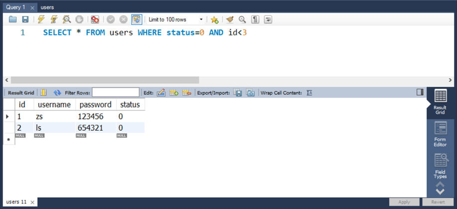

# 目标

能够知道如何配置 MySQ 数据库环境

能够认识并使用常见的 SQ 语句操作数据库

能够在项目中操作 MySQ 数据库

能够了解 Session 的实现原理

能够了解 JWT 的实现原理

## 数据库的基本概念

### **1.1** **什么是数据库**

数据库（database）是用来组织、存储和管理数据的仓库。

当今世界是一个充满着数据的互联网世界，充斥着大量的数据。数据的来源有很多，比如出行记录、消费记录、浏览的网页、发送的消息等等。除了文本类型的数据，图像、音乐、声音都是数据。

为了方便管理互联网世界中的数据，就有了数据库管理系统的概念（简称：数据库）。用户可以对数据库中的数据进行新增、查询、更新、删除等操作。

### **1.2** **常见的数据库及分类**

市面上的数据库有很多种，最常见的数据库有如下几个：

1. MySQ 数据库（目前使用最广泛、流行度最高的开源免费数据库；Community + Enterprise）
2. Orace 数据库（收费）
3. SQ Server 数据库（收费）
4. Mongodb 数据库（Community + Enterprise）

其中，MySQ、Orace、SQ Server 属于**传统型数据库**（又叫做：关系型数据库 或 SQ 数据库），这三者的设计理念相同，用法比较类似。

而 Mongodb 属于**新型数据库**（又叫做：非关系型数据库 或 NoSQ 数据库），它在一定程度上弥补了传统型数据库的缺陷。

### **1.3** **传统型数据库的****数据组织结构**

数据的组织结构：指的就是数据以什么样的结构进行存储。

传统型数据库的数据组织结构，与 Exce 中数据的组织结构比较类似。

因此，我们可以对比着 Exce 来了解和学习传统型数据库的数据组织结构。

**1. Exce** **的数据组织结构**

每个 Exce 中，数据的组织结构分别为工作簿、工作表、数据行、列这 4 大部分组成。

①整个 Exce 叫做工作簿

②users 和 books 是工作表

③users 工作表中有 3 行数据

④每行数据由 6 列信息组成

⑤每列信息都有对应的数据类型

**2.** **传统型数据库的数据组织结构**

在传统型数据库中，数据的组织结构分为数据库(database)、数据表(tabe)、数据行(row)、字段(fied)这 4 大部分组成。

① 数据库类似于 Exce 的工作簿

② 数据表类似于 Exce 的工作表

③ 数据行类似于 Exce 的每一行数据

④ 字段类似于 Exce 的列

⑤ 每个字段都有对应的数据类型

**3.** **实际开发中库、表、行、字段的关系**

①在实际项目开发中，一般情况下，每个项目都对应独立的数据库。

②不同的数据，要存储到数据库的不同表中，例如：用户数据存储到 users 表中，图书数据存储到 books 表中。

③每个表中具体存储哪些信息，由字段来决定，例如：我们可以为 users 表设计 id、username、password 这 3 个字段。

④表中的行，代表每一条具体的数据。

## 安装并配置 MySQ

### **2.1** 了解需要安装哪些MySQ相关的软件

对于开发人员来说，只需要安装 MySQ Server 和 MySQ Workbench 这两个软件，就能满足开发的需要了。

MySQ Server：专门用来提供数据存储和服务的软件。

MySQ Workbench：可视化的 MySQ 管理工具，通过它，可以方便的操作存储在 MySQ Server 中的数据。

**2.2 MySQ** **在** **Mac** **环境下的安装**

在 Mac 环境下安装 MySQ 的过程比 Windows 环境下的步骤简单很多：

①先运行 **mysq-8.0.19-macos10.15-x86_64.dmg** 这个安装包，将 MySQ Server 安装到 Mac 系统

②再运行 **mysq-workbench-community-8.0.19-macos-x86_64.dmg** 这个安装包，将可视化的 MySQ Workbench 工具安装到 Mac 系统

具体的安装教程，可以参考 素材 -> MySQ for Mac ->安装教程 - Mac系统安装MySq -> README.md

**2.3 MySQ** **在** **Windows** **环境下的安装**

在 Windows 环境下安装 MySQ，只需要运行 **mysq-instaer-community-8.0.19.0.msi** 这个安装包，就能一次性将 MySQ Server 和 MySQ Workbench 安装到自己的电脑上。

具体的安装教程，可以参考 素材 -> MySQ for Windows ->安装教程 - Windows系统安装MySq -> README.md

## MySQL的基本使用

### 3.1使用MySQL Workbench管理数据库

#### **1.** **连接****数据库**


##### **2.** **了解主界面的****组成部分**


##### **3.** **创建数据库**


Name: my_db_01

```sql
CREATE SCHEMA `my_db_01` ;
```

##### **4.** **创建数据表**


DataType 数据类型：

① int 整数

② varchar(len) 字符串

③ tinyint(1) 布尔值

字段的特殊标识：

① PK（Primary Key）主键、唯一标识

② NN（Not Null）值不允许为空

③ UQ（Unique）值唯一

④ AI（Auto Increment）值自动增长

Tables右击Create Tables...

names：users

Comments：用户信息表

id                DataType: INT                   √PK     √NN   √UQ    √AI

username DataType: VARCHAR(45)             √NN    √UQ

password  DataType: VARCHAR(45)             √NN

status         DataType: TINYINT(1)                     √NN

Default/Expression设置为0  ，表示默认为0。

0表示正常
1表示禁用

```sql
CREATE TABLE `my_db_01`.`users` (
  `id` INT NOT NULL AUTO_INCREMENT COMMENT '这是用户信息的唯一标识',
  `username` VARCHAR(45) NOT NULL COMMENT '用户的登录名',
  `password` VARCHAR(45) NOT NULL COMMENT '用户的登录密码',
  `status` TINYINT(1) NOT NULL DEFAULT 0 COMMENT '用户的状态，是一个布尔值\n0表示正常\n1表示禁用',
  PRIMARY KEY (`id`),
  UNIQUE INDEX `id_UNIQUE` (`id` ASC) VISIBLE,
  UNIQUE INDEX `username_UNIQUE` (`username` ASC) VISIBLE)
COMMENT = '用户信息表';
```

##### **5.** **向表中****写入数据**


在users表上鼠标右键

Select Rows -Limit1000

输入数据  apply

```sql
INSERT INTO `my_db_01`.`users` (`username`, `password`) VALUES ('tianyajuan', '123');
INSERT INTO `my_db_01`.`users` (`username`, `password`) VALUES ('zhuangzhuang ', '123');
```

### **3.2** **使用** **SQL** **管理数据库**

#### **1.** **什么是** **SQL**

SQL（英文全称：Structured Query Language）是结构化查询语言，专门用来访问和处理数据库的编程语言。能够让我们**以编程的形式**，**操作数据库里面的数据**。

三个关键点：

①SQL 是一门数据库编程语言

②使用 SQL 语言编写出来的代码，叫做 SQL 语句

③SQL 语言只能在关系型数据库中使用（例如 MySQL、Oracle、SQL Server）。非关系型数据库（例如 Mongodb）不支持 SQL 语言

#### **2. SQL** **能做什么**

① 从数据库中查询数据

② 向数据库中插入新的数据

③ 更新数据库中的数据

④ 从数据库删除数据

⑤ 可以创建新数据库

⑥ 可在数据库中创建新表

⑦ 可在数据库中创建存储过程、视图

⑧ etc…

#### **3. SQL** **的学习目标**

重点掌握如何使用 SQL 从数据表中：

查询数据（select） 、插入数据（insert into） 、更新数据（update） 、删除数据（delete）

额外需要掌握的 4 种 SQL 语法：

where 条件、and 和 or 运算符、order by 排序、count(*) 函数

### **3.3 SQL** **的** **SELECT** **语句**

**1.** **语法**

SELECT 语句用于从表中查询数据。执行的结果被存储在一个结果表中（称为结果集）。语法格式如下：


注意：SQL 语句中的关键字对**大小写不敏感**。SELECT 等效于 select，FROM 等效于 from。

```sql
-- 将user所有数据都查找出出来
select *  from users
```

**2.** **SELECT \*** **示例**

我们希望从 users 表中选取所有的列，可以使用符号 * 取代列的名称，示例如下：


**3.** **SELECT** **列名称** **示例**

如需获取名为 "username" 和 "password" 的列的内容（从名为 "users" 的数据库表），请使用下面的 SELECT 语句：


```sql
select username , password from users
```

### **3.4 SQL** **的** **INSERT INTO** **语句**

**1.** **语法**

INSERT INTO 语句用于向数据表中插入新的数据行，语法格式如下：


**2.** **INSERT INTO** **示例**

向 users 表中，插入一条 username 为 tony stark，password 为 098123 的用户数据，示例如下：


```sql
-- 向 users 表中，插入新数据，username 的值为 tony stark  password 的值为 098123
insert into users (username, password) values ('tony stark', '098123')
insert into users (username,password) values('rui','098123')
select * from users
```

### **3.5 SQL** **的** **UPDATE** **语句**

**1.** **语法**

Update 语句用于修改表中的数据。语法格式如下：


**2. UPDATE** **示例** **-** **更新某一行中的一个列**

把 users 表中 id 为 7 的用户密码，更新为 888888。示例如下：


```sql
-- 将 id 为 4 的用户密码，更新成 888888
update users set password='888888'where id=2
select * from users
```

**3. UPDATE** **示例** **-** **更新某一行中的若干列**

把 users 表中 id 为 2 的用户密码和用户状态，分别更新为 admin123 和 1。示例如下：


```sql
-- 更新 id 为 2 的用户，把用户密码更新为 admin123  同时，把用户的状态更新为 1
update users set password='admin123',status=1 where id=1
select *  from users
```

### **3.6 SQL** **的** **DELETE** **语句**

**1.** **语法**

DELETE 语句用于删除表中的行。语法格式如下：


**2. DELETE** **示例**

从 users 表中，删除 id 为 4 的用户，示例如下：


```sql
-- 删除 users 表中， id 为 6 的用户
delete from users where id=6
select * from users
```

### **3.7 SQL** **的** **WHERE** **子句**

**1.** **语法**

WHERE 子句用于限定选择的标准。在 SELECT、UPDATE、DELETE 语句中，皆可使用 WHERE 子句来限定选择的标准。


**2.** **可在** **WHERE** **子句中使用的**运算符

下面的运算符可在 WHERE 子句中使用，用来限定选择的标准：


注意：在某些版本的 SQL 中，操作符 <> 可以写为 !=

**3.** **WHERE** **子句示例**

可以通过 WHERE 子句来限定 SELECT 的查询条件：


```sql
-- 演示 where 子句的使用
select * from users where status=1
select * from users where id>=2
select * from users where username<>'ls'
select * from users where username!='ls'
```

### **3.8 SQL** **的** **AND** **和** **OR** **运算符**

**1.** **语法**

AND 和 OR 可在 WHERE 子语句中把两个或多个条件结合起来。

AND 表示必须同时满足多个条件，相当于 JavaScript 中的 && 运算符，例如 if (a !== 10 && a !== 20)

OR 表示只要满足任意一个条件即可，相当于 JavaScript 中的 || 运算符，例如 if(a !== 10 || a !== 20)

**2.** **AND** **运算符****示例**

使用 AND 来显示所有 status 为 0，并且 id 小于 3 的用户：



```sql
-- 使用 AND 来显示所有状态为0且id小于3的用户
select * from users where status=0 and id<3
```

**2.** **OR** **运算符****示例**

使用 OR 来显示所有 status 为 1，或者 username 为 zs 的用户：


```sql
-- 使用 or 来显示所有状态为1 或 username 为 zs 的用户
select * from users where status=1 or username='zs'
```

### **3.9 SQL** **的** **ORDER BY** **子句**

**1.** **语法**

ORDER BY 语句用于根据指定的列对结果集进行排序。

ORDER BY 语句**默认**按照升序对记录进行排序。

如果您希望按照**降序**对记录进行排序，可以使用 DESC 关键字。

**2. ORDER BY** **子句** **-** **升序排序**

对 users 表中的数据，按照 status 字段进行升序排序，示例如下：


```sql
-- 对users表中的数据，按照 status 字段进行升序排序
select * from users order by status asc
```

**3. ORDER BY** **子句** **–** **降序排序**

对 users 表中的数据，按照 id 字段进行降序排序，示例如下：


```sql
-- 按照 id 对结果进行降序的排序  desc 表示降序排序   asc 表示升序排序（默认情况下，就是升序排序的）
select * from users order by id desc
```

**4. ORDER BY** **子句** **–** **多重排序**

对 users 表中的数据，先按照 status 字段进行降序排序，再按照 username 的字母顺序，进行升序排序，示例如下：


```sql
-- 对 users 表中的数据，先按照 status 进行降序排序，再按照 username 字母的顺序，进行升序的排序
select * from users order by status desc, username asc
```

### **3.10 SQL** **的** **COUNT(\*)** **函数**

**1.** **语法**

COUNT(*) 函数用于返回查询结果的总数据条数，语法格式如下：

```sql
SELECT COUNT(*) FROM 表名称
```

**2. COUNT(\*)** **示例**

查询 users 表中 status 为 0 的总数据条数：


```sql
-- 使用 count(*) 来统计 users 表中，状态为 0 用户的总数量
select count(*) from users where status=0
```

**2.** **使用** **AS** **为列****设置别名**

如果希望给查询出来的列名称设置别名，可以使用 AS 关键字，示例如下：


```sql
-- 使用 AS 关键字给列起别名
select count(*) as total from users where status=0
select username as uname, password as upwd from users
```

## 在项目中操作 MySQL

### **4.1** **在项目中操作数据库的步骤**

①安装操作 MySQL 数据库的第三方模块（mysql）

②通过 mysql 模块连接到 MySQL 数据库

③通过 mysql 模块执行 SQL 语句


### **4.2** **安装与配置** **mysql** **模块**

**1.** **安装** **mysql** **模块**

mysql 模块是托管于 npm 上的第三方模块。它提供了在 Node.js 项目中连接和操作 MySQL 数据库的能力。

想要在项目中使用它，需要先运行如下命令，将 mysql 安装为项目的依赖包：

```bash
npm init -y
npm install mysql
```

**2.** **配置** **mysql** **模块**

在使用 mysql 模块操作 MySQL 数据库之前，必须先对 mysql 模块进行必要的配置，主要的配置步骤如下：

```javascript
// 1. 导入 mysql 模块
const mysql = require('mysql')
// 2. 建立与 MySQL 数据库的连接关系
const db = mysql.createPool({
  host: '127.0.0.1', // 数据库的 IP 地址
  user: 'root', // 登录数据库的账号
  password: 'admin123', // 登录数据库的密码
  database: 'my_db_01', // 指定要操作哪个数据库
})
```

**3.** **测试** **mysql** **模块能否正常工作**

调用 db.query() 函数，指定要执行的 SQL 语句，通过回调函数拿到执行的结果：

```javascript
db.query('select 1', (err, results) => {
  // mysql 模块工作期间报错了
  if(err) return console.log(err.message)
  // 能够成功的执行 SQL 语句
  console.log(results)
}) 
//结果   [ RowDataPacket { '1': 1 } ]
```

### **4.3** **使用** **mysql** **模块操作** **MySQL** **数据库**

#### **1.** **查询数据**

查询 users 表中所有的数据：

```javascript
// 查询 users 表中所有的数据
const sqlStr = 'select * from users'
db.query(sqlStr, (err, results) => {
  // 查询数据失败
  if (err) return console.log(err.message)
  // 查询数据成功
  // 注意：如果执行的是 select 查询语句，则执行的结果是数组
  console.log(results)
})
```

```javascript
[
  RowDataPacket {
    id: 1,
    username: 'tianyajuan',
    password: 'admin123',
    status: 1
  },
  RowDataPacket {
    id: 2,
    username: 'zhuangzhuang ',
    password: '888888',
    status: 0
  },
  RowDataPacket {
    id: 3,
    username: 'tony stark',
    password: '098123',
    status: 0
  },
  RowDataPacket {
    id: 5,
    username: 'mark',
    password: '098123',
    status: 0
  },
  RowDataPacket {
    id: 7,
    username: 'rui',
    password: '098123',
    status: 0
  }
]
```

#### **2.** **插入数据**

向 users 表中新增数据， 其中 username 为 Spider-Man，password 为 pcc321。示例代码如下：

```javascript
// 向 users 表中，新增一条数据，其中 username 的值为 Spider-Man，password 的值为 pcc123
const user = { username: 'Spider-Man', password: 'pcc123' }
// 定义待执行的 SQL 语句
const sqlStr = 'insert into users (username, password) values (?, ?)'
// 执行 SQL 语句
db.query(sqlStr, [user.username, user.password], (err, results) => {
  // 执行 SQL 语句失败了
  if (err) return console.log(err.message)
  // 成功了
  // 注意：如果执行的是 insert into 插入语句，则 results 是一个对象
  // 可以通过 affectedRows 属性，来判断是否插入数据成功
  if (results.affectedRows === 1) {
    console.log('插入数据成功!')
  }
})
```

#### **3.** **插入数据的****便捷方式**

向表中新增数据时，如果数据对象的每个属性和数据表的字段**一一对应**，则可以通过如下方式快速插入数据：

```javascript
// 演示插入数据的便捷方式
const user = { username: 'Spider-Man2', password: 'pcc4321' }
// 定义待执行的 SQL 语句
const sqlStr = 'insert into users set ?'
// 执行 SQL 语句
db.query(sqlStr, user, (err, results) => {
  if (err) return console.log(err.message)
  if (results.affectedRows === 1) {
    console.log('插入数据成功')
  }
})
```

#### **4.** **更新数据**

可以通过如下方式，更新表中的数据：

```javascript
// 演示如何更新用户的信息
const user = { id: 6, username: 'aaa', password: '000' }
// 定义 SQL 语句
const sqlStr = 'update users set username=?, password=? where id=?'
// 执行 SQL 语句
db.query(sqlStr, [user.username, user.password, user.id], (err, results) => {
  if (err) return console.log(err.message)
  // 注意：执行了 update 语句之后，执行的结果，也是一个对象，可以通过 affectedRows 判断是否更新成功
  if (results.affectedRows === 1) {
    console.log('更新成功')
  }
})
```

#### **5.** **更新数据的****便捷方式**

更新表数据时，如果数据对象的每个属性和数据表的字段**一一对应**，则可以通过如下方式快速更新表数据：

```javascript
// 演示更新数据的便捷方式
const user = { id: 6, username: 'aaaa', password: '0000' }
// 定义 SQL 语句
const sqlStr = 'update users set ? where id=?'
// 执行 SQL 语句
db.query(sqlStr, [user, user.id], (err, results) => {
  if (err) return console.log(err.message)
  if (results.affectedRows === 1) {
    console.log('更新数据成功')
  }
})
```

#### **6.** **删除数据**

在删除数据时，推荐根据 id 这样的唯一标识，来删除对应的数据。示例如下：

SQL语句中有多个占位符，则必须使用数组为每一个占位符指定具体的值

SQL语句中只有一个占位符，则可以省略数组

```javascript
// 删除 id 为 5 的用户
const sqlStr = 'delete from users where id=?'
db.query(sqlStr, 5, (err, results) => {
  if (err) return console.log(err.message)
  // 注意：执行 delete 语句之后，结果也是一个对象，也会包含 affectedRows 属性
  if (results.affectedRows === 1) {
    console.log('删除数据成功')
  }
})
```

#### **7.** **标记删除**

使用 DELETE 语句，会把真正的把数据从表中删除掉。为了保险起见，**推荐使用**标记删除的形式，来**模拟删除的动作**。

所谓的标记删除，就是在表中设置类似于 **status** 这样的**状态字段**，来**标记**当前这条数据是否被删除。

当用户执行了删除的动作时，我们并没有执行 DELETE 语句把数据删除掉，而是执行了 UPDATE 语句，将这条数据对应的 status 字段标记为删除即可。

```javascript
// 标记删除
const sqlStr = 'update users set status=? where id=?'
db.query(sqlStr, [1, 6], (err, results) => {
  if (err) return console.log(err.message)
  if (results.affectedRows === 1) {
    console.log('标记删除成功')
  }
})
```

## 前后端的身份认证

### **5.1 Web** **开发模式**

目前主流的 Web 开发模式有两种，分别是：

①基于服务端渲染的传统 Web 开发模式

②基于前后端分离的新型 Web 开发模式

#### **1.** **服务端渲染的** **Web** **开发模式**

服务端渲染的概念：服务器发送给客户端的 HTML 页面，是在服务器通过字符串的拼接，动态生成的。因此，客户端不需要使用 Ajax 这样的技术额外请求页面的数据。代码示例如下：


#### **2.** **服务端渲染的优缺点**

优点：

① **前端耗时少。**因为服务器端负责动态生成 HTML 内容，浏览器只需要直接渲染页面即可。尤其是移动端，更省电。

② **有利于****SEO****。**因为服务器端响应的是完整的 HTML 页面内容，所以爬虫更容易爬取获得信息，更有利于 SEO。

缺点：

① **占用服务器端资源。**即服务器端完成 HTML 页面内容的拼接，如果请求较多，会对服务器造成一定的访问压力。

② **不利于前后端分离，开发效率低。**使用服务器端渲染，则**无法进行分工合作**，尤其对于**前端复杂度高**的项目，不利于项目高效开发。

#### **3.** **前后端分离****的** **Web** **开发模式**

前后端分离的概念：前后端分离的开发模式，**依赖于** **Ajax** **技术的广泛应用**。简而言之，前后端分离的 Web 开发模式，就是**后端只负责提供** **API** **接口，前端使用** **Ajax** **调用接口**的开发模式。

#### **4.** **前后端分离的优缺点**

优点：

① **开发体验好。**前端专注于 UI 页面的开发，后端专注于api 的开发，且前端有更多的选择性。

② **用户体验好。**Ajax 技术的广泛应用，极大的提高了用户的体验，可以轻松实现页面的局部刷新。

③ **减轻了服务器端的渲染压力。**因为页面最终是在每个用户的浏览器中生成的。

缺点：

① **不利于** SEO。因为完整的 HTML 页面需要在客户端动态拼接完成，所以爬虫对无法爬取页面的有效信息。（解决方案：利用 Vue、React 等前端框架的 **SSR** （server side render）技术能够很好的解决 SEO 问题！）

#### **5.** **如何选择** **Web** **开发模式**

**不谈业务场景而盲目选择使用何种开发模式都是耍流氓。**

- 比如企业级网站，主要功能是展示而没有复杂的交互，并且需要良好的 SEO，则这时我们就需要使用服务器端渲染；
- 而类似后台管理项目，交互性比较强，不需要考虑 SEO，那么就可以使用前后端分离的开发模式。

另外，具体使用何种开发模式并不是绝对的，为了**同时兼顾**了**首页的渲染速度**和**前后端分离的开发效率**，一些网站采用了首屏服务器端渲染 + 其他页面前后端分离的开发模式。

### **5.2** **身份认证**

**1.** 什么是身份认证

**身份认证**（Authentication）又称“身份验证”、“鉴权”，是指**通过一定的手段，完成对用户身份的确认**。

- 日常生活中的身份认证随处可见，例如：高铁的验票乘车，手机的密码或指纹解锁，支付宝或微信的支付密码等。
- 在 Web 开发中，也涉及到用户身份的认证，例如：各大网站的**手机验证码登录**、**邮箱密码登录**、**二维码登录**等。

**2.** **为什么需要身份认证**

身份认证的目的，是为了**确认当前所声称为某种身份的用户，确实是所声称的用户**。例如，你去找快递员取快递，你要怎么证明这份快递是你的。

在互联网项目开发中，如何对用户的身份进行认证，是一个值得深入探讨的问题。例如，如何才能保证网站不会错误的将“马云的存款数额”显示到“马化腾的账户”上。

**3.** **不同开发模式下的****身份认证**

对于服务端渲染和前后端分离这两种开发模式来说，分别有着不同的身份认证方案：

① 服务端渲染推荐使用 **Session** **认证机制**

② 前后端分离推荐使用 **JWT** **认证机制**

### **5.3 Session** **认证机制**

**1. HTTP** 协议的无状态性

了解 HTTP 协议的无状态性是进一步学习 Session 认证机制的必要前提。

HTTP 协议的无状态性，指的是客户端**的每次** **HTTP** **请求都是独立的**，连续多个请求之间没有直接的关系，**服务器不会主动保留每次** **HTTP** **请求的状态**。


**2.** **如何突破** **HTTP** **无状态的限制**

对于超市来说，为了方便收银员在进行结算时给 VIP 用户打折，超市可以为每个 VIP 用户发放会员卡。


注意：现实生活中的**会员卡身份认证方式**，在 Web 开发中的专业术语叫做 **Cookie**。

**3.** **什么是** **Cookie**

Cookie 是**存储在用户浏览器中的一段不超过** **4 KB** **的字符串**。它由一个名称（Name）、一个值（Value）和其它几个用于控制 Cookie 有效期、安全性、使用范围的可选属性组成。

Cookies Application   Expires有效期

不同域名下的 Cookie 各自独立，每当客户端发起请求时，会**自动**把**当前域名下**所有**未过期的** **Cookie** 一同发送到服务器。

**Cookie****的几大特性：**

①自动发送

②域名独立

③过期时限

④4KB 限制

**4. Cookie** **在身份认证中的作用**

客户端第一次请求服务器的时候，服务器**通过响应头的形式**，向客户端发送一个身份认证的 Cookie，客户端会自动将 Cookie 保存在浏览器中。

随后，当客户端浏览器每次请求服务器的时候，浏览器会**自动**将身份认证相关的 Cookie，**通过请求头的形式**发送给服务器，服务器即可验明客户端的身份。


Header **Cookie**

**5. Cookie** **不具有****安全性**

由于 Cookie 是存储在浏览器中的，而且**浏览器也提供了读写** **Cookie** **的** **API**，因此 **Cookie** **很容易被伪造**，不具有安全性。因此不建议服务器将重要的隐私数据，通过 Cookie 的形式发送给浏览器。


注意：千万不要使用 **Cookie** **存储重要且隐私的数据**！比如用户的身份信息、密码等。

**6.** **提高身份认证的安全性**

为了防止客户伪造会员卡，收银员在拿到客户出示的会员卡之后，可以**在收银机上进行刷卡认证**。只有收银机确认存在的会员卡，才能被正常使用。


这种“**会员卡** **+** **刷卡认证**”的设计理念，就是 Session 认证机制的精髓。

**7.** **Session** **的****工作原理**


### **5.4** **在** **Express** **中使用** **Session** **认证**

**1.** **安装** **express-session** **中间件**

在 Express 项目中，只需要安装 express-session 中间件，即可在项目中使用 Session 认证：

```bash
npm install express-session
```

**2.** **配置** **express-session** **中间件**

express-session 中间件安装成功后，需要通过 app.use() 来注册 session 中间件，示例代码如下：


**3.** **向** **session** **中****存数据**

当 express-session 中间件配置成功后，即可通过 **req.session** 来访问和使用 session 对象，从而存储用户的关键信息：


4.从session中取数据

可以直接从 **req.session** 对象上获取之前存储的数据，示例代码如下：


**5.** **清空** **session**

调用 **req.session.destroy****()** 函数，即可清空服务器保存的 session 信息。


### 5.5 JWT 认证机制

**1.** **了解** **Session** **认证的****局限性**

Session 认证机制需要配合 Cookie 才能实现。由于 Cookie 默认不支持跨域访问，所以，当涉及到前端跨域请求后端接口的时候，**需要做很多额外的配置**，才能实现跨域 Session 认证。

注意：

- 当前端请求后端接口**不存在跨域问题**的时候，**推荐使用** **Session** 身份认证机制。
- 当前端需要跨域请求后端接口的时候，不推荐使用 Session 身份认证机制，推荐使用 JWT 认证机制。

**2.** **什么是** **JWT**

JWT（英文全称：JSON Web Token）是目前**最流行**的**跨域认证解决方案**。

**3. JWT** **的****工作原理**


总结：用户的信息通过 Token 字符串的形式，保存在客户端浏览器中。服务器通过还原 Token 字符串的形式来认证用户的身份。

**4. JWT** **的****组成部分**

JWT 通常由三部分组成，分别是 Header（头部）、Payload（有效荷载）、Signature（签名）。

三者之间使用英文的“.”分隔，格式如下：

```text
Header.Payload.Signature
```

下面是 JWT 字符串的示例：


**6. JWT** **的****三个部分各自代表的含义**

JWT 的三个组成部分，从前到后分别是 Header、Payload、Signature。

其中：

- **Payload** 部分**才是真正的用户信息**，它是用户信息经过加密之后生成的字符串。
- Header 和 Signature 是**安全性相关**的部分，只是为了保证 Token 的安全性。


7.JWT 的使用方式

客户端收到服务器返回的 JWT 之后，通常会将它储存在 localStorage 或 sessionStorage 中。

此后，客户端每次与服务器通信，都要带上这个 JWT 的字符串，从而进行身份认证。推荐的做法是**把** **JWT** **放在** **HTTP** **请求头的** **Authorization** **字段中**，格式如下：

```javascript
Authorization：Bearer <token>
```

### **5.6** **在** Express中使用JWT

**1.** **安装** **JWT** **相关的包**

运行如下命令，安装如下两个 JWT 相关的包：

```bash
npm install jsonwebtoken express-jwt
```

其中：

- **jsonwebtoken** 用于**生成** **JWT** **字符串**
- express-jwt 用于将 **JWT** **字符串解析还原成** **JSON** **对象**

**2.** **导入** **JWT** **相关的包**

使用 **require()** 函数，分别导入 JWT 相关的两个包：


**3.** **定义** **secret** **密钥**

为了保证 JWT 字符串的安全性，防止 JWT 字符串在网络传输过程中被别人破解，我们需要专门定义一个用于**加密**和**解密**的 secret 密钥：

①当生成 JWT 字符串的时候，需要使用 secret 密钥对用户的信息进行加密，最终得到加密好的 JWT 字符串

②当把 JWT 字符串解析还原成 JSON 对象的时候，需要使用 secret 密钥进行解密


**4.** **在登录成功后生成WT 字符串**

调用 **jsonwebtoken** 包提供的 **sign()** 方法，将用户的信息加密成 JWT 字符串，响应给客户端：


5.将JWT字符串还原为 JSON对象

客户端每次在访问那些有权限接口的时候，都需要主动通过**请求头中的** **Authorization** **字段**，将 Token 字符串发送到服务器进行身份认证。

此时，服务器可以通过 **express-jwt** 这个中间件，自动将客户端发送过来的 Token 解析还原成 JSON 对象：


**6.** **使用** **req.user** **获取用户信息**

当 express-jwt 这个中间件配置成功之后，即可在那些有权限的接口中，使用 **req.user** 对象，来访问从 JWT 字符串中解析出来的用户信息了，示例代码如下：


**7.** **捕获解析** **JWT** **失败后产生的错误**

当使用 express-jwt 解析 Token 字符串时，如果客户端发送过来的 Token 字符串**过期**或**不合法**，会产生一个**解析失败**的错误，影响项目的正常运行。我们可以通过 **Express** **的错误中间件**，捕获这个错误并进行相关的处理，示例代码如下：


```javascript
// 导入 express 模块
const express = require('express')
// 创建 express 的服务器实例
const app = express()

// TODO_01：请配置 Session 中间件
const session = require('express-session')
app.use(
  session({
    secret: 'itheima',
    resave: false,
    saveUninitialized: true,
  })
)

// 托管静态页面
app.use(express.static('./pages'))
// 解析 POST 提交过来的表单数据
app.use(express.urlencoded({ extended: false }))

// 登录的 API 接口
app.post('/api/login', (req, res) => {
  // 判断用户提交的登录信息是否正确
  if (req.body.username !== 'admin' || req.body.password !== '000000') {
    return res.send({ status: 1, msg: '登录失败' })
  }

  // TODO_02：请将登录成功后的用户信息，保存到 Session 中
  // 注意：只有成功配置了 express-session 这个中间件之后，才能够通过 req 点出来 session 这个属性
  req.session.user = req.body // 用户的信息
  req.session.islogin = true // 用户的登录状态

  res.send({ status: 0, msg: '登录成功' })
})

// 获取用户姓名的接口
app.get('/api/username', (req, res) => {
  // TODO_03：请从 Session 中获取用户的名称，响应给客户端
  if (!req.session.islogin) {
    return res.send({ status: 1, msg: 'fail' })
  }
  res.send({
    status: 0,
    msg: 'success',
    username: req.session.user.username,
  })
})

// 退出登录的接口
app.post('/api/logout', (req, res) => {
  // TODO_04：清空 Session 信息
  req.session.destroy()
  res.send({
    status: 0,
    msg: '退出登录成功',
  })
})

// 调用 app.listen 方法，指定端口号并启动web服务器
app.listen(80, function () {
  console.log('Express server running at http://127.0.0.1:80')
})

```
