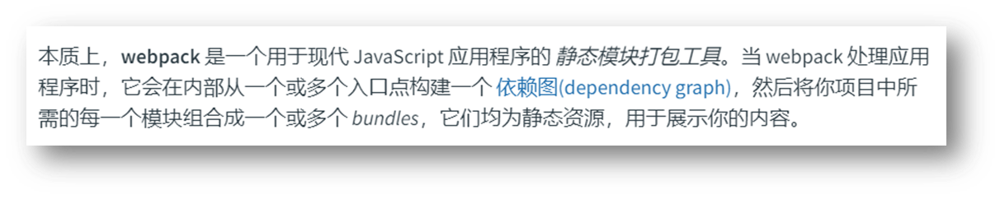
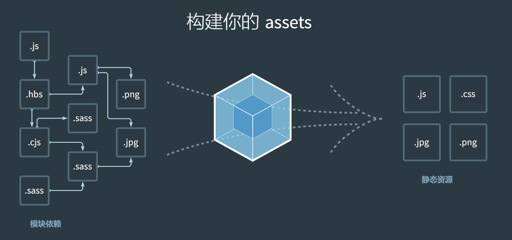
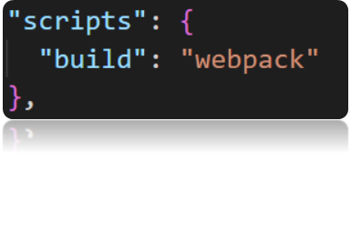
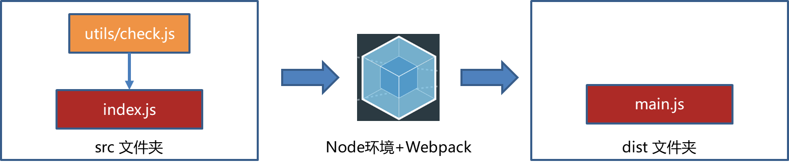
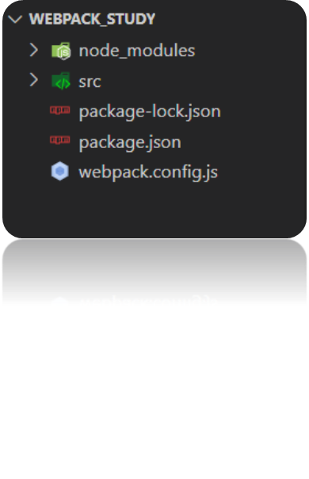
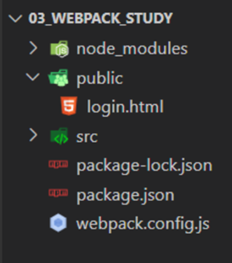
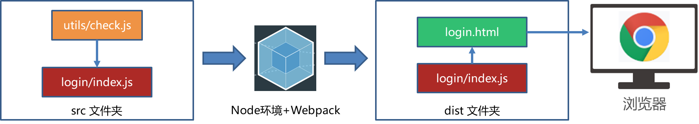
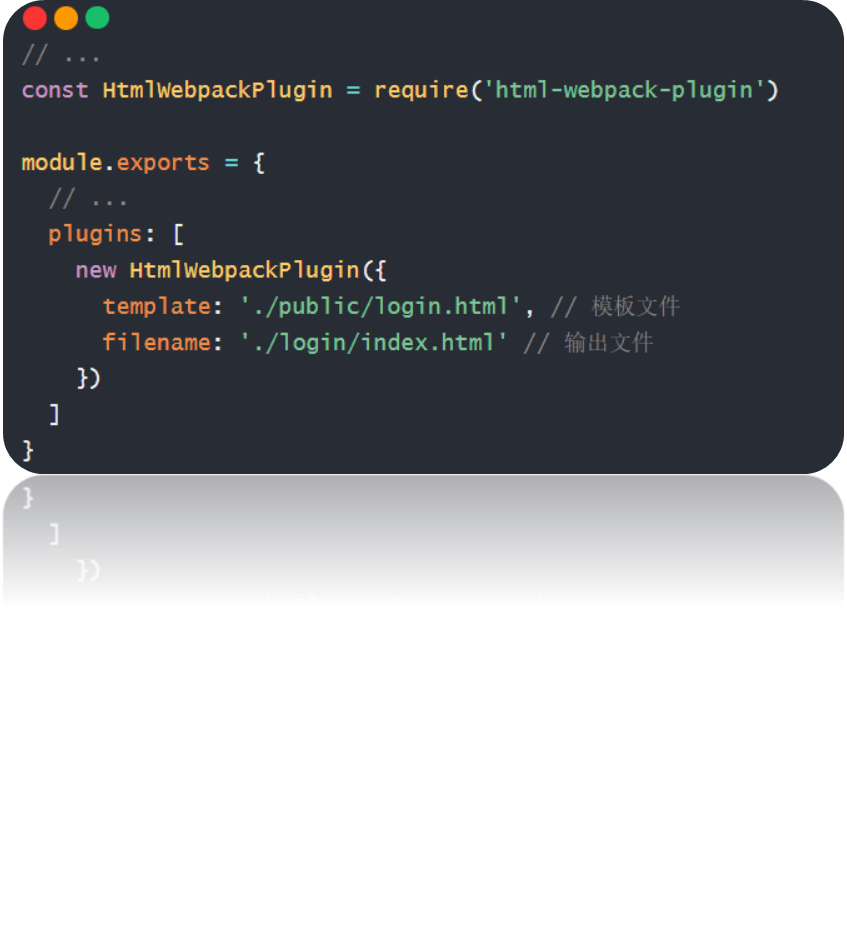

## Webpack


#### 什么是 Webpack？

[定义：](https://webpack.docschina.org/concepts/)



Webpack 是一个模块打包工具，主要用于现代 JavaScript 应用程序的构建。它能够将各种资源（如 JavaScript、CSS、图片等）视为模块，并通过配置文件将其打包成一个或多个最终的输出文件。Webpack 的主要功能包括：

1. **模块打包**：Webpack 可以将项目中的所有模块（如 JavaScript 文件、CSS 文件、图片等）打包成一个或多个最终的输出文件。

2. **代码分割**：Webpack 支持代码分割，可以将代码分成多个小块，按需加载，从而提高应用的性能。

3. **热模块替换（HMR）**：在开发过程中，Webpack 提供了热模块替换功能，可以在不刷新整个页面的情况下更新部分模块，提升开发效率。

4. **插件系统**：Webpack 有一个强大的插件系统，可以通过安装和使用各种插件来扩展其功能，例如自动清理输出目录、压缩代码、处理环境变量等。

5. **加载器（Loaders）**：Webpack 使用加载器来处理不同类型的文件。例如，`babel-loader` 可以将 ES6+ 代码转换为 ES5 代码，`css-loader` 和 `style-loader` 可以处理 CSS 文件。

6. **优化**：Webpack 提供了一些内置的优化选项，可以帮助减少打包后的文件大小，提高应用的加载速度。

7. **跨平台支持**：Webpack 不仅可以在桌面环境中运行，还可以在服务器端（如 Node.js 环境中）运行。

总之，Webpack 是一个非常强大且灵活的工具，广泛应用于前端开发中，帮助开发者更高效地管理和构建复杂的 JavaScript 应用程序。

静态模块：指的是编写代码过程中的，html，css，js，图片等固定内容的文件

打包：把静态模块内容，压缩，整合，转译等（前端工程化）

- 把 less / sass 转成 css 代码
- 把 ES6+ 降级成 ES5
- 支持多种模块标准语法



问题：为何不学 vite ？

因为：很多项目还是基于 Webpack 构建，并为 Vue

React 脚手架使用做铺垫！

#### 使用 Webpack

需求：封装 utils 包，校验手机号长度和验证码长度，在 src/index.js 中使用并打包观察

步骤：

1.新建并初始化项目，编写业务源代码

2.下载 webpack webpack-cli 到当前项目中（版本独立），并配置局部自定义命令

3.运行打包命令，自动产生 dist 分发文件夹（压缩和优化后，用于最终运行的代码）


```
npm i webpack webpack-cli --save-dev
```



```
npm run build
```



#### 修改 Webpack 打包入口和出口

[Webpack ](https://webpack.docschina.org/concepts/)[配置：](https://webpack.docschina.org/concepts/)影响 Webpack 打包过程和结果

步骤：

1.项目根目录，新建 webpack.config.js 配置文件

2.导出配置对象，配置入口，出口文件的路径

3.重新打包观察

注意：只有和入口产生直接/间接的引入关系，才会被打包




#### 用户登录 - 长度判断

需求：点击登录按钮，判断手机号和验证码长度

步骤：

1.准备用户登录页面

2.编写核心 JS 逻辑代码

3.打包并手动复制网页到 dist 下，引入打包后的 js，运行

核心：Webpack 打包后的代码，作用在前端网页中使用





自动生成 html 文件

[插件](https://webpack.docschina.org/plugins/html-webpack-plugin/)[ html-webpack-plugin](https://webpack.docschina.org/plugins/html-webpack-plugin/)[：](https://webpack.docschina.org/plugins/html-webpack-plugin/) 在 Webpack 打包时生成 html 文件

步骤：

1.下载 html-webpack-plugin 本地软件包

2.配置 webpack.config.js 让 Webpack 拥有插件功能

3.重新打包观察效果

```
npm i html-webpack-plugin  --save-dev
```

