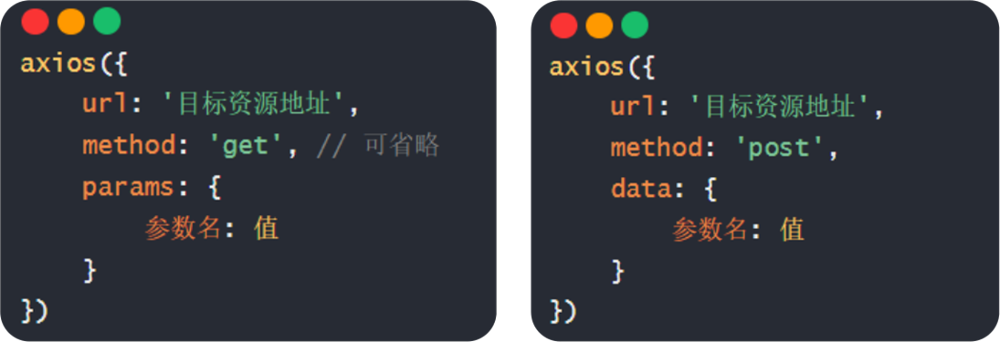
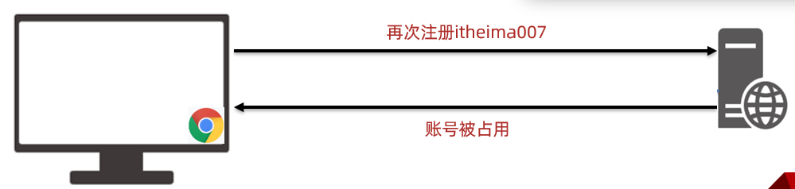
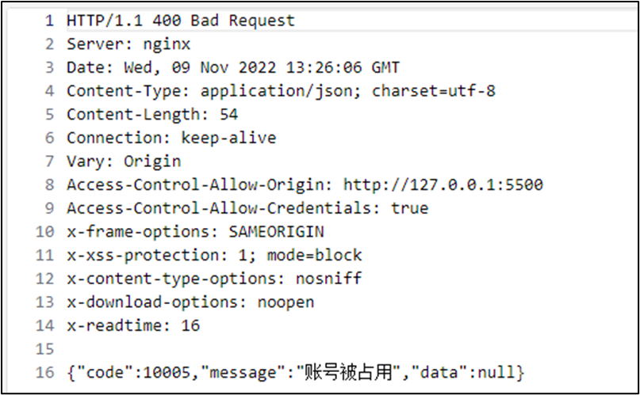
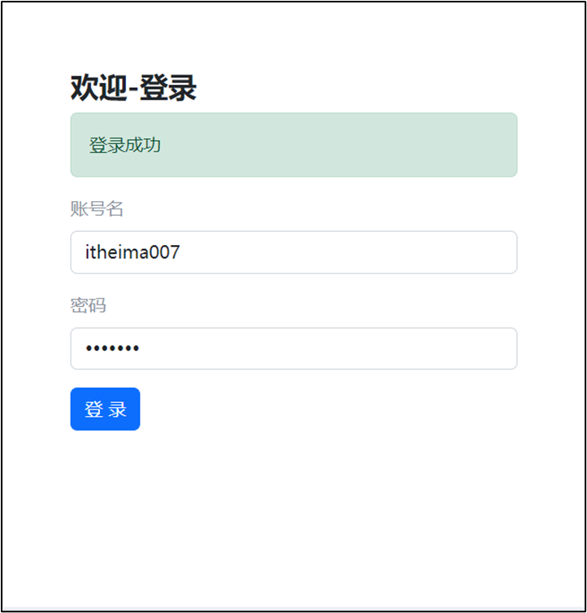

# Day01_Ajax入门

## 知识点自测

1. 如下对象取值的方式哪个正确?

   ```js
   let obj = {
       name: '黑马'
   }
   ```

   A: obj.a
   B: obj()a

   <details>
   <summary>答案</summary>
   <ul>
   <li>A选项正确</li>
   </ul>
   </details>


2. 哪个赋值会让浏览器解析成标签显示?

   ```js
   let ul = document.querySelector('#ul')
   let str = `<span>我是span标签</span>`
   ```

   A: ul.innerText = str
   B: ul.innerHTML = str

   <details>
   <summary>答案</summary>
   <ul>
   <li>选择B, innerText会把字符串当做普通文本现在在ul标签之间, innerHTML会试着把字符串解析成标签, 如果是普通文本则显示普通文本字符串</li>
   </ul>
   </details>


3. 哪个是获取输入框值的方式?

   ```js
   let theInput = document.querySelector('#input')
   ```

   A: theInput.innerHTML

   B: theInput.value

   <details>
   <summary>答案</summary>
   <ul>
   <li>答案是B, 表单标签设置或获取值用value属性, 其他标签用innerHTML/innerText, 进行设置/获取</li>
   </ul>
   </details>


4. 哪个是用于获取标签内容?

   ```js
   let theP = document.querySelector('#p')
   ```

   A: theP.innerHTML = '内容'

   B: theP.innerHTML

   <details>
   <summary>答案</summary>
   <ul>
   <li>答案是B, 单独出现是获取值在原地, 如果看到=这个符号, 是把右侧的值赋予给左侧的属性, 影响标签展示效果</li>
   </ul>
   </details>


5. 哪个是数组的映射方法？

   A: arr.forEach

   B: arr.map

   <details>
   <summary>答案</summary>
   <ul>
   <li>答案是B</li>
   </ul>
   </details>


6. 数组转字符串并指定拼接符的是哪个?

   A: arr.join()

   B: arr.split()

   <details>
   <summary>答案</summary>
   <ul>
   <li>答案是A</li>
   </ul>
   </details>


7. 函数传参的方式哪个是正确的？

   ```js
   function showAlert(msg, className) {}
   ```

   A：showAlert('消息', '类名')

   B：showAlert()

   <details>
   <summary>答案</summary>
   <ul>
   <li>答案是A</li>
   </ul>
   </details>


8. 以下哪套代码可以实现对象属性的简写？

   A：

   ```js
   const username = '老李'
   let obj = {
     username: username
   }
   ```

   B：

   ```js
   const user = '老李'
   let obj = {
     username: user
   }
   ```

   <details>
   <summary>答案</summary>
   <ul>
   <li>答案是A</li>
   </ul>
   </details>


9. 以下代码的值是多少？

   ```js
   const age = 10
   const result = age > 18 ? '成年了' : '未成年'
   ```

   A：‘成年了’

   B：‘未成年’

   <details>
   <summary>答案</summary>
   <ul>
   <li>答案是B</li>
   </ul>
   </details>


10. 以下哪个方法可以添加一个额外类名？

    A：标签对象.classList.add()

    B：标签对象.classList.contains()

    <details>
    <summary>答案</summary>
    <ul>
    <li>答案是A</li>
    </ul>
    </details>


## 目录

* AJAX 概念和 axios 使用
* 认识 URL
* URL 查询参数
* 常用请求方法和数据提交
* HTTP协议-报文
* 接口文档
* 案例 - 用户登录
* form-serialize 插件


## 学习目标

1. 掌握 axios 相关参数，从服务器获取并解析展示数据
1. 掌握接口文档的查看和使用
1. 掌握在浏览器的 network 面板中查看请求和响应的内容
1. 了解请求和响应报文的组成部分


## 01.AJAX 概念和 axios 使用

### 目标

了解 AJAX 概念并掌握 axios 库基本使用

AJAX（Asynchronous JavaScript and XML）是一种用于创建快速动态网页的技术。它允许网页在不重新加载整个页面的情况下与服务器进行异步通信，从而实现部分页面的更新。

主要特点：

1. **异步通信**：AJAX通过JavaScript在后台与服务器进行数据交换，而不会阻塞用户界面。
2. **减少页面刷新**：减少了不必要的页面刷新，提高了用户体验。
3. **实时性**：可以实现实时数据更新，如聊天应用、股票行情等。
4. **轻量级**：使用XMLHttpRequest对象或Fetch API来发送和接收数据，代码相对简单。

能够做的事情：

1. **数据获取**：从服务器获取数据并显示在网页上。
2. **表单提交**：无需刷新页面即可提交表单数据。
3. **动态内容更新**：根据用户的操作动态更新网页内容。
4. **搜索功能**：提供即时搜索结果，如Google的搜索框。
5. **文件上传**：支持文件上传功能，如图片上传、文档上传等。
6. **地图和位置服务**：集成地图API，提供地理位置信息。
7. **实时通知**：实现实时消息推送，如社交媒体通知。

示例代码：

以下是一个简单的AJAX示例，使用`XMLHttpRequest`对象：

```javascript
// 创建一个新的XMLHttpRequest对象
var xhr = new XMLHttpRequest();

// 配置请求
xhr.open('GET', 'https://api.example.com/data', true);

// 设置回调函数
xhr.onload = function() {
    if (xhr.status >= 200 && xhr.status < 300) {
        // 请求成功，处理响应数据
        var response = JSON.parse(xhr.responseText);
        console.log(response);
    } else {
        // 请求失败，处理错误
        console.error('请求失败: ' + xhr.statusText);
    }
};

xhr.onerror = function() {
    // 网络错误，处理错误
    console.error('网络错误');
};

// 发送请求
xhr.send();
```

在这个示例中，我们使用`XMLHttpRequest`对象向服务器发送一个GET请求，并在请求成功后处理响应数据。

总之，AJAX是现代Web开发中不可或缺的一部分，它极大地增强了网页的交互性和用户体验。

### 讲解

1. 什么是 AJAX ? [mdn](https://developer.mozilla.org/zh-CN/docs/Web/Guide/AJAX/Getting_Started)

   * AJAX是异步的JavaScript和XML(Asynchronous JavaScript and XML)。

   * 简单点说，就是使用浏览器的 XMLHttpRequest 对象与服务器通信。

   * 它可以使用JSON，XML，HTML，text文本等格式发送和接受数据。

   * AJAX最吸引人的就是它的“异步”特性，也就是说它可以在不重新刷新页面的情况下与服务器通信，交换数据，或更新页面。

   * 浏览器网页中，使用 AJAX技术（XHR对象）发起获取省份列表数据的请求，服务器代码响应准备好的省份列表数据给前端，前端拿到数据数组以后，展示到网页

     

2. 什么是服务器？

   * 可以暂时理解为提供数据的一台电脑

3. 为何学 AJAX ?

   * 以前我们的数据都是写在代码里固定的, 无法随时变化
   * 现在我们的数据可以从服务器上进行获取，让数据变活

4. 怎么用 AJAX ？

   1. 先使用 [axios](http://https:/axios-http.com/zh/) [æk‘sioʊs] 库，与服务器进行数据通信
      - 基于 XMLHttpRequest 封装、代码简单、月下载量在 14 亿次
      -  Vue、React 项目中都会用到 axios

   2. 再学习 XMLHttpRequest 对象的使用，了解 AJAX 底层原理

5. 怎么学 AJAX ?

   * 这里使用一个第三方库叫 axios, 后续在学习 XMLHttpRequest 对象了解 AJAX 底层原理
   * 因为 axios 库语法简单，让我们有更多精力关注在与服务器通信上，而且后续 Vue，React 学习中，也使用 axios 库与服务器通信

6. 接下来讲解 axios 语法，步骤：

  7. 引入 axios.js 文件到自己的网页中，支持通过多个主流 CDN 获取，包括：

     > axios.js文件jsDelivr‌：链接: https://cdn.jsdelivr.net/npm/axios/dist/axios.min.js
     >
     > axios.js文件unpkg‌：链接:https://unpkg.com/axios/dist/axios.min.js

  8. 明确axios函数的使用语法

     ✓  传入配置对象

     ✓  再用 .then 回调函数接收结果，并做后续处理

     ```js
     axios({
       url: '目标资源地址'
     }).then((result) => {
       // 对服务器返回的数据做后续处理
     }).catch(error => {
                 console.error('AJAX 请求失败:', error);
             });
     ```

     > 注意：请求的 url 地址, 就是标记资源的网址
     >
     > 注意：then 方法这里先体验使用，由来后续会讲到

  9. 需求：请求目标资源地址，从服务器获取省份列表数据，展示到页面上（体验 axios 语法的使用）

     > 获取省份列表数据 - 目标资源地址：http://hmajax.itheima.net/api/province

     ```
     axios({
     url: 'http://hmajax.itheima.net/api/province' 
      }) .then((result) => {
     // 对服务器返回的数据做后续处理
     })
     ```

     * 完成效果：

       

10. 对应代码

  ```html
  <!DOCTYPE html>
  <html lang="en">
  
  <head>
    <meta charset="UTF-8">
    <meta http-equiv="X-UA-Compatible" content="IE=edge">
    <meta name="viewport" content="width=device-width, initial-scale=1.0">
    <title>AJAX概念和axios使用</title>
  </head>
  
  <body>
    <!--
      axios库地址：https://cdn.jsdelivr.net/npm/axios/dist/axios.min.js
      省份数据地址：http://hmajax.itheima.net/api/province
  
      目标: 使用axios库, 获取省份列表数据, 展示到页面上
      1. 引入axios库
    -->
    <p class="my-p"></p>
    <script src="https://cdn.jsdelivr.net/npm/axios/dist/axios.min.js"></script>
    <script>
      // 2. 使用axios函数
      axios({
        url: 'http://hmajax.itheima.net/api/province'
      }).then(result => {
        console.log(result)
        // 好习惯：多打印，确认属性名
        console.log(result.data.list)
        console.log(result.data.list.join('<br>'))
        // 把准备好省份列表，插入到页面
        document.querySelector('.my-p').innerHTML = result.data.list.join('<br>') 
      })
    </script>
  </body>
  
  </html>
  ```


###  小结

1. AJAX 有什么用？

   <details>
   <summary>答案</summary>
   <ul>
   <li>浏览器和服务器之间通信，动态数据交互</li>
   </ul>
   </details>


2. AJAX 如何学：

   <details>
   <summary>答案</summary>
   <ul>
   <li>先掌握 axios 库使用，再了解 XMLHttpRequest 原理</li>
   </ul>
   </details>


3. 这一节 axios 体验步骤（语法）？

   <details>
   <summary>答案</summary>
   <ul>
   <li>引入 axios 库，使用 axios 相关语法</li>
   </ul>
   </details>
   
   

## 02.认识 URL

### 目标

了解 URL 的组成和作用

原因：知道作用和组成，方便与后端人员沟通

### 讲解

1. 为什么要认识 URL ? [mdn](https://developer.mozilla.org/zh-CN/docs/Web/Guide/AJAX/Getting_Started)

   * 虽然是后端给我的一个地址，但是哪部分标记的是服务器电脑，哪部分标记的是资源呢？所以为了和服务器有效沟通我们要认识一下

2. 什么是 URL ？

   * 统一资源定位符，简称网址，用于定位网络中的资源（资源指的是：网页，图片，数据，视频，音频等等）

     
     
     网页资源：https://www.baidu.com/index.html
     
     图片资源：[https://www.itheima.com/images/logo.png](http://https:/www.baidu.com/index.html)
     
     数据资源：[http://hmajax.itheima.net/api/province](http://https:/www.itheima.com/images/logo.png)

3. URL 的组成?

   * 协议，域名，资源路径（URL 组成有很多部分，我们先掌握这3个重要的部分即可）

     

     

4. 什么是 http 协议 ?

   * 叫超文本传输协议，规定了浏览器和服务器传递数据的格式（而格式具体有哪些稍后我们就会学到）

   * 协议范围:http，https，...

     

5. 什么是域名 ?

   * 域名：标记服务器在互联网中方位

   * 标记服务器在互联网当中的方位，网络中有很多服务器，你想访问哪一台，就需要知道它的域名才可以

     

6. 什么是资源路径 ?

   * 资源路径：标记资源在服务器下的具体位置

   * 一个服务器内有多个资源，用于标识你要访问的资源具体的位置

     

7. 接下来做个需求，访问新闻列表的 URL 网址，打印新闻数据

   * 获取 - 新闻列表
   * 需求：使用 axios 从服务器拿到新闻列表数据
   * 效果图如下：

   

   > 新闻列表数据 URL 网址：新闻列表\<http://hmajax.itheima.net/api/news\>
   
   ```js
   axios({
     url: 'http://hmajax.itheima.net/api/news'
   }).then(result => {
     console.log(result)
   })
   ```
   
   > url解释：从黑马服务器使用http协议，访问/api/news路径下的新闻列表资源


###  小结

1. URL 是什么？

   <details>
   <summary>答案</summary>
   <ul>
   <li>统一资源定位符，网址，用于访问服务器上资源
   </li>
   </ul>
   </details>


2. 请解释这个 URL，每个部分作用？

   http://hmajax.itheima.net/api/news

   <details>
   <summary>答案</summary>
   <ul>
   <li>协议://域名/资源路径
   </li>
   </ul>
   </details>


## 03.URL 查询参数

### 目标

掌握-通过URL传递查询参数，获取匹配的数据


### 讲解

1. URL 查询参数有什么作用？

   ➢ 浏览器提供给服务器额外信息，获取对应的数据

2. 什么是查询参数 ?

   * 携带给服务器额外信息，让服务器返回我想要的某一部分数据而不是全部数据
   * 举例：查询河北省下属的城市列表，需要先把河北省传递给服务器

     

3. 查询参数的语法 ？

   * 在 url 网址后面用?拼接格式：http://xxxx.com/xxx/xxx?参数名1=值1&参数名2=值2
   * 参数名一般是后端规定的，值前端看情况传递即可

4. axios 如何携带查询参数?

   * 使用 params 选项，携带参数名和值

   * 使用 params 选项即可

     ```js
     axios({
       url: '目标资源地址',
       params: {
         参数名: 值
       }
     }).then(result => {
       // 对服务器返回的数据做后续处理
     })
     ```
     
     > 查询城市列表的 url地址：[http://hmajax.itheima.net/api/city](http://hmajax.itheima.net/api/city?pname=河北省)
     >
     > 参数名：pname （值要携带省份名字）

5. 需求：获取“河北省”下属的城市列表，展示到页面，对应代码：

   ```html
   <!DOCTYPE html>
   <html lang="en">
   <head>
     <meta charset="UTF-8">
     <meta http-equiv="X-UA-Compatible" content="IE=edge">
     <meta name="viewport" content="width=device-width, initial-scale=1.0">
     <title>查询参数</title>
   </head>
   <body>
     <!-- 
       城市列表: http://hmajax.itheima.net/api/city
       参数名: pname
       值: 省份名字
     -->
     <p></p>
     <script src="https://cdn.jsdelivr.net/npm/axios/dist/axios.min.js"></script>
     <script>
       axios({
         url: 'http://hmajax.itheima.net/api/city',
         // 查询参数
         params: {
           pname: '辽宁省'
         }
       }).then(result => {
         console.log(result.data.list)
         document.querySelector('p').innerHTML = result.data.list.join('<br>')
       })
     </script>
   </body>
   </html>
   ```

   

###  小结

1. URL 查询参数有什么用？

   <details>
   <summary>答案</summary>
   <ul>
   <li>浏览器提供给服务器额外信息，获取对应的数据
   </li>
   </ul>
   </details>


2. axios 要如何携带查询参数？

   <details>
   <summary>答案</summary>
   <ul>
   <li>使用 params 选项，携带参数名和值在对象结构中
   </li>
   </ul>
   </details>


## 04.案例-查询-地区列表

### 目标

巩固查询参数的使用，并查看多对查询参数如何传递


### 讲解

1. 需求：根据输入的省份名字和城市名字，查询下属地区列表

   * 完成效果如下：

     

   * 相关参数

     > 查询地区: http://hmajax.itheima.net/api/area
     >
     > 参数名：
     >
     > pname：省份名字
     >
     > cname：城市名字

   

2. 地区查询

   1. 首先：确定 URL 网址和参数说明

   2. 查询某个省内某个城市的所有地区: http://hmajax.itheima.net/api/area

      • 参数名：

      pname：省份名字或直辖市名字，比如北京、福建省、辽宁省... cname：城市名字，比如北京市、厦门市、大连市...

   3.   完整：[http://hma](http://hmajax.itheima.net/api/area?pname=儊京&cname=儊京帇)[jax.itheima.net/api/area?pname=北京&cname=北京市](http://hmajax.itheima.net/api/area)

3. 正确代码如下：

   ```js
   <!DOCTYPE html>
   <html lang="en">
   
   <head>
     <meta charset="UTF-8">
     <meta http-equiv="X-UA-Compatible" content="IE=edge">
     <meta name="viewport" content="width=device-width, initial-scale=1.0">
     <title>案例_地区查询</title>
     <link rel="stylesheet" href="https://cdn.jsdelivr.net/npm/bootstrap@5.1.3/dist/css/bootstrap.min.css">
     <style>
       :root {
         font-size: 15px;
       }
   
       body {
         padding-top: 15px;
       }
     </style>
   </head>
   
   <body>
     <div class="container">
       <form id="editForm" class="row">
         <!-- 输入省份名字 -->
         <div class="mb-3 col">
           <label class="form-label">省份名字</label>
           <input type="text" value="北京" name="province" class="form-control province" placeholder="请输入省份名称" />
         </div>
         <!-- 输入城市名字 -->
         <div class="mb-3 col">
           <label class="form-label">城市名字</label>
           <input type="text" value="北京市" name="city" class="form-control city" placeholder="请输入城市名称" />
         </div>
       </form>
       <button type="button" class="btn btn-primary sel-btn">查询</button>
       <br><br>
       <p>地区列表: </p>
       <ul class="list-group">
         <!-- 示例地区 -->
         <li class="list-group-item">东城区</li>
       </ul>
     </div>
     <script src="https://cdn.jsdelivr.net/npm/axios/dist/axios.min.js"></script>
     <script>
       /*
         获取地区列表: http://hmajax.itheima.net/api/area
         查询参数:
           pname: 省份或直辖市名字
           cname: 城市名字
       */
       // 目标: 根据省份和城市名字, 查询地区列表
       // 1. 查询按钮-点击事件
       document.querySelector('.sel-btn').addEventListener('click', () => {
         // 2. 获取省份和城市名字
         let pname = document.querySelector('.province').value
         let cname = document.querySelector('.city').value
   
         // 3. 基于axios请求地区列表数据
         axios({
           url: 'http://hmajax.itheima.net/api/area',
           params: {
             pname,
             cname
           }
         }).then(result => {
           // console.log(result)
           // 4. 把数据转li标签插入到页面上
           let list = result.data.list
           console.log(list)
           let theLi = list.map(areaName => `<li class="list-group-item">${areaName}</li>`).join('')
           console.log(theLi)
           document.querySelector('.list-group').innerHTML = theLi
         })
       })
   
   
     </script>
   </body>
   
   </html>
   ```

   ### **`map`方法的基本作用**

   `map`方法会遍历数组的每个元素，并对每个元素执行指定的操作（即回调函数），最后返回一个**新数组**。新数组的元素是原数组元素经过回调函数处理后的结果。例如：

   ```javascript
   const numbers = [1, 2, 3];
   const doubled = numbers.map(num => num * 2); // 新数组为 [2, 4, 6]
   ```

​		**数组的`map`方法**（如本例）：用于处理数组元素，返回新数组。

###  小结

1. ES6 对象属性和值简写的前提是什么？

   <details>
   <summary>答案</summary>
   <ul>
   <li>当属性名和value位置变量名同名即可简写
   </li>
   </ul>
   </details>


## 05.常用请求方法和数据提交

### 目标

掌握如何向服务器提交数据，而不单单是获取数据


### 讲解

1. 想要提交数据，先来了解什么是请求方法

   * 请求方法是一些固定单词的英文，例如：GET，POST，PUT，DELETE，PATCH（这些都是http协议规定的），每个单词对应一种对服务器资源要执行的操作

   * 请求方法：对服务器资源，要执行的操作

     

     

   * 前面我们获取数据其实用的就是GET请求方法，但是axios内部设置了默认请求方法就是GET，我们就没有写

   * 但是提交数据需要使用POST请求方法

2. 什么时候进行数据提交呢？

   * 数据提交的场景：当数据需要在服务器上保存

   * 例如：多端要查看同一份订单数据，或者使用同一个账号进行登录，那订单/用户名+密码，就需要保存在服务器上，随时随地进行访问

     

     

3. axios 如何提交数据到服务器呢？

   * axios 请求配置

   * url：请求的 URL 网址

   * method：请求的方法，GET可以省略（不区分大小写）

   * data：提交数据

   * 需要学习，method 和 data 这2个新的选项了（大家不用担心，这2个学完，axios常用的选项就都学完了）

     ```js
     axios({
       url: '目标资源地址',
       method: '请求方法',
       data: {
         参数名: 值
       }
     }).then(result => {
       // 对服务器返回的数据做后续处理
     })
     ```
     
     

4. 需求：数据提交－注册账号，提交用户名和密码到服务器保存

   - 需求：通过 axios 提交用户名和密码，完成注册功能

   > 注册用户 URL 网址：http://hmajax.itheima.net/api/register
   >
   > 请求方法：POST
   >
   > 参数名：
   >
   > username：用户名（要求中英文和数字组成，最少8位）
   >
   > password：密码（最少6位）

   

5. 正确代码如下：

   ```js
   <!DOCTYPE html>
   <html lang="en">
   
   <head>
     <meta charset="UTF-8">
     <meta http-equiv="X-UA-Compatible" content="IE=edge">
     <meta name="viewport" content="width=device-width, initial-scale=1.0">
     <title>常用请求方法和数据提交</title>
   </head>
   
   <body>
     <button class="btn">注册用户</button>
     <script src="https://cdn.jsdelivr.net/npm/axios/dist/axios.min.js"></script>
     <script>
       /*
         注册用户：http://hmajax.itheima.net/api/register
         url: 'https://hmajax.itheima.net/api/register,
         请求方法：POST
         参数名：
           username：用户名（中英文和数字组成，最少8位）
           password：密码  （最少6位）
   
         目标：点击按钮，通过axios提交用户和密码，完成注册
         
       */
       document.querySelector('.btn').addEventListener('click', () => {
         axios({
           url: 'http://hmajax.itheima.net/api/register',
           
           method: 'POST',
           data: {
             username: 'itheima007',
             password: '7654321'
         }
       }).then(result => {
         // 成功
         console.log(result)
       }).catch(error => {
         // 失败
         // 处理错误信息
         console.log(error)
         console.log(error.response.data.message)
         alert(error.response.data.message)
       })
      })
     </script>
   </body>
   
   </html>
   ```


###  小结

1. 请求方法最常用的是哪2个，分别有什么作用？

   <details>
   <summary>答案</summary>
   <ul>
   <li>POST 提交数据，GET 查询数据
   </li>
   </ul>
   </details>

2. axios 的核心配置项？

   <details>
   <summary>答案</summary>
   <ul>
   <li>url：目标资源地址，method：请求方法，params：查询参数，data：提交的数据
   </li>
   </ul>
   </details>



## 06.axios 错误处理

### 目标

掌握接收 axios 响应错误信息的处理语法


### 讲解

1. 如果注册相同的用户名，则会遇到注册失败的请求，也就是 axios 请求响应失败了，你会在控制台看到如图的错误：

   

2. 在 axios 语法中要如何处理呢？

   - axios 错误处理

   - 场景：再次注册相同的账号，会遇到报错信息

   - 处理：用更直观的方式，给普通用户展示错误信息

   - 因为，普通用户不会去控制台里看错误信息，我们要编写代码拿到错误并展示给用户在页面上

3. 使用 axios 的 catch 方法，捕获这次请求响应的错误并做后续处理.

   语法：在 then 方法的后面，通过点语法调用 catch 方法，传入回调函数并定义形参

   ```js
   axios({
     // ...请求选项
   }).then(result => {
     // 处理成功数据
   }).catch(error => {
     // 处理失败错误
   })
   ```

   处理**：**注册案例，重复注册时通过弹框提示用户错误原因

4. 需求：再次重复注册相同用户名，提示用户注册失败的原因

   

   

5. 对应代码

   ```js
   <!DOCTYPE html>
   <html lang="en">
   
   <head>
     <meta charset="UTF-8">
     <meta http-equiv="X-UA-Compatible" content="IE=edge">
     <meta name="viewport" content="width=device-width, initial-scale=1.0">
     <title>axios错误处理</title>
   </head>
   
   <body>
     <button class="btn">注册用户</button>
     <script src="https://cdn.jsdelivr.net/npm/axios/dist/axios.min.js"></script>
     <script>
       /*
         注册用户: http://hmajax.itheima.net/api/register
         请求方法: POST
         参数名:
           username: 用户名 (中英文和数字组成, 最少8位)
           password: 密码 (最少6位)
   
         目标: 点击按钮, 通过axios提交用户和密码, 完成注册
         需求: 使用axios错误处理语法, 拿到报错信息, 弹框反馈给用户
       */
      document.querySelector('.btn').addEventListener('click', () => {
       axios({
         url: 'http://hmajax.itheima.net/api/register',
         method: 'post',
         data: {
           username: 'itheima007',
           password: '7654321'
         }
       }).then(result => {
         // 成功
         console.log(result)
       }).catch(error => {
         // 失败
         // 处理错误信息
         console.log(error)
         console.log(error.response.data.message)
         alert(error.response.data.message)
       })
      })
     </script>
   </body>
   
   </html>
   ```


###  小结

1. axios 如何拿到请求响应失败的信息？

   <details>
   <summary>答案</summary>
   <ul>
   <li>通过 axios 函数调用后，在后面接着调用 .catch 方法捕获
   </li>
   </ul>
   </details>


## 07.HTTP 协议-请求报文

### 目标

了解 HTTP 协议中，请求报文的组成和作用


### 讲解

1. HTTP 协议－请求报文

2. 首先，HTTP 协议规定了浏览器和服务器返回内容的<span style="color: red;">格式</span>

3. 请求报文：浏览器按照 HTTP 协议要求的格式，发送给服务器的内容

4. 请求报文：是浏览器按照协议规定发送给服务器的内容，例如刚刚注册用户时，发起的请求报文：

   ```
       axios({
         url: 'http://hmajax.itheima.net/api/register',
         method: 'post',
         data: {
           username: 'itheima007',
           password: '7654321'
         }
   ```

   

   

5. 请求报文的格式

   请求报文的组成部分有:

   1. 请求行：请求方法，URL，协议
   2. 请求头：以键值对的格式携带的附加信息，比如：Content-Type（指定了本次传递的内容类型），Content-Type：appcation/json
   3. 空行：分割请求头，空行之后的是发送给服务器的资源
   4. 请求体：发送的资源，json字符串

6. 我们切换到浏览器中，来看看刚才注册用户发送的这个请求报文以及内容去哪里查看呢

7. 代码：直接在上个代码基础上复制，然后运行查看请求报文对应关系即可

对应代码

```html
<!DOCTYPE html>
<html lang="en">

<head>
  <meta charset="UTF-8">
  <meta http-equiv="X-UA-Compatible" content="IE=edge">
  <meta name="viewport" content="width=device-width, initial-scale=1.0">
  <title>请求报文_辅助调试</title>
  <!-- 引入bootstrap.css -->
  <link rel="stylesheet" href="https://cdn.jsdelivr.net/npm/bootstrap@5.2.2/dist/css/bootstrap.min.css">
  <!-- 公共 -->
  <style>
    html,
    body {
      background-color: #EDF0F5;
      width: 100%;
      height: 100%;
      display: flex;
      justify-content: center;
      align-items: center;
    }

    .container {
      width: 520px;
      height: 540px;
      background-color: #fff;
      padding: 60px;
      box-sizing: border-box;
    }

    .container h3 {
      font-weight: 900;
    }
  </style>
  <!-- 表单容器和内容 -->
  <style>
    .form_wrap {
      color: #8B929D !important;
    }

    .form-text {
      color: #8B929D !important;
    }
  </style>
  <!-- 提示框样式 -->
  <style>
    .alert {
      transition: .5s;
      opacity: 0;
    }

    .alert.show {
      opacity: 1;
    }
  </style>
</head>

<body>
  <div class="container">
    <h3>欢迎-登录</h3>
    <!-- 登录结果-提示框 -->
    <div class="alert alert-success" role="alert">
      JS中会动态插入提示文字
    </div>
    <!-- 表单 -->
    <div class="form_wrap">
      <form>
        <div class="mb-3">
          <label for="username" class="form-label">账号名</label>
          <input type="text" class="form-control username" name="username" aria-describedby="usernameHelp">
        </div>
        <div class="mb-3">
          <label for="password" class="form-label">密码</label>
          <input type="password" class="form-control password" name="password">
        </div>
        <button type="button" class="btn btn-primary btn-login"> 登 录 </button>
      </form>
    </div>
  </div>
  <script src="https://cdn.jsdelivr.net/npm/axios/dist/axios.min.js"></script>
  <script>
    // 1.获取 alert
    const alertCom = document.querySelector('.alert')

    // 2.抽取提示框的方法
    function showAlert(msg, classname) {
      alertCom.innerText = msg
      alertCom.classList.add(classname)
      alertCom.classList.add('show')
      setTimeout(() => {
        // 延迟隐藏
        alertCom.classList.remove('show')
        alertCom.classList.remove(classname)
      }, 2000);
    }

    // 3.给登录按钮绑定点击事件，提交输入的用户信息到服务器
    document.querySelector('.btn-login').addEventListener('click', function () {
      // 3.1 获取输入的用户名和密码
      const username = document.querySelector('.username').value
      const password = document.querySelector('.password').value

      // 3.2用户名 密码 长度判断
      if (username.trim().length < 8) {
        showAlert('用户名长度需要大于等于8', 'alert-danger')
        return
      }
      if (password.trim().length < 6) {
        showAlert('密码长度需要大于等于6', 'alert-danger')
        return
      }

      // 3.3 通过axios提交到服务器 并 提示用户 成功 / 失败
      axios({
        url: 'http://hmajax.itheima.net/api/login',
        method: 'post',
        data: {
          username,
          password
        }
      }).then(res => {
        // 显示提示框
        showAlert(res.data.message, 'alert-success')
      }).catch(err => {
        // 显示警示框
        showAlert(err.response.data.message, 'alert-danger')
      })
    })
  </script>
</body>

</html>
```


### 小结

1. 浏览器发送给服务器的内容叫做，请求报文

2. 请求报文的组成是什么？

   <details>
   <summary>答案</summary>
   <ul>
   <li>请求行，请求头，空行，请求体
   </li>
   </ul>
   </details>

3. 通过 Chrome 的网络面板如何查看请求体？

   


## 08.请求报文-错误排查

### 目标

了解学习了查看请求报文之后的作用，可以用来辅助错误排查


### 讲解

1. 请求报文－错误排查
2. 需求：通过请求报文排查错误原因，并修复输入正确的用户名和密码无法登录
3. 用户名：itheima007
4. 密码：7654321
5. 学习了查看请求报文有什么用呢？
   * 可以用来确认我们代码发送的请求数据是否真的正确
6. 配套模板代码里，对应 08 标题文件夹里是我同桌的代码，它把登录也写完了，但是无法登录，我们来到模板代码中，找到运行后，在<span style="color: red;">不逐行查看代码的情况下</span>，查看请求报文，看看它登录提交的相关信息对不对，帮他找找问题出现的原因
7. 发现请求体数据有问题，往代码中定位，找到类名写错误了
8. 代码：在配套文件夹素材里，找到需要对应代码，直接运行，根据报错信息，找到错误原因


### 小结

1. 学会了查看请求报文，对实际开发有什么帮助呢？

   <details>
   <summary>答案</summary>
   <ul>
   <li>可以快速确认我们发送的内容是否正确
   </li>
   </ul>
   </details>


## 09.HTTP 协议-响应报文

### 目标

了解响应报文的组成


### 讲解

1. HTTP 协议－响应报文

2. HTTP 协议：规定了浏览器发送及服务器返回内容的格式

3. 响应报文：服务器按照 HTTP 协议要求的格式，返回给浏览器的内容

4. 响应报文：是服务器按照协议固定的格式，返回给浏览器的内容

   

   

5. 响应报文的组成：

   * 响应行（状态行）：协议，HTTP响应状态码，状态信息
   * 响应头：以键值对的格式携带的附加信息，比如：Content-Type（告诉浏览器，本次返回的内容类型）
   * 空行：分割响应头，控制之后的是服务器返回的资源
   * 响应体：返回的资源

6. HTTP 响应状态码：

   * HTTP 响应状态码：用来表明请求是否成功完成

   * 用来表明请求是否成功完成

   * 例如：404（客户端要找的资源，在服务器上不存在）（服务器找不到资源）

     

对应代码

```html
<!DOCTYPE html>
<html lang="en">

<head>
  <meta charset="UTF-8">
  <meta http-equiv="X-UA-Compatible" content="IE=edge">
  <meta name="viewport" content="width=device-width, initial-scale=1.0">
  <title>HTTP协议_响应报文</title>
</head>

<body>
  <button class="btn">注册用户</button>
  <script src="https://cdn.jsdelivr.net/npm/axios/dist/axios.min.js"></script>
  <script>
    /*
      注册用户: http://hmajax.itheima.net/api/register
      请求方法: POST
      参数名:
        username: 用户名 (中英文和数字组成, 最少8位)
        password: 密码 (最少6位)

      目标: 点击按钮, 通过axios提交用户和密码, 完成注册
      需求: 使用axios错误处理语法, 拿到报错信息, 弹框反馈给用户
    */
   document.querySelector('.btn').addEventListener('click', () => {
    axios({
      url: 'http://hmajax.itheima.net/api/registrweer1ddd',
      method: 'post',
      data: {
        username: 'itheima007',
        password: '7654321'
      }
    }).then(result => {
      // 成功
      console.log(result)
    }).catch(error => {
      // 失败
      // 处理错误信息
      // console.log(error)
      console.log(error.response.data.message)
      // alert(error.response.data.message)
    })
   })
  </script>
</body>

</html>
```


### 小结

1. 响应报文的组成？

   <details>
   <summary>答案</summary>
   <ul>
   <li>响应行（状态行）：协议、HTTP 响应状态码、状态信息</li>
   <li>响应头：以键值对的格式携带的附加信息，比如 Content-Type</li>
   <li>空行：分隔响应头，空行之后的是返回给浏览器的资源</li>
   <li>响应体：返回的资源</li>
   </ul>
   </details>

2. HTTP 响应状态码是做什么的？

   <details>
   <summary>答案</summary>
   <ul>
   <li>HTTP 响应状态码用来表明请求是否成功完成</li>
   <li>表明请求是否成功完成，状态码：2xx都是成功的</li>
   </ul>
   </details>


## 10.接口文档

### 目标

掌握接口文档的使用，配合 axios 与服务器进行数据交互


### 讲解

1. 接口文档：描述接口的文章（一般是后端工程师，编写和提供）
2. 接口：指的使用 AJAX 和 服务器通讯时，使用的 URL，请求方法，以及参数
3. 传送门：[AJAX阶段接口文档](https://apifox.com/apidoc/shared-1b0dd84f-faa8-435d-b355-5a8a329e34a8)
4. 例如：获取城市列表接口样子

   
5. 需求：打开 AJAX 阶段接口文档，查看登录接口，并编写代码，完成一次登录的效果吧
6. 代码如下：

   ```js
   <!DOCTYPE html>
   <html lang="en">
   
   <head>
     <meta charset="UTF-8">
     <meta http-equiv="X-UA-Compatible" content="IE=edge">
     <meta name="viewport" content="width=device-width, initial-scale=1.0">
     <title>接口文档</title>
   </head>
   
   <body>
     <button class="btn">用户登录</button>
     <script src="https://cdn.jsdelivr.net/npm/axios/dist/axios.min.js"></script>
     <script>
       // 用户注册
       // axios({
       //   url: 'http://hmajax.itheima.net/api/register',
       //   method: 'post',
       //   data: {
       //     username: 'itheima007',
       //     password: '7654321'
       //   }
       // })
   
       document.querySelector('.btn').addEventListener('click', () => {
         // 用户登录
         axios({
           url: 'http://hmajax.itheima.net/api/login',
           method: 'post',
           data: {
             username: 'itheima007',
             password: '7654321'
           }
         })
       })
     </script>
   </body>
   
   </html>
   ```

   

### 小结

1. 接口文档是什么？

   <details>
   <summary>答案</summary>
   <ul>
   <li>由后端提供的描述接口的文章
   </li>
   </ul>
   </details>

   

2. 接口文档里包含什么？

   <details>
   <summary>答案</summary>
   <ul>
   <li>请求的 URL 网址，请求方法，请求参数和说明
   </li>
   </ul>
   </details>


## 11.案例-用户登录-主要业务

### 目标

尝试通过页面获取用户名和密码，进行登录

案例－用户登录

1. 点击登录时，判断用户名和密码长度

2. 提交数据和服务器通信

3. 提示信息

   

### 讲解

1. 先来到备课代码中，运行完成的页面，查看要完成的登录效果（登录成功和失败）

2. 需求：编写代码，查看接口文档，填写相关信息，完成登录业务

2. 分析实现的步骤
   
   1. 点击登录，获取并判断用户名和长度
   
   2. 提交数据和服务器通信
   
   3. 提示信息，反馈给用户（这节课先来完成前 2 个步骤）
   
      
   
4. 代码如下：

   ```js
   <!DOCTYPE html>
   <html lang="en">
   
   <head>
     <meta charset="UTF-8">
     <meta http-equiv="X-UA-Compatible" content="IE=edge">
     <meta name="viewport" content="width=device-width, initial-scale=1.0">
     <title>案例_登录</title>
     <!-- 引入bootstrap.css -->
     <link rel="stylesheet" href="https://cdn.jsdelivr.net/npm/bootstrap@5.2.2/dist/css/bootstrap.min.css">
     <!-- 公共 -->
     <style>
       html,
       body {
         background-color: #EDF0F5;
         width: 100%;
         height: 100%;
         display: flex;
         justify-content: center;
         align-items: center;
       }
   
       .container {
         width: 520px;
         height: 540px;
         background-color: #fff;
         padding: 60px;
         box-sizing: border-box;
       }
   
       .container h3 {
         font-weight: 900;
       }
     </style>
     <!-- 表单容器和内容 -->
     <style>
       .form_wrap {
         color: #8B929D !important;
       }
   
       .form-text {
         color: #8B929D !important;
       }
     </style>
     <!-- 提示框样式 -->
     <style>
       .alert {
         transition: .5s;
         opacity: 0;
       }
   
       .alert.show {
         opacity: 1;
       }
     </style>
   </head>
   
   <body>
     <div class="container">
       <h3>欢迎-登录</h3>
       <!-- 登录结果-提示框 -->
       <div class="alert alert-success" role="alert">
         提示消息
       </div>
       <!-- 表单 -->
       <div class="form_wrap">
         <form>
           <div class="mb-3">
             <label for="username" class="form-label">账号名</label>
             <input type="text" class="form-control username">
           </div>
           <div class="mb-3">
             <label for="password" class="form-label">密码</label>
             <input type="password" class="form-control password">
           </div>
           <button type="button" class="btn btn-primary btn-login"> 登 录 </button>
         </form>
       </div>
     </div>
     <script src="https://cdn.jsdelivr.net/npm/axios/dist/axios.min.js"></script>
     <script>
       // 目标1：点击登录时，用户名和密码长度判断，并提交数据和服务器通信
   
       // 1.1 登录-点击事件
       document.querySelector('.btn-login').addEventListener('click', () => {
         // 1.2 获取用户名和密码
         const username = document.querySelector('.username').value
         const password = document.querySelector('.password').value
         // console.log(username, password)
   
         // 1.3 判断长度
         if (username.length < 8) {
           console.log('用户名必须大于等于8位')
           return // 阻止代码继续执行
         }
         if (password.length < 6) {
           console.log('密码必须大于等于6位')
           return // 阻止代码继续执行
         }
   
         // 1.4 基于axios提交用户名和密码
         // console.log('提交数据到服务器')
         axios({
           url: 'http://hmajax.itheima.net/api/login',
           method: 'POST',
           data: {
             username,
             password
           }
         }).then(result => {
           console.log(result)
           console.log(result.data.message)
         }).catch(error => {
           console.log(error)
           console.log(error.response.data.message)
         })
       })
     </script>
   </body>
   
   </html>
   ```


### 小结

1. 总结下用户登录案例的思路？

   <details>
   <summary>答案</summary>
   <ul>
   <li>1. 登录按钮-绑定点击事件
   2. 从页面输入框里，获取用户名和密码
   3. 判断长度是否符合要求
   4. 基于 axios 提交用户名和密码
   </li>
   </ul>
   </details>


## 12.案例-用户登录-提示信息

### 目标

根据准备好的提示标签和样式，给用户反馈提示

案例－用户登录

1. 点击登录时，判断用户名和密码长度

2. 提交数据和服务器通信

3. 提示信息

### 讲解

1. 需求：使用提前准备好的提示框，来把登录成功/失败结果提示给用户

   

   

   

2. 使用提示框，反馈提示消息，因为有4处地方需要提示框，所以封装成函数

   1. 获取提示框

   2. 封装提示框函数，重复调用，满足提示需求

      功能：

      1. 显示提示框
      2. 不同提示文字msg，和成功绿色失败红色isSuccess参数（true成功，false失败）
      3. 过2秒后，让提示框自动消失

3. 对应提示框核心代码：

   ```js
   <!DOCTYPE html>
   <html lang="en">
   
   <head>
     <meta charset="UTF-8">
     <meta http-equiv="X-UA-Compatible" content="IE=edge">
     <meta name="viewport" content="width=device-width, initial-scale=1.0">
     <title>案例_登录_提示消息</title>
     <!-- 引入bootstrap.css -->
     <link rel="stylesheet" href="https://cdn.jsdelivr.net/npm/bootstrap@5.2.2/dist/css/bootstrap.min.css">
     <!-- 公共 -->
     <style>
       html,
       body {
         background-color: #EDF0F5;
         width: 100%;
         height: 100%;
         display: flex;
         justify-content: center;
         align-items: center;
       }
   
       .container {
         width: 520px;
         height: 540px;
         background-color: #fff;
         padding: 60px;
         box-sizing: border-box;
       }
   
       .container h3 {
         font-weight: 900;
       }
     </style>
     <!-- 表单容器和内容 -->
     <style>
       .form_wrap {
         color: #8B929D !important;
       }
   
       .form-text {
         color: #8B929D !important;
       }
     </style>
     <!-- 提示框样式 -->
     <style>
       .alert {
         transition: .5s;
         opacity: 0;
       }
   
       .alert.show {
         opacity: 1;
       }
     </style>
   </head>
   
   <body>
     <div class="container">
       <h3>欢迎-登录</h3>
       <!-- 登录结果-提示框 -->
       <div class="alert alert-success" role="alert">
         提示消息
       </div>
       <!-- 表单 -->
       <div class="form_wrap">
         <form>
           <div class="mb-3">
             <label for="username" class="form-label">账号名</label>
             <input type="text" class="form-control username">
           </div>
           <div class="mb-3">
             <label for="password" class="form-label">密码</label>
             <input type="password" class="form-control password">
           </div>
           <button type="button" class="btn btn-primary btn-login"> 登 录 </button>
         </form>
       </div>
     </div>
     <script src="https://cdn.jsdelivr.net/npm/axios/dist/axios.min.js"></script>
     <script>
       // 目标1：点击登录时，用户名和密码长度判断，并提交数据和服务器通信
       // 目标2：使用提示框，反馈提示消息
       // 2.1 获取提示框
       const myAlert = document.querySelector('.alert')
       /**
        * 2.2 封装提示框函数，重复调用，满足提示需求
        * 功能：
        * 1. 显示提示框
        * 2. 不同提示文字msg，和成功绿色失败红色isSuccess（true成功，false失败）
        * 3. 过2秒后，让提示框自动消失
       */
       function alertFn(msg, isSuccess) {
         // 1> 显示提示框
         myAlert.classList.add('show')
   
         // 2> 实现细节
         myAlert.innerText = msg
         const bgStyle = isSuccess ? 'alert-success' : 'alert-danger'
         myAlert.classList.add(bgStyle)
   
         // 3> 过2秒隐藏
         setTimeout(() => {
           myAlert.classList.remove('show')
           // 提示：避免类名冲突，重置背景色
           myAlert.classList.remove(bgStyle)
         }, 2000)
       }
       
       // 1.1 登录-点击事件
       document.querySelector('.btn-login').addEventListener('click', () => {
         // 1.2 获取用户名和密码
         const username = document.querySelector('.username').value
         const password = document.querySelector('.password').value
         // console.log(username, password)
   
         // 1.3 判断长度
         if (username.length < 8) {
           alertFn('用户名必须大于等于8位', false)
           console.log('用户名必须大于等于8位')
           return // 阻止代码继续执行
         }
         if (password.length < 6) {
           alertFn('密码必须大于等于6位', false)
           console.log('密码必须大于等于6位')
           return // 阻止代码继续执行
         }
   
         // 1.4 基于axios提交用户名和密码
         // console.log('提交数据到服务器')
         axios({
           url: 'http://hmajax.itheima.net/api/login',
           method: 'POST',
           data: {
             username,
             password
           }
         }).then(result => {
           alertFn(result.data.message, true)
           console.log(result)
           console.log(result.data.message)
         }).catch(error => {
           alertFn(error.response.data.message, false)
           console.log(error)
           console.log(error.response.data.message)
         })
       })
     </script>
   </body>
   
   </html>
   ```


### 小结

1. 我们什么时候需要封装函数？

   <details>
   <summary>答案</summary>
   <ul>
   <li>遇到相同逻辑，重复代码要复用的时候
   </li>
   </ul>
   </details>

2. 如何封装一个函数呢？

   <details>
   <summary>答案</summary>
   <ul>
   <li>先明确要完成的需求，以及需要的参数，再来实现其中的细节，然后在需要的地方调用
   </li>
   </ul>
   </details>

3. 我们的提示框是如何控制出现/隐藏的？

   <details>
   <summary>答案</summary>
   <ul>
   <li>添加或移除显示的类名即可
   </li>
   </ul>
   </details>


## 13.form-serialize 插件

### 目标

使用 form-serialize 插件，快速收集目标表单范围内表单元素的值

作用：快速收集表单元素的值

### 讲解

1. 我们前面收集表单元素的值，是一个个标签获取的

   

2. 如果一套表单里有很多很多表单元素，如何一次性快速收集出来呢？

   

3. 使用 form-serialize 插件提供的 serialize 函数就可以办到

4. form-serialize 插件语法：

   1. 引入 form-serialize 插件到自己网页中

   2. 使用 serialize 函数

      * 参数1：要获取的 form 表单标签对象（要求表单元素需要有 name 属性-用来作为收集的数据中属性名）

      * 参数2：配置对象
        * hash：
          * true - 收集出来的是一个 JS 对象结构
          * false - 收集出来的是一个查询字符串格式
        * empty：
          * true - 收集空值
          * false - 不收集空值

   3. 语法：

      ```js
      const form =document.querySelector('.example-form')
      const data = serialize(form,{hash:true,empty:true})
      ```

      

5. 需求：收集登录表单里用户名和密码

6. 对应代码：

   ```html
   <!DOCTYPE html>
   <html lang="en">
   
   <head>
     <meta charset="UTF-8">
     <meta http-equiv="X-UA-Compatible" content="IE=edge">
     <meta name="viewport" content="width=device-width, initial-scale=1.0">
     <title>form-serialize插件使用</title>
   </head>
   
   <body>
     <form action="javascript:;" class="example-form">
       <input type="text" name="username">
       <br>
       <input type="text" name="password">
       <br>
       <input type="button" class="btn" value="提交">
     </form>
     <!-- 
       目标：在点击提交时，使用form-serialize插件，快速收集表单元素值
       1. 把插件引入到自己网页中
     -->
     <script src="./lib/form-serialize.js"></script>
     <script>
       document.querySelector('.btn').addEventListener('click', () => {
         /**
          * 2. 使用serialize函数，快速收集表单元素的值
          * 参数1：要获取哪个表单的数据
          *  表单元素设置name属性，值会作为对象的属性名
          *  建议name属性的值，最好和接口文档参数名一致
          * 参数2：配置对象
          *  hash 设置获取数据结构
          *    - true：JS对象（推荐）一般请求体里提交给服务器
          *    - false: 查询字符串
          *  empty 设置是否获取空值
          *    - true: 获取空值（推荐）数据结构和标签结构一致
          *    - false：不获取空值
         */
         const form = document.querySelector('.example-form')
         const data = serialize(form, { hash: true, empty: true })
         // const data = serialize(form, { hash: false, empty: true })
         // const data = serialize(form, { hash: true, empty: false })
         console.log(data)
       })
     </script>
   </body>
   
   </html>
   ```


### 小结

1. 我们什么时候使用 form-serialize 插件？

   <details>
   <summary>答案</summary>
   <ul>
   <li>快速收集表单元素的值</li>
   </ul>
   </details>

2. 如何使用 form-serialize 插件？

   <details>
   <summary>答案</summary>
   <ul>
   <li>1. 先引入插件到自己的网页中，2. 准备form和表单元素的name属性，3.使用serialize函数，传入form表单和配置对象
   </li>
   </ul>
   </details>

3. 配置对象中 hash 和 empty 有什么用？

   <details>
   <summary>答案</summary>
   <ul>
   <li>hash 决定是收集为 JS 对象还是查询参数字符串，empty 决定是否收集空值
   </li>
   </ul>
   </details>


## 14.案例-用户登录-form-serialize

### 目标

尝试通过 form-serialize 重新修改用户登录案例-收集用户名和密码

案例－用户登录

使用 form-serialize 插件，收集用户名和密码

### 讲解

1. 基于模板代码，使用 form-serialize 插件来收集用户名和密码
2. 在原来的代码基础上修改即可

   1. 先引入插件

      ```html
      <!-- 3.1 引入插件 -->
      <script src="./lib/form-serialize.js"></script>
      ```

   2. 然后修改代码

      ```js
      // 3.2 使用serialize函数，收集登录表单里用户名和密码
      const form = document.querySelector('.login-form')
      const data = serialize(form, { hash: true, empty: true })
      console.log(data)
      // {username: 'itheima007', password: '7654321'}
      const { username, password } = data
      ```

对应代码：

```html
<!DOCTYPE html>
<html lang="en">

<head>
  <meta charset="UTF-8">
  <meta http-equiv="X-UA-Compatible" content="IE=edge">
  <meta name="viewport" content="width=device-width, initial-scale=1.0">
  <title>案例_登录_插件使用</title>
  <!-- 引入bootstrap.css -->
  <link rel="stylesheet" href="https://cdn.jsdelivr.net/npm/bootstrap@5.2.2/dist/css/bootstrap.min.css">
  <!-- 公共 -->
  <style>
    html,
    body {
      background-color: #EDF0F5;
      width: 100%;
      height: 100%;
      display: flex;
      justify-content: center;
      align-items: center;
    }

    .container {
      width: 520px;
      height: 540px;
      background-color: #fff;
      padding: 60px;
      box-sizing: border-box;
    }

    .container h3 {
      font-weight: 900;
    }
  </style>
  <!-- 表单容器和内容 -->
  <style>
    .form_wrap {
      color: #8B929D !important;
    }

    .form-text {
      color: #8B929D !important;
    }
  </style>
  <!-- 提示框样式 -->
  <style>
    .alert {
      transition: .5s;
      opacity: 0;
    }

    .alert.show {
      opacity: 1;
    }
  </style>
</head>

<body>
  <div class="container">
    <h3>欢迎-登录</h3>
    <!-- 登录结果-提示框 -->
    <div class="alert alert-success" role="alert">
      提示消息
    </div>
    <!-- 表单 -->
    <div class="form_wrap">
      <form class="login-form">
        <div class="mb-3">
          <label for="username" class="form-label">账号名</label>
          <input type="text" class="form-control username" name="username">
        </div>
        <div class="mb-3">
          <label for="password" class="form-label">密码</label>
          <input type="password" class="form-control password" name="password">
        </div>
        <button type="button" class="btn btn-primary btn-login"> 登 录 </button>
      </form>
    </div>
  </div>
  <script src="https://cdn.jsdelivr.net/npm/axios/dist/axios.min.js"></script>
  <!-- 3.1 引入插件 -->
  <script src="./lib/form-serialize.js"></script>
  <script>
    // 目标1：点击登录时，用户名和密码长度判断，并提交数据和服务器通信
    // 目标2：使用提示框，反馈提示消息
    // 目标3：使用form-serialize插件，收集用户名和密码

    // 2.1 获取提示框
    const myAlert = document.querySelector('.alert')
    /**2.2 封装提示框函数，重复调用，满足提示需求
     * 功能：
     * 1. 显示提示框
     * 2. 不同提示文字msg，和成功绿色失败红色isSuccess（true成功，false失败）
     * 3. 过2秒后，让提示框自动消失
    */
    function alertFn(msg, isSuccess) {
      // 1> 显示提示框
      myAlert.classList.add('show')

      // 2> 实现细节
      myAlert.innerText = msg
      const bgStyle = isSuccess ? 'alert-success' : 'alert-danger'
      myAlert.classList.add(bgStyle)

      // 3> 过2秒隐藏
      setTimeout(() => {
        myAlert.classList.remove('show')
        // 提示：避免类名冲突，重置背景色
        myAlert.classList.remove(bgStyle)
      }, 2000)
    }

    // 1.1 登录-点击事件
    document.querySelector('.btn-login').addEventListener('click', () => {
      // 3.2 使用serialize函数，收集登录表单里用户名和密码
      const form = document.querySelector('.login-form')
      const data = serialize(form, { hash: true, empty: true })
      console.log(data)
      // {username: 'itheima007', password: '7654321'}
      const { username, password } = data

      // 1.2 获取用户名和密码
      // const username = document.querySelector('.username').value
      // const password = document.querySelector('.password').value
      console.log(username, password)

      // 1.3 判断长度
      if (username.length < 8) {
        alertFn('用户名必须大于等于8位', false)
        console.log('用户名必须大于等于8位')
        return // 阻止代码继续执行
      }
      if (password.length < 6) {
        alertFn('密码必须大于等于6位', false)
        console.log('密码必须大于等于6位')
        return // 阻止代码继续执行
      }

      // 1.4 基于axios提交用户名和密码
      // console.log('提交数据到服务器')
      axios({
        url: 'http://hmajax.itheima.net/api/login',
        method: 'POST',
        data: {
          username,
          password
        }
      }).then(result => {
        alertFn(result.data.message, true)
        console.log(result)
        console.log(result.data.message)
      }).catch(error => {
        alertFn(error.response.data.message, false)
        console.log(error)
        console.log(error.response.data.message)
      })
    })
  </script>
</body>

</html>
```


### 小结

1. 如何把一个第三方插件使用在已完成的案例中？

   <details>
   <summary>答案</summary>
   <ul>
   <li>引入后，只需要使用在要修改的地方，修改一点就要确认测试一下
   </li>
   </ul>
   </details>


## 今日重点(必须会)

1. axios 的配置项有哪几个，作用分别是什么？
2. 接口文档都包含哪些信息？
3. 在浏览器中如何查看查询参数/请求体，以及响应体数据？
4. 请求报文和响应报文由几个部分组成，每个部分的作用？


## 今日作业(必完成)

## 客观题

### 小结

1、什么是 AJAX（ ）？

A、浏览器与浏览器通信数据的方式

B、浏览器与服务器通信的技术

C、本机电脑和其他电脑交互数据的方式

D、就是 axios 库

<details>
<summary>答案</summary>
<ul>
<li>B、浏览器与服务器通信的技术
</li>
</ul>
</details>

2、AJAX 和 axios 关系（ ）？

A、AJAX 就是 axios

B、axios 和 AJAX 没关系

C、AJAX 是对 axios 进行了封装

D、AJAX 是浏览器通过 XMLHttpRequest 对象与服务器通信，axios 是第三方库对原生 XMLHttpRequest 相关代码进行封装，使用更简单

<details>
<summary>答案</summary>
<ul>
<li>D、AJAX 是浏览器通过 XMLHttpRequest 对象与服务器通信，axios 是第三方库对原生 XMLHttpRequest 相关代码进行封装，使用更简单
</li>
</ul>
</details>

3、以下哪个不是 url 组成部分（ ）？

A、协议

B、域名

C、地址

D、资源路径

<details>
<summary>答案</summary>
<ul>
<li>C、地址
</li>
</ul>
    url组成有很多部分，最重要的是协议，域名和资源路径
</details>

4、axios 传参要求用查询参数，选择哪个配置项（ ）？

A、url

B、params

C、data

D、method

<details>
<summary>答案</summary>
<ul>
<li>B、params
</li>
</ul>
axios的配置项params对应查询参数（query），而配置项data对应请求体（body）
</details>

5、axios 传参要求用请求体， 选择哪个配置项（ ）？

A、data

B、params

C、url

D、method

<details>
<summary>答案</summary>
<ul>
<li>A、data</li>
</ul>
    axios的配置项params对应查询参数（query），而配置项data对应请求体（body）
</details>

6、以下哪个不是 AJAX 请求的方式（ ）？

A、GET

B、POST

C、DELETE

D、PUATC

<details>
<summary>答案</summary>
<ul>
<li>D、PUATC</li>
</ul>
Ajax请求的方式有GET、POST、DELETE、PUT、PATCH
</details>

7、axios 接收错误结果的方法叫（ ）？

A、then

B、catch

C、url

D、data

<details>
<summary>答案</summary>
<ul>
<li>B、catch</li>
</ul>
axios函数调用后，原地的对象可以继续调用then/catch方法并传入函数体，接受成功/失败的结果
</details>

8、以下哪个是浏览器发给服务器的（ ）？

A、请求报文

B、响应报文

C、响应状态码

D、响应体

<details>
<summary>答案</summary>
<ul>
<li>A、请求报文
</li>
</ul>
</details>

9、服务器返回数据的动作叫（ ）？

A、响应

B、请求

C、axios

D、请求报文

<details>
<summary>答案</summary>
<ul>
<li>A、响应
</li>
</ul>
</details>

10、以下哪个是 http 响应状态码（ ）？

A、49000

B、200

C、10000

D、699

<details>
<summary>答案</summary>
<ul>
<li>B、200
</li>
</ul>
http 响应状态码标记本次请求和相应是否成功，一般由3位数字组成，有1XX，2XX，3XX，4XX，5XX
</details>


## 主观题

### 作业1 - 微信聊天

目标：完成如下聊天效果

要求：

1. 点击发送和敲击回车键，都能发送聊天消息
2. 把自己和对方消息都展示到页面上
3. 当聊天消息出现滚动条时，始终让最后一条消息出现在视口范围内

接口文档：https://apifox.com/apidoc/shared-1b0dd84f-faa8-435d-b355-5a8a329e34a8/api-82668104

效果如下：配套标签和样式在文件夹内


```html
<!DOCTYPE html>
<html lang="en">

<head>
  <meta charset="UTF-8">
  <meta http-equiv="X-UA-Compatible" content="IE=edge">
  <meta name="viewport" content="width=device-width, initial-scale=1.0">
  <title>聊天机器人</title>
  <!-- 字体图标 -->
  <link rel="stylesheet" href="https://at.alicdn.com/t/c/font_3736758_vxpb728fcyh.css">
  <!-- 初始化样式 -->
  <link rel="stylesheet" href="https://cdn.jsdelivr.net/npm/reset.css@2.0.2/reset.min.css">
  <!-- 公共 -->
  <style>
    * {
      box-sizing: border-box;
    }

    html,
    body {
      width: 100%;
      height: 100%;
      overflow: hidden;
    }

    .container {
      width: 100%;
      height: 100%;
      background-color: #f5f4f4;
      position: relative;
      display: flex;
      flex-direction: column;
    }
  </style>
  <!-- 头部 -->
  <style>
    .top {
      width: 100%;
      height: 44px;
      padding: 15px 7px 12px 21px;
      background-color: #f5f4f4;
      display: flex;
      justify-content: space-between;
      position: fixed;
      top: 0;
      left: 0;
    }
  </style>
  <!-- 好友名字 -->
  <style>
    .friend_name {
      width: 100%;
      height: 44px;
      padding: 14px 19px 14px;
      background-color: #f5f4f4;
      text-align: center;
      position: fixed;
      top: 44px;
      left: 0;
    }

    .friend_name img {
      width: 10px;
      height: 16px;
      position: absolute;
      left: 19px;
    }
  </style>
  <!-- 聊天区域 -->
  <style>
    .chat {
      width: 100%;
      /* 顶部留出88px的2个头部导航的高度 */
      /* 底部留出89px内边距让出固定在底部的对话框-防止遮挡 */
      /* 再多留出10px, 最后一条消息距离底部 */
      padding: 88px 20px 99px;
      flex: 1;
      overflow-y: scroll;
    }

    /* 隐藏滚动条 */
    .chat::-webkit-scrollbar {
      display: none;
    }

    .chat ul {
      padding-top: 20px;
    }

    .chat img {
      width: 35px;
      height: 35px;
      border-radius: 50%;
    }

    .chat li {
      display: flex;
      align-items: top;
    }

    .chat li~li {
      /* 除了第一个li, 选择所有的兄弟li标签 */
      margin-top: 20px;
    }

    .chat .right {
      display: flex;
      justify-content: flex-end;
    }

    .left span {
      margin-left: 10px;
      border-radius: 1px 10px 1px 10px;
      display: inline-block;
      padding: 12px 16px;
      background-image: linear-gradient(180deg, #B1E393 0%, #50D287 100%);
      box-shadow: 2px 2px 10px 0px rgba(201, 201, 201, 0.1);
      color: #FFFFFF;
    }

    .right span {
      margin-right: 10px;
      border-radius: 1px 10px 1px 10px;
      display: inline-block;
      padding: 12px 16px;
      background: #FFFFFF;
      border: 1px solid rgba(247, 247, 247, 1);
      color: #000000;
    }
  </style>
  <!-- 底部区域(发送消息) -->
  <style>
    .bottom_div {
      width: 100%;
      height: 89px;
      position: fixed;
      left: 0;
      bottom: 0;
      background: #FFFFFF;
      box-shadow: 0px -5px 7px 0px rgba(168, 168, 168, 0.05);
      border-radius: 25px 25px 0px 0px;
      padding: 15px 15px 0px 15px;
    }

    /* 外框盒子 */
    .send_box {
      display: flex;
    }

    .send_box img {
      width: 34px;
      height: 34px;
    }

    /* 输入框背景 */
    .input_bg {
      height: 35px;
      background: #f3f3f3;
      border-radius: 50px;
      padding-left: 17px;
      flex: 1;
      margin-right: 15px;
      /* 让input宽度高度 */
      display: flex;
    }

    .input_bg input {
      border: 0;
      outline: 0;
      background-color: transparent;
      display: inline-block;
      width: 100%;
    }


    /* 修改输入框默认占位文字
        webkit内核, firefox18-, firfox19+, 其他
        */
    .input_bg input::-webkit-input-placeholder,
    .input_bg input:-moz-placeholder,
    .input_bg input::-moz-placeholder,
    .input_bg input:-ms-input-placeholder {
      font-family: PingFangSC-Regular;
      font-size: 26px;
      color: #C7C7C7;
      letter-spacing: 0;
      font-weight: 400;
    }

    /* 底部黑色小条 */
    .black_border {
      margin-top: 10px;
      height: 34px;
      text-align: center;
    }

    .black_border span {
      display: inline-block;
      background-color: #000;
      width: 105px;
      height: 4px;
      border-radius: 50px;
    }
  </style>
  <!-- PC端单独适配成移动大小 -->
  <style>
    /* PC端居中显示手机 */
    @media screen and (min-width: 1200px) {
      .container {
        width: 375px;
        margin: 0 auto;
        border: 1px solid black;
        /* 让fixed固定定位标签参照当前标签 */
        transform: translate(0px);
      }
    }
  </style>
</head>

<body>
  <div class="container">
    <!-- 头部 -->
    <div class="top">
      <span>9:41</span>
      <div class="icon">
        <i class="iconfont icon-xinhao"></i>
        <i class="iconfont icon-xinhao1"></i>
        <i class="iconfont icon-electricity-full"></i>
      </div>
    </div>
    <!-- 好友名字 -->
    <div class="friend_name">
      
      <span>使劲夸夸</span>
    </div>
    <!-- 聊天区域 -->
    <div class="chat">
      <ul class="chat_list">
        <!-- 他的消息 -->
        <li class="left">
          
          <span>小宝贝</span>
        </li>
        <!-- 我的消息 -->
        <li class="right">
          <span>干啥</span>
          
        </li>
      </ul>
    </div>
    <!-- 底部固定 -->
    <div class="bottom_div">
      <!-- 发送消息 -->
      <div class="send_box">
        <div class="input_bg">
          <input class="chat_input" type="text" placeholder="说点什么吧">
        </div>
        
      </div>
      <!-- 底部黑条 -->
      <div class="black_border">
        <span></span>
      </div>
    </div>
  </div>
  <script src="https://cdn.jsdelivr.net/npm/axios/dist/axios.min.js"></script>
  <script>
    // 获取机器人回答消息 - 接口地址: http://hmajax.itheima.net/api/robot
    // 查询参数名: spoken
    // 查询参数值: 我说的消息
  </script>
</body>

</html>
```

完整代码

```html
<!DOCTYPE html>
<html lang="en">

<head>
  <meta charset="UTF-8">
  <meta http-equiv="X-UA-Compatible" content="IE=edge">
  <meta name="viewport" content="width=device-width, initial-scale=1.0">
  <title>01.聊天机器人</title>
  <!-- 字体图标 -->
  <link rel="stylesheet" href="https://at.alicdn.com/t/c/font_3736758_vxpb728fcyh.css">
  <!-- 初始化样式 -->
  <link rel="stylesheet" href="https://cdn.jsdelivr.net/npm/reset.css@2.0.2/reset.min.css">
  <!-- 公共 -->
  <style>
    * {
      box-sizing: border-box;
    }

    html,
    body {
      width: 100%;
      height: 100%;
      overflow: hidden;
    }

    .container {
      width: 100%;
      height: 100%;
      background-color: #f5f4f4;
      position: relative;
      display: flex;
      flex-direction: column;
    }
  </style>
  <!-- 头部 -->
  <style>
    .top {
      width: 100%;
      height: 44px;
      padding: 15px 7px 12px 21px;
      background-color: #f5f4f4;
      display: flex;
      justify-content: space-between;
      position: fixed;
      top: 0;
      left: 0;
    }
  </style>
  <!-- 好友名字 -->
  <style>
    .friend_name {
      width: 100%;
      height: 44px;
      padding: 14px 19px 14px;
      background-color: #f5f4f4;
      text-align: center;
      position: fixed;
      top: 44px;
      left: 0;
    }

    .friend_name img {
      width: 10px;
      height: 16px;
      position: absolute;
      left: 19px;
    }
  </style>
  <!-- 聊天区域 -->
  <style>
    .chat {
      width: 100%;
      /* 顶部留出88px的2个头部导航的高度 */
      /* 底部留出89px内边距让出固定在底部的对话框-防止遮挡 */
      /* 再多留出10px, 最后一条消息距离底部 */
      padding: 88px 20px 99px;
      flex: 1;
      overflow-y: scroll;
    }

    /* 隐藏滚动条 */
    .chat::-webkit-scrollbar {
      display: none;
    }

    .chat ul {
      padding-top: 20px;
    }

    .chat img {
      width: 35px;
      height: 35px;
      border-radius: 50%;
    }

    .chat li {
      display: flex;
      align-items: top;
    }

    .chat li~li {
      /* 除了第一个li, 选择所有的兄弟li标签 */
      margin-top: 20px;
    }

    .chat .right {
      display: flex;
      justify-content: flex-end;
    }

    .left span {
      margin-left: 10px;
      border-radius: 1px 10px 1px 10px;
      display: inline-block;
      padding: 12px 16px;
      background-image: linear-gradient(180deg, #B1E393 0%, #50D287 100%);
      box-shadow: 2px 2px 10px 0px rgba(201, 201, 201, 0.1);
      color: #FFFFFF;
    }

    .right span {
      margin-right: 10px;
      border-radius: 1px 10px 1px 10px;
      display: inline-block;
      padding: 12px 16px;
      background: #FFFFFF;
      border: 1px solid rgba(247, 247, 247, 1);
      color: #000000;
    }
  </style>
  <!-- 底部区域(发送消息) -->
  <style>
    .bottom_div {
      width: 100%;
      height: 89px;
      position: fixed;
      left: 0;
      bottom: 0;
      background: #FFFFFF;
      box-shadow: 0px -5px 7px 0px rgba(168, 168, 168, 0.05);
      border-radius: 25px 25px 0px 0px;
      padding: 15px 15px 0px 15px;
    }

    /* 外框盒子 */
    .send_box {
      display: flex;
    }

    .send_box img {
      width: 34px;
      height: 34px;
    }

    /* 输入框背景 */
    .input_bg {
      height: 35px;
      background: #f3f3f3;
      border-radius: 50px;
      padding-left: 17px;
      flex: 1;
      margin-right: 15px;
      /* 让input宽度高度 */
      display: flex;
    }

    .input_bg input {
      border: 0;
      outline: 0;
      background-color: transparent;
      display: inline-block;
      width: 100%;
    }


    /* 修改输入框默认占位文字
        webkit内核, firefox18-, firfox19+, 其他
        */
    .input_bg input::-webkit-input-placeholder,
    .input_bg input:-moz-placeholder,
    .input_bg input::-moz-placeholder,
    .input_bg input:-ms-input-placeholder {
      font-family: PingFangSC-Regular;
      font-size: 26px;
      color: #C7C7C7;
      letter-spacing: 0;
      font-weight: 400;
    }

    /* 底部黑色小条 */
    .black_border {
      margin-top: 10px;
      height: 34px;
      text-align: center;
    }

    .black_border span {
      display: inline-block;
      background-color: #000;
      width: 105px;
      height: 4px;
      border-radius: 50px;
    }
  </style>
  <!-- PC端单独适配成移动大小 -->
  <style>
    /* PC端居中显示手机 */
    @media screen and (min-width: 1200px) {
      .container {
        width: 375px;
        margin: 0 auto;
        border: 1px solid black;
        /* 让fixed固定定位标签参照当前标签 */
        transform: translate(0px);
      }
    }
  </style>
</head>

<body>
  <div class="container">
    <!-- 头部 -->
    <div class="top">
      <span>9:41</span>
      <div class="icon">
        <i class="iconfont icon-xinhao"></i>
        <i class="iconfont icon-xinhao1"></i>
        <i class="iconfont icon-electricity-full"></i>
      </div>
    </div>
    <!-- 好友名字 -->
    <div class="friend_name">
      
      <span>使劲夸夸</span>
    </div>
    <!-- 聊天区域 -->
    <div class="chat">
      <ul class="chat_list">
        <!-- 他的消息 -->
        <li class="left">
          
          <span>小宝贝</span>
        </li>
        <!-- 我的消息 -->
        <li class="right">
          <span>干啥</span>
          
        </li>
      </ul>
    </div>
    <!-- 底部固定 -->
    <div class="bottom_div">
      <!-- 发送消息 -->
      <div class="send_box">
        <div class="input_bg">
          <input class="chat_input" type="text" placeholder="说点什么吧">
        </div>
        
      </div>
      <!-- 底部黑条 -->
      <div class="black_border">
        <span></span>
      </div>
    </div>
  </div>
  <script src="https://cdn.jsdelivr.net/npm/axios/dist/axios.min.js"></script>
  <script>
    // 获取机器人回答消息 - 接口地址: http://hmajax.itheima.net/api/robot
    // 查询参数名: spoken
    // 查询参数值: 我说的消息

    // 聊天区域div
    let chatDiv = document.querySelector('.chat')
    // 聊天容器ul
    let chatUL = document.querySelector('.chat_list')
    // 发送消息input
    let sendInput = document.querySelector('.chat_input')

    // 聊天逻辑函数
    let chatFn = () => {
      // 2. 获取输入框内容-并显示到页面上
      let sendText = sendInput.value
      chatUL.innerHTML += `<li class="right">
          <span>${sendText}</span>
          
        </li>`
      // 清空输入框内容
      sendInput.value = ''
      // 让滚动条始终在底部
      chatDiv.scrollTop = chatDiv.scrollHeight
      // 3. 调用接口, 获取机器人返回消息
      axios({
        url: 'http://hmajax.itheima.net/api/robot',
        params: {
          spoken: sendText
        }
      }).then(result => {
        // 4. 把机器人消息设置到页面上
        chatUL.innerHTML += `<li class="left">
          
          <span>${result.data.data.info.text}</span>
        </li>`
        // 让滚动条始终在底部
        chatDiv.scrollTop = chatDiv.scrollHeight
        //scrollTop 属性:表示滚动条在垂直方向上的偏移量。
 		//设置为 chatDiv.scrollTop = ... 可以控制滚动条的位置。
        //scrollHeight 属性:返回目标元素的内容高度（包括不可见部分，如溢出内容）。
		//将 scrollTop 设为 scrollHeight 的值会将滚动条移动到最底部。
      })
    }

    // 1. 发送消息-绑定点击事件
    document.querySelector('.send_img').addEventListener('click', chatFn)

    // 优化-集成回车-发送消息
    document.querySelector('.chat_input').addEventListener('keyup', e => {
      if (e.keyCode === 13) {
        chatFn()
      }
    })

  </script>
</body>

</html>
```


### 作业2 - 必要商城搜索

目标：完成如下搜索效果

要求：

1. 输入要搜索的关键字，点击放大镜搜索匹配商品

接口文档：https://apifox.com/apidoc/shared-1b0dd84f-faa8-435d-b355-5a8a329e34a8/api-82668101

效果如下：配套标签和样式在文件夹内


模板代码

```html
<!DOCTYPE html>
<html>

<head>
	<meta http-equiv="Content-Type" content="text/html; charset=UTF-8">
	<meta name="renderer" content="webkit">
	<meta http-equiv="X-UA-Compatible" content="IE=Edge">
	<title>必要商城_大牌品质 工厂价格</title>
	<link href="http://static.biyao.com/pc/favicon.ico" rel="shortcut icon" type="image/x-icon">
	<link href="./lib/common.css" rel="stylesheet" type="text/css">
	<link href="./lib/new.main.css" rel="stylesheet" type="text/css">
	<link href="./lib/elementUI.css" rel="stylesheet" type="text/css">
	<link href="./lib/global.css" rel="stylesheet" type="text/css">
	<link href="./lib/iprHeader.css" rel="stylesheet" type="text/css">
	<link rel="stylesheet" type="text/css" href="./lib/new.category.css">
</head>

<body id="pagebody">
	<div class="header header-index"></div>
	<!-- 导航栏 -->
	<div class="nav nav-index">
		<div class="clearfix">
			<a href="http://www.biyao.com/home/index.html" class="nav-logo"></a>
			<div class="nav-category">
				<p><span>全部分类</span><i></i></p>
				<div>
					<ul class="nav-list">
						<li class="nav-main">
							<p><ahref="http://www.biyao.com/classify/category.html?categoryId=621">咖啡</a>
								<span>/</span>
								<ahref="http://www.biyao.com/classify/category.html?categoryId=627">饮食</a>
								<ahref="http://www.biyao.com/classify/category.html?categoryId=621">咖啡</a>
								<span>/</span>
								<ahref="http://www.biyao.com/classify/category.html?categoryId=691">正餐</a>
							</p>
						</li>
						<li class="nav-main">
							<p><a href="http://www.biyao.com/classify/category.html?categoryId=279">男装</a>
								<span>/</span>
								<a href="http://www.biyao.com/classify/category.html?categoryId=294">女装</a>
								<span>/</span>
								<a href="http://www.biyao.com/classify/category.html?categoryId=35"> 鞋靴</a>
							</p>
						</li>
						<li class="nav-main">
							<p><a href="http://www.biyao.com/classify/category.html?categoryId=122">眼镜</a>
								<span>/</span>
								<ahref="http://www.biyao.com/classify/category.html?categoryId=339">内衣配饰</a>
								<span>/</span>
								<ahref="http://www.biyao.com/classify/category.html?categoryId=39"> 运动</a>
							</p>
						</li>
						<li class="nav-main">
							<p><a href="http://www.biyao.com/classify/category.html?categoryId=119">美妆</a>
								<span>/</span>
								<ahref="http://www.biyao.com/classify/category.html?categoryId=724">个护</a>
								<span>/</span>
								<ahref="http://www.biyao.com/classify/category.html?categoryId=391"> 母婴</a>
							</p>
						</li>

						<li class="nav-main">
							<p>
								<ahref="http://www.biyao.com/classify/category.html?categoryId=652">生鲜直供</a>
								<span>/</span>
								<ahref="http://www.biyao.com/classify/category.html?categoryId=51">餐厨</a>
								<span>/</span>
								<ahref="http://www.biyao.com/classify/category.html?categoryId=334">电器</a>
							</p>
						</li>

						<li class="nav-main">
							<p><ahref="http://www.biyao.com/classify/category.html?categoryId=153">箱包</a>
								<span>/</span>
								<ahref="http://www.biyao.com/classify/category.html?categoryId=223">数码办公</a>
								<span>/</span>
								<ahref="http://www.biyao.com/classify/category.html?categoryId=429">汽配</a>
							</p>
						</li>

						<li class="nav-main">
							<p>
								<a href="http://www.biyao.com/classify/category.html?categoryId=355">家纺</a>
								<span>/</span>
								<ahref="http://www.biyao.com/classify/category.html?categoryId=10">家具</a>
								<span>/</span>
								<ahref="http://www.biyao.com/classify/category.html?categoryId=369">家装</a>
							</p>
						</li>

						<li class="nav-main">
							<p>
								<a href="http://www.biyao.com/classify/category.html?categoryId=546"> 健康保健</a>
								<span>/</span>
								<a href="http://www.biyao.com/classify/category.html?categoryId=685"> 宠物</a>
								<span>/</span>
								<a href="http://www.biyao.com/classify/category.html?categoryId=816"> 礼品</a></p>
						</li>

					</ul>
				</div>
			</div>
			<div class="nav-search">
				<p><input type="text" id="searchInp" placeholder="请输入要搜索的商品"><span id="searchButton"></span></p>
				<ul style="">
					<li>行李箱</li>
					<li>洗面奶</li>
					<li>枕头</li>
					<li>袜子男夏季</li>
					<li>防晒霜</li>
					<li>洗发水</li>
					<li>伞</li>
					<li>香水</li>
					<li>眼霜</li>
					<li>精华</li>
				</ul>
			</div>
			<div class="nav-tab">
				<ul>
					<li><a href="http://www.biyao.com/home/index.html">首页</a></li>
					<li><a href="http://www.biyao.com/classify/newProduct.html">每日上新</a></li>
					<li class="border-l"></li>
					<li class="nav-tab-last">
						<div class="hover_text">
							了解必要
							<div class="hover_code gzh"><span>关注必要微信公众号<br>了解你想了解的一切<br>小必姐在此发福利哦</span>
							</div>
						</div>
					</li>
					<li class="nav-tab-last" id="appDownload">下载必要APP</li>
					<li class="border-l"></li>
					<li class="nav-tab-last">
						<div class="hover_text">
							我的必要
							<div class="hover_code app"><span> 扫码下载必要app <br> 手机用户独享海量权益</span>
							</div>
						</div>
					</li>
				</ul>
			</div>
		</div>
	</div>

	<!-- 右边栏 -->
	<ul class="rightBar" style="display: block;">


		<li class="toggle"></li>
		<li class="rightBar-xcx-code toggle novice">
			<div class="coupon_red">
				<div class="tis">
					迎新福利<br>
					微信扫码即得
				</div>
				<div class="rightBar-title">
					15元
				</div>
				<div class="count-down" data-time="7200000" id="count-down"></div>
			</div>
			<div class="rightBar-ercode"></div>
		</li>

		<li class="rightBar-top" style="display: none;"></li>
	</ul>
	<!-- 分享弹框 -->
	<div class="shareCon">
		<div>
			<p>分享<b></b></p>
			<div class="share-main">
				<dl>
					<dt></dt>
					<dd>扫一扫，分享给好友！</dd>
				</dl>
			</div>
		</div>
	</div>

	<!-- 搜索商品列表 -->
	<ul class="category-container">
		<li>
			<ul class="supplier-recommen category-list clearfix">
				<!-- 每件搜索商品 -->
				<!-- <li>
					<a><i><imgsrc="./lib/CghkFmIuDbOAUFjRAADsxoYlvAQ019_360x360.jpg"></i>
						<div class="supplier">祖玛珑同原料制造商</div>
						<div class="title">【会呼吸的洗发水】风铃草</div>
						<div class="priceBox">
							<div class="price" price="88"><span	style="color: #F7A701; font-size: 12px; padding-left: 2px;">￥<span		style="font-size:18px;">88</span></span></div>
							<div class="mack"><span	style="color:#FB4C81;background:#FFFFFF; border-color:#FB4C81">一起拼</span><span	style="color:#FFFFFF;background:#AB7FD1; border-color:#AB7FD1">精选</span></div>
						</div>
						<div class="evaluate">653条好评</div>
					</a>
				</li> -->
			</ul>
		</li>
	</ul>
	<script type="text/javascript" src="./lib/jquery-1.8.3.js.下载"></script>
	<script type="text/javascript" src="./lib/jquery.cookie.js.下载"></script>
	<script type="text/javascript" src="./lib/md5.js.下载"></script>
	<script type="text/javascript" src="./lib/masterCommon.js.下载"></script>
	<script type="text/javascript" src="./lib/jquery.extention.js.下载"></script>
	<script type="text/javascript" src="./lib/common.js.下载"></script>
	<script type="text/javascript" src="./lib/qs.min.js.下载"></script>
	<script type="text/javascript" src="./lib/vue.min.js.下载"></script>
	<script type="text/javascript" src="./lib/elementUI.min.js.下载"></script>
	<script type="text/javascript" src="./lib/utils.js.下载"></script>
	<script src="./lib/smcp.min.js.下载"></script>
	<script src="./lib/dialog.js.下载"></script>
	<script src="./lib/md5.js(1).下载"></script>
	<script src="https://cdn.jsdelivr.net/npm/axios/dist/axios.min.js"></script>
	<script>
		// 目标: 点击搜索按钮(放大镜), 根据关键词搜索商品并铺设列表
	</script>
</body>

</html>
```

正确代码：

```html
<!DOCTYPE html>
<html>

<head>
	<meta http-equiv="Content-Type" content="text/html; charset=UTF-8">
	<meta name="renderer" content="webkit">
	<meta http-equiv="X-UA-Compatible" content="IE=Edge">
	<title>必要商城_大牌品质 工厂价格</title>
	<link href="http://static.biyao.com/pc/favicon.ico" rel="shortcut icon" type="image/x-icon">
	<link href="./lib/common.css" rel="stylesheet" type="text/css">
	<link href="./lib/new.main.css" rel="stylesheet" type="text/css">
	<link href="./lib/elementUI.css" rel="stylesheet" type="text/css">
	<link href="./lib/global.css" rel="stylesheet" type="text/css">
	<link href="./lib/iprHeader.css" rel="stylesheet" type="text/css">
	<link rel="stylesheet" type="text/css" href="./lib/new.category.css">
</head>

<body id="pagebody">
	<div class="header header-index"></div>
	<!-- 导航栏 -->
	<div class="nav nav-index">
		<div class="clearfix">
			<a href="http://www.biyao.com/home/index.html" class="nav-logo"></a>
			<div class="nav-category">
				<p><span>全部分类</span><i></i></p>
				<div>
					<ul class="nav-list">
						<li class="nav-main">
							<p><ahref="http://www.biyao.com/classify/category.html?categoryId=621">咖啡</a>
								<span>/</span>
								<ahref="http://www.biyao.com/classify/category.html?categoryId=627">饮食</a>
								<ahref="http://www.biyao.com/classify/category.html?categoryId=621">咖啡</a>
								<span>/</span>
								<ahref="http://www.biyao.com/classify/category.html?categoryId=691">正餐</a>
							</p>
						</li>
						<li class="nav-main">
							<p><a href="http://www.biyao.com/classify/category.html?categoryId=279">男装</a>
								<span>/</span>
								<a href="http://www.biyao.com/classify/category.html?categoryId=294">女装</a>
								<span>/</span>
								<a href="http://www.biyao.com/classify/category.html?categoryId=35"> 鞋靴</a>
							</p>
						</li>
						<li class="nav-main">
							<p><a href="http://www.biyao.com/classify/category.html?categoryId=122">眼镜</a>
								<span>/</span>
								<ahref="http://www.biyao.com/classify/category.html?categoryId=339">内衣配饰</a>
								<span>/</span>
								<ahref="http://www.biyao.com/classify/category.html?categoryId=39"> 运动</a>
							</p>
						</li>
						<li class="nav-main">
							<p><a href="http://www.biyao.com/classify/category.html?categoryId=119">美妆</a>
								<span>/</span>
								<ahref="http://www.biyao.com/classify/category.html?categoryId=724">个护</a>
								<span>/</span>
								<ahref="http://www.biyao.com/classify/category.html?categoryId=391"> 母婴</a>
							</p>
						</li>

						<li class="nav-main">
							<p>
								<ahref="http://www.biyao.com/classify/category.html?categoryId=652">生鲜直供</a>
								<span>/</span>
								<ahref="http://www.biyao.com/classify/category.html?categoryId=51">餐厨</a>
								<span>/</span>
								<ahref="http://www.biyao.com/classify/category.html?categoryId=334">电器</a>
							</p>
						</li>

						<li class="nav-main">
							<p><ahref="http://www.biyao.com/classify/category.html?categoryId=153">箱包</a>
								<span>/</span>
								<ahref="http://www.biyao.com/classify/category.html?categoryId=223">数码办公</a>
								<span>/</span>
								<ahref="http://www.biyao.com/classify/category.html?categoryId=429">汽配</a>
							</p>
						</li>

						<li class="nav-main">
							<p>
								<a href="http://www.biyao.com/classify/category.html?categoryId=355">家纺</a>
								<span>/</span>
								<ahref="http://www.biyao.com/classify/category.html?categoryId=10">家具</a>
								<span>/</span>
								<ahref="http://www.biyao.com/classify/category.html?categoryId=369">家装</a>
							</p>
						</li>

						<li class="nav-main">
							<p>
								<a href="http://www.biyao.com/classify/category.html?categoryId=546"> 健康保健</a>
								<span>/</span>
								<a href="http://www.biyao.com/classify/category.html?categoryId=685"> 宠物</a>
								<span>/</span>
								<a href="http://www.biyao.com/classify/category.html?categoryId=816"> 礼品</a></p>
						</li>

					</ul>
				</div>
			</div>
			<div class="nav-search">
				<p><input type="text" id="searchInp" placeholder="请输入要搜索的商品"><span id="searchButton"></span></p>
				<ul style="">
					<li>行李箱</li>
					<li>洗面奶</li>
					<li>枕头</li>
					<li>袜子男夏季</li>
					<li>防晒霜</li>
					<li>洗发水</li>
					<li>伞</li>
					<li>香水</li>
					<li>眼霜</li>
					<li>精华</li>
				</ul>
			</div>
			<div class="nav-tab">
				<ul>
					<li><a href="http://www.biyao.com/home/index.html">首页</a></li>
					<li><a href="http://www.biyao.com/classify/newProduct.html">每日上新</a></li>
					<li class="border-l"></li>
					<li class="nav-tab-last">
						<div class="hover_text">
							了解必要
							<div class="hover_code gzh"><span>关注必要微信公众号<br>了解你想了解的一切<br>小必姐在此发福利哦</span>
							</div>
						</div>
					</li>
					<li class="nav-tab-last" id="appDownload">下载必要APP</li>
					<li class="border-l"></li>
					<li class="nav-tab-last">
						<div class="hover_text">
							我的必要
							<div class="hover_code app"><span> 扫码下载必要app <br> 手机用户独享海量权益</span>
							</div>
						</div>
					</li>
				</ul>
			</div>
		</div>
	</div>

	<!-- 右边栏 -->
	<ul class="rightBar" style="display: block;">


		<li class="toggle"></li>
		<li class="rightBar-xcx-code toggle novice">
			<div class="coupon_red">
				<div class="tis">
					迎新福利<br>
					微信扫码即得
				</div>
				<div class="rightBar-title">
					15元
				</div>
				<div class="count-down" data-time="7200000" id="count-down"></div>
			</div>
			<div class="rightBar-ercode"></div>
		</li>

		<li class="rightBar-top" style="display: none;"></li>
	</ul>
	<!-- 分享弹框 -->
	<div class="shareCon">
		<div>
			<p>分享<b></b></p>
			<div class="share-main">
				<dl>
					<dt></dt>
					<dd>扫一扫，分享给好友！</dd>
				</dl>
			</div>
		</div>
	</div>

	<!-- 搜索商品列表 -->
	<ul class="category-container">
		<li>
			<ul class="supplier-recommen category-list clearfix">
				<!-- 每件搜索商品 -->
				<!-- <li>
					<a><i><imgsrc="./lib/CghkFmIuDbOAUFjRAADsxoYlvAQ019_360x360.jpg"></i>
						<div class="supplier">祖玛珑同原料制造商</div>
						<div class="title">【会呼吸的洗发水】风铃草</div>
						<div class="priceBox">
							<div class="price" price="88"><span	style="color: #F7A701; font-size: 12px; padding-left: 2px;">￥<span		style="font-size:18px;">88</span></span></div>
							<div class="mack"><span	style="color:#FB4C81;background:#FFFFFF; border-color:#FB4C81">一起拼</span><span	style="color:#FFFFFF;background:#AB7FD1; border-color:#AB7FD1">精选</span></div>
						</div>
						<div class="evaluate">653条好评</div>
					</a>
				</li> -->
			</ul>
		</li>
	</ul>
	<script type="text/javascript" src="./lib/jquery-1.8.3.js.下载"></script>
	<script type="text/javascript" src="./lib/jquery.cookie.js.下载"></script>
	<script type="text/javascript" src="./lib/md5.js.下载"></script>
	<script type="text/javascript" src="./lib/masterCommon.js.下载"></script>
	<script type="text/javascript" src="./lib/jquery.extention.js.下载"></script>
	<script type="text/javascript" src="./lib/common.js.下载"></script>
	<script type="text/javascript" src="./lib/qs.min.js.下载"></script>
	<script type="text/javascript" src="./lib/vue.min.js.下载"></script>
	<script type="text/javascript" src="./lib/elementUI.min.js.下载"></script>
	<script type="text/javascript" src="./lib/utils.js.下载"></script>
	<script src="./lib/smcp.min.js.下载"></script>
	<script src="./lib/dialog.js.下载"></script>
	<script src="./lib/md5.js(1).下载"></script>
	<script src="https://cdn.jsdelivr.net/npm/axios/dist/axios.min.js"></script>
	<script>
		// 目标: 点击搜索按钮(放大镜), 根据关键词搜索商品并铺设列表
		// 1. 读标签, 找到相关标签
		// 2. 搜索按钮->点击事件
		document.querySelector('#searchButton').addEventListener('click', e => {
			// 3. 获取输入框内容
			let searchText = document.querySelector('#searchInp').value
			// 4. 查看接口文档(其他可用接口->必要商城->获取-搜索结果列表)
			axios({
				url: 'https://hmajax.itheima.net/api-s/searchGoodsList',
				method: 'GET',
				params: {
					searchText: searchText,
					page: 1,
					everyNum: 16
					// 其他2个(接口不要求必须传, 使用后台默认设置的值即可, 也可以自己视需求而定传什么)
				}
			}).then(result => {
				console.log(result);
				// 5. 把结果铺设到页面上
				let ul = document.querySelector('.category-list')
				ul.innerHTML = result.data.list.data.map(obj => `<li>
					<a><i></i>
						<div class="supplier">xxxx制造商</div>
						<div class="title">${obj.goodsName}</div>
						<div class="priceBox">
							<div class="price" price="${obj.goodsPrice}"><span
									style="color: #F7A701; font-size: 12px; padding-left: 2px;">￥<span
										style="font-size:18px;">${obj.goodsPrice}</span></span></div>
							<div class="mack"><span
									style="color:#FB4C81;background:#FFFFFF; border-color:#FB4C81">一起拼</span><span
									style="color:#FFFFFF;background:#AB7FD1; border-color:#AB7FD1">精选</span></div>
						</div>
						<div class="evaluate">${obj.evalNum}条好评</div>
					</a>
				</li>`).join('')
			})
		})
	</script>
</body>

</html>
```


## 面试题

### 1. GET 和 POST 请求方法的区别？

1. GET和POST请求方式无区别, 本质都是一次HTTP请求(TCP链接), 而HTTP请求报文中都包含请求行, 请求头, 请求体，我们可以在相应位置携带值给服务器

2. 图解: 

   

3. 但是[GET或HEAD请求方式, 浏览器会忽略请求体](https://xhr.spec.whatwg.org/#the-send()-method), 但不代表GET/HEAD方式无法发送请求体, 使用apifox等接口调试工具是可以携带请求体的

4. 非要说区别有如下几点

   1. 浏览器回退的时候, GET不会重新提交, 而POST会重新提交表单
   2. GET会被浏览器主动缓存, POST不会
   3. 再就是url上传查询参数和请求体传参的区别了(实际上不是GET和POST区别了)
      * url上只能进行url编码, 而请求体里支持多种编码格式
      * url上的参数会保留在浏览器历史记录里, 而请求体不会被保留, 除非用代码设置


### 2. 原生Ajax的原理?

> axios库是对原生Ajax的XMLHttpRequest相关语法的封装
>
> AJAX 原理是 XMLHttpRequest 相关语法
>
> 而原生JS代码参考如下文档

[点我看答案](https://lamphc.github.io/fe-up/#/JavaScript/ajax?id=%e9%9d%a2%e8%af%95%e5%ae%98%ef%bc%9aajax%e5%8e%9f%e7%90%86%e6%98%af%e4%bb%80%e4%b9%88%ef%bc%9f%e5%a6%82%e4%bd%95%e5%ae%9e%e7%8e%b0%ef%bc%9f)


### 3. 箭头函数和function函数区别?

箭头函数常用做回调函数使用, 它无自己的this, 无arguments对象, 不能被new调用


### 4. 一个页面从输入 URL 到页面加载显示完成，这个过程中都发生了什么

1. 浏览器查找域名对应的 IP 地址(DNS 查询：浏览器缓存->系统缓存->路由器缓存->ISPDNS 缓存->根域名服务器) 
2. 浏览器向 Web 服务器发送一个 HTTP 请求（TCP 三次握手） 
3. （如果服务器设置了重定向）服务器 301 重定向（从 HTTP://example.com 重定向到 HTTP://www.example.com）
4. 浏览器跟踪重定向地址，请求另一个带 www 的网址 
5. 服务器处理请求（通过路由读取资源） 
6. 服务器返回一个 HTTP 响应（报头中把 Content-type 设置为 'text/html'）
7. 浏览器进 DOM 树构建
8. 浏览器发送请求获取嵌在 HTML 中的资源（如图片、音频、视频、CSS、JS 等）
9. 浏览器显示完成页面 
10. 浏览器发送异步请求


### 5. 面试题2. DOM 事件流与事件委托


#### 1 事件流

**事件流**：⼜称为事件传播，是⻚⾯中接收事件的顺序。DOM2级事件规定的事件流包括了3个阶段：

- 事件捕获阶段（capture phase）
- 处于⽬标阶段（target phase）
- 事件冒泡阶段（bubbling phase）

**事件捕获（Event Capturing）**

事件开始由较为不具体的节点接收后，然后开始逐级向下传播到最具体的元素上。

事件捕获的最大作用在于：事件在到达预定⽬标之前就可以捕获到它。

如果仍以上面那段 HTML 代码为例，当点击按钮后，在事件捕获的过程中，document 对象会首先接收到这个 `click` 事件，然后再沿着 DOM 树依次向下，直到 `<button>`。具体顺序如下：

1. document 对象
2. html 元素
3. body 元素
4. button 元素


**事件冒泡（Event Bubbling）**

事件开始由最具体的元素（⽂档中嵌套层次最深的那个节点）接收到后，开始逐级向上传播到较为不具体的节点。

```HTML
<html>
  
  <head> 
    <title>Document</title> 
  </head>
  
  <body> 
    <button>按钮</button> 
  </body> 
  
</html>
```

如果点击了上面页面代码中的 `<button>` 按钮，那么该 `click` 点击事件会沿着 DOM 树向上逐级传播，在途经的每个节点上都会发生，具体顺序如下：

1. button 元素
2. body 元素
3. html 元素
4. document 对象


#### 2 事件委托

事件委托: 利用了事件冒泡的机制，在较上层位置的元素上添加一个事件监听函数，来管理该元素及其所有子孙元素上的某一类的所有事件。

**示例**

```HTML
<ul id="list">
    <li>111</li>
    <li>222</li>
    <li>333</li>
    <li>444</li>
    <li>555</li>
</ul>

<script type="text/javascript">
    // ⽗元素 
    var list = document.getElementById('list');

    // 为⽗元素绑定事件，委托管理它的所有⼦元素li的点击事件 
    list.onclick = function (event) {
        var currentTarget = event.target;
        if (currentTarget.tagName.toLowerCase() === 'li') {
            alert(currentTarget.innerText)
        }
    }
</script>
```

> 适用场景：在绑定大量事件的时候，可以选择事件委托

**优点**

- 事件委托可以减少事件注册数量，节省内存占⽤!
- 当新增⼦元素时，⽆需再次做事件绑定，因此非常适合动态添加元素   (vue解析模板时, 会对新创建的元素, 额外进行绑定的)

```
思维导图-语雀地址:https://www.yuque.com/u21437924/hwabky/mw2mcig1x6afv1h5?singleDoc#
```


## 参考文献

1. [客户端->百度百科](https://baike.baidu.com/item/%E5%AE%A2%E6%88%B7%E7%AB%AF/101081?fr=aladdin)
2. [浏览器解释->百度百科](https://baike.baidu.com/item/%E6%B5%8F%E8%A7%88%E5%99%A8/213911?fr=aladdin)
3. [服务器解释->百度百科](https://baike.baidu.com/item/%E6%9C%8D%E5%8A%A1%E5%99%A8/100571?fr=aladdin)
4. [url解释->百度百科](https://baike.baidu.com/item/%E7%BB%9F%E4%B8%80%E8%B5%84%E6%BA%90%E5%AE%9A%E4%BD%8D%E7%B3%BB%E7%BB%9F/5937042?fromtitle=URL&fromid=110640&fr=aladdin)
5. [http协议->百度百科](https://baike.baidu.com/item/HTTP?fromtitle=HTTP%E5%8D%8F%E8%AE%AE&fromid=1276942)
6. [主机名->百度百科](https://baike.baidu.com/item/%E4%B8%BB%E6%9C%BA%E5%90%8D)
7. [端口号->百度百科](https://baike.baidu.com/item/%E7%AB%AF%E5%8F%A3%E5%8F%B)
8. [Ajax解释->百度-懂啦](https://baike.baidu.com/tashuo/browse/content?id=11fca6ecdc2c066af4c5594f&lemmaId=8425&fromLemmaModule=pcBottom&lemmaTitle=ajax)
9. [Ajax解释->MDN解释Ajax是与服务器通信而不只是请求](https://developer.mozilla.org/zh-CN/docs/Web/Guide/AJAX/Getting_Started)
10. [axios->百度(可以点击播报听读音)](https://baike.baidu.com/item/axios)
11. [axios(github)地址](https://github.com/axios/axios)
12. [axios官方推荐官网](https://axios-http.com/)
13. [axios(npmjs)地址](https://www.npmjs.com/package/axios)
14. [GET和POST区别->百度百科](https://baike.baidu.com/item/post/2171305)
15. [报文讲解->百度百科](https://baike.baidu.com/item/%E6%8A%A5%E6%96%87/3164352)
16. [HTTP状态码->百度百科](https://baike.baidu.com/item/HTTP%E7%8A%B6%E6%80%81%E7%A0%81/5053660)
17. [接口概念->百度百科](https://baike.baidu.com/item/%E6%8E%A5%E5%8F%A3/2886384)

