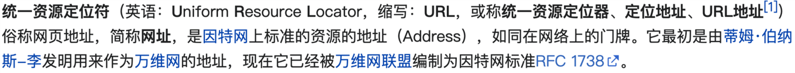
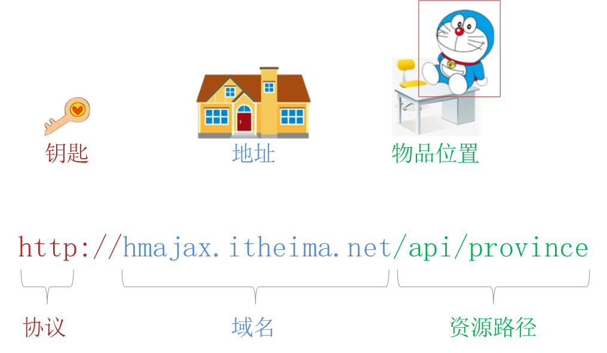

# AJAX入门

让数据活起来

## ◆   AJAX 概念和 axios 使用

概念：AJAX 是浏览器与服务器进行数据通信的技

什么是 AJAX

### 怎么用 AJAX ？

1. 先使用 axios [æk‘sioʊs] 库，与服务器进行数据通信
⚫   基于 XMLHttpRequest 封装、代码简单、月下载量在 14 亿次
⚫   Vue、React 项目中都会用到 axios
2. 再学习 XMLHttpRequest 对象的使用，了解 AJAX 底层原理

### axios 使用

语法：

1. 引入 axios.js：https://cdn.jsdelivr.net/npm/axios/dist/axios.min.js

2. 使用 axios 函数
  ✓   传入配置对象
  ✓   再用 .then 回调函数接收结果，并做后续处理

  

```
axios({
url: '目标资源地址' 
}) .then((result) => {
// 对服务器返回的数据做后续处理
}) 
```

axios 使用
需求：请求目标资源地址，拿到省份列表数据，显示到页面
目标资源地址：<http://hmajax.itheima.net/api/province>

```
axios({
url: 'http://hmajax.itheima.net/api/province' 
}) .then((result) => {
// 对服务器返回的数据做后续处理
})
```


## ◆   认识 URL

什么是 URL？


定义：


```
网页资源<https://www.baidu.com/index.html>

图片资源<https://www.itheima.com/images/logo.png>

数据资源<http://hmajax.itheima.net/api/province>
```

概念：URL 就是统一资源定位符，简称网址，用于访问网络上的资源


## ◆   URL 查询参数


URL 的组成




组成：

协议

http 协议：超文本传输协议，规定浏览器和服务器之间传输数据的格式

http://hmajax.itheima.net/api/province

协议

以指定格式传输数据

以指定格式解析服务器返回的资源

浏览器 服务器

协议范围:

http，https，..

## ◆  常用请求方法和数据提交

## ◆   HTTP协议-报文

## ◆   接口文档

## ◆  案例 - 用户登录

## ◆  form-serialize 插件